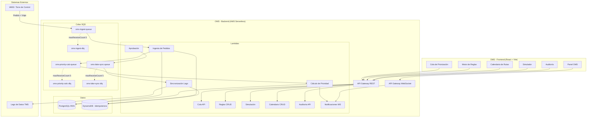
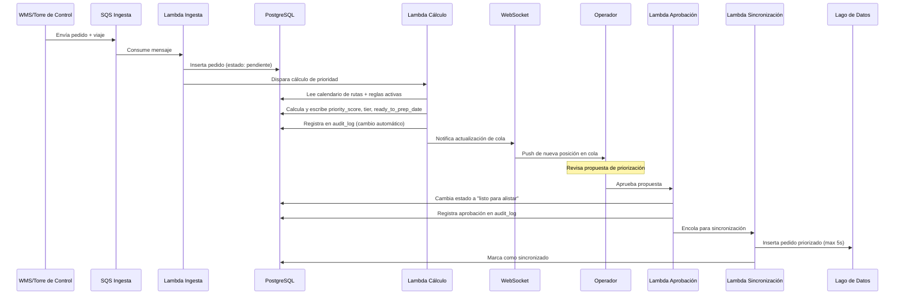
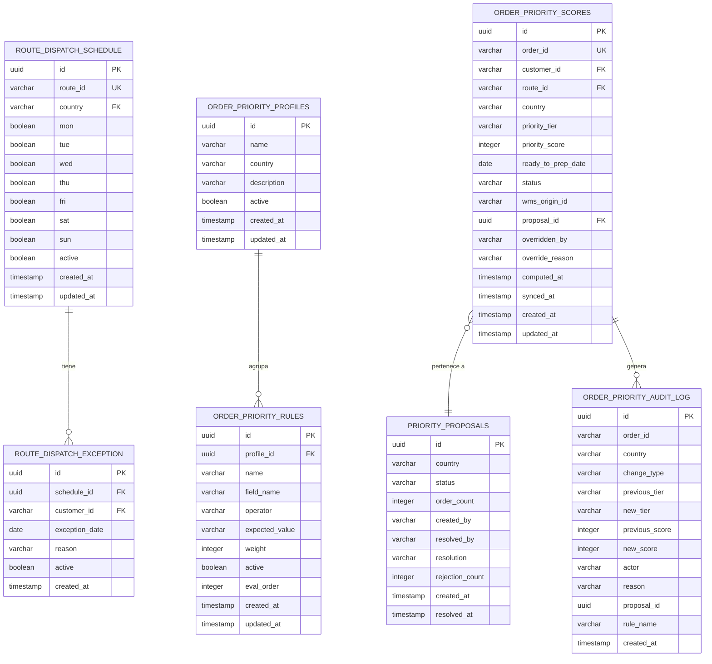
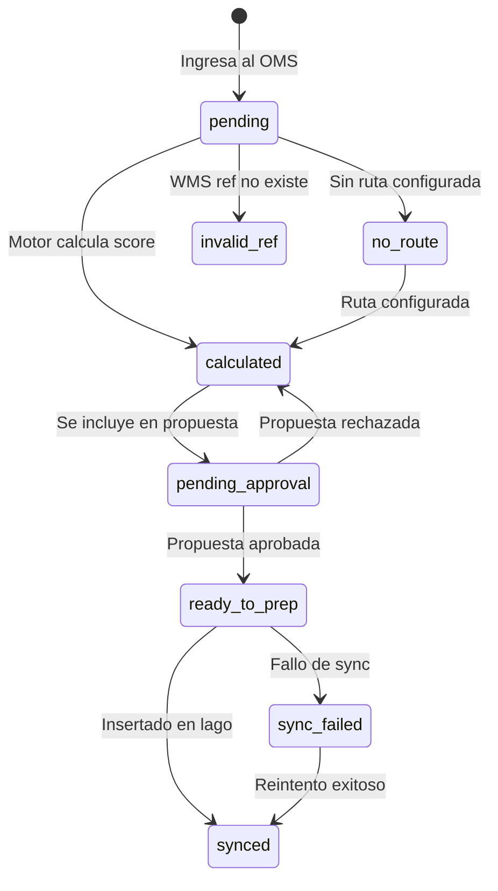

# Diseño Técnico — Módulo OMS (Order Management System)

## Overview

El OMS es un sistema satélite del TMS OLO cuyo trabajo es decidir **cuándo** y **con qué prioridad** cada pedido debe mandarse a alistar, aplicando reglas de negocio configurables (no FIFO). Se posiciona entre el WMS/Torre de Control y el lago de datos: recibe pedidos, calcula su prioridad según el calendario de rutas y las reglas activas, requiere aprobación humana, y finalmente inserta el pedido priorizado en el lago de datos para consumo downstream (Pedidos, Planificación, Tracking).

### Principios de diseño

1. **Satélite independiente**: El TMS funciona sin el OMS; el OMS agrega valor (priorización inteligente) sin crear dependencia.
2. **Motor de reglas declarativo**: Las reglas son datos, no código. Un administrador las configura vía UI.
3. **Aprobación humana obligatoria**: El OMS propone, la operación aprueba — nunca automatización ciega.
4. **Multi-país aislado**: Costa Rica y Venezuela operan con calendarios, reglas y perfiles independientes.
5. **Serverless-first**: Lambda + SQS + API Gateway para el backend, PostgreSQL (RDS) como base transaccional.

### Decisiones clave

| Decisión | Justificación |
|---|---|
| PostgreSQL (RDS) como BD transaccional separada del lago de datos | El OMS necesita integridad referencial, transacciones ACID y consultas complejas (joins regla-pedido-calendario). El lago de datos se alimenta post-aprobación. |
| Motor de reglas basado en suma de pesos | Simple, predecible, explicable al operador. Cada regla que aplica suma su peso al `priority_score`. El `priority_tier` se deriva por umbrales configurables. |
| WebSocket (API Gateway WebSocket) para actualizaciones en tiempo real | Requisito de max 5s de latencia en la cola. Polling a 5s generaría carga innecesaria con muchos operadores simultáneos. Fallback a polling si WebSocket no disponible. |
| Simulación como operación de solo lectura en Lambda | Hasta 10,000 pedidos en max 30s. Lambda con 1024MB y timeout 30s es suficiente para evaluación in-memory sin tocar datos de producción. |
| Auditoría append-only con retención 12 meses | Tabla particionada por mes en PostgreSQL. Índices en `order_id`, `created_at`, `country`. Sin deletes ni updates. |

---

## Architecture

### Diagrama de alto nivel



### Flujo principal (happy path)



### Capas de la arquitectura

| Capa | Tecnología | Responsabilidad |
|---|---|---|
| Presentación | React + TypeScript + Vite | UI con patrón Page → Controller → Api |
| API | API Gateway REST + WebSocket | Endpoints REST para CRUD, WebSocket para push |
| Lógica de negocio | Lambda (Python 3.13) | Motor de reglas, cálculo, simulación, aprobación |
| Mensajería async | SQS + DLQ | Ingesta, cálculo asíncrono, sincronización con lago |
| Persistencia | PostgreSQL (RDS) | Modelo transaccional completo del OMS |
| Idempotencia | DynamoDB + TTL | Deduplicación de mensajes SQS |
| Observabilidad | CloudWatch Logs + Alarmas | Logs JSON, alarmas en DLQ, métricas de latencia |

---

## Components and Interfaces

### Frontend — Estructura de módulos

```
src/pages/oms/
├── panel/page.tsx              # Dashboard KPIs + alertas
├── cola/page.tsx               # Cola de priorización operativa
├── reglas/page.tsx             # CRUD de reglas + perfiles
├── rutas-despacho/page.tsx     # Calendario de rutas (nuevo)
├── simulador/page.tsx          # Vista previa de cambios
├── auditoria/page.tsx          # Log inmutable
├── api/omsApi.ts               # Capa de acceso HTTP centralizada
├── hooks/
│   ├── useOmsPanelController.ts
│   ├── useOmsColaController.ts
│   ├── useOmsReglasController.ts
│   ├── useOmsRutasController.ts
│   ├── useOmsSimuladorController.ts
│   └── useOmsAuditoriaController.ts
└── components/
    ├── PriorityBadge.tsx       # Badge con mapeo tier → color
    ├── RuleBuilderRow.tsx      # Fila de condición si/entonces
    ├── QueueSidePanel.tsx      # Panel lateral detalle pedido
    ├── ApprovalBanner.tsx      # Banner de propuesta pendiente
    ├── SimulationDiff.tsx      # Comparación lado a lado
    └── AlertsTable.tsx         # Tabla de alertas del panel
```

### Backend — Lambdas y responsabilidades

| Lambda | Trigger | Timeout | Memoria | Responsabilidad |
|---|---|---|---|---|
| `oms-ingest` | SQS (`oms-ingest-queue`) | 30s | 512MB | Validar pedido entrante, insertar en BD, encolar cálculo |
| `oms-priority-calc` | SQS (`oms-priority-calc-queue`) | 30s | 512MB | Evaluar reglas activas, calcular score/tier, escribir resultado |
| `oms-queue-api` | API Gateway | 10s | 256MB | CRUD cola: listar, filtrar, override manual |
| `oms-rules-api` | API Gateway | 10s | 256MB | CRUD reglas y perfiles |
| `oms-schedule-api` | API Gateway | 10s | 256MB | CRUD calendario de rutas y excepciones |
| `oms-simulation` | API Gateway | 30s | 1024MB | Recalcular hasta 10,000 pedidos con reglas propuestas |
| `oms-approval` | API Gateway | 10s | 256MB | Aprobar/rechazar propuesta, encolar sync |
| `oms-lake-sync` | SQS (`oms-lake-sync-queue`) | 30s | 512MB | Insertar/actualizar pedido en lago de datos |
| `oms-audit-api` | API Gateway | 10s | 256MB | Consulta paginada del log de auditoría |
| `oms-ws-notify` | DynamoDB Streams / invocación directa | 10s | 256MB | Push de cambios via WebSocket |

### API REST — Endpoints principales

```yaml
# Calendario de Rutas
POST   /oms/schedules                    # Crear ruta con días de salida
GET    /oms/schedules?country={cr|ve}     # Listar rutas por país
PUT    /oms/schedules/{route_id}          # Actualizar días de salida
DELETE /oms/schedules/{route_id}          # Desactivar ruta
POST   /oms/schedules/{route_id}/exceptions  # Crear excepción puntual

# Cola de Priorización
GET    /oms/queue?country={cr|ve}&page=1&filters...  # Listar cola paginada
GET    /oms/queue/{order_id}              # Detalle de pedido
PUT    /oms/queue/{order_id}/override     # Override manual

# Reglas
POST   /oms/rules                         # Crear regla
GET    /oms/rules?profile={id}            # Listar reglas
PUT    /oms/rules/{rule_id}               # Actualizar regla
PUT    /oms/rules/{rule_id}/activate      # Activar/desactivar
GET    /oms/profiles                      # Listar perfiles
POST   /oms/profiles                      # Crear perfil

# Simulación
POST   /oms/simulations                   # Ejecutar simulación
POST   /oms/simulations/{sim_id}/apply    # Aplicar resultado

# Aprobación
GET    /oms/proposals?country={cr|ve}     # Listar propuestas pendientes
POST   /oms/proposals/{proposal_id}/approve  # Aprobar
POST   /oms/proposals/{proposal_id}/reject   # Rechazar

# Auditoría
GET    /oms/audit?order_id=&user=&type=&from=&to=&country=&page=1

# Panel
GET    /oms/dashboard/kpis?country={cr|ve}
GET    /oms/dashboard/alerts?country={cr|ve}
```

### Patrón de comunicación Frontend ↔ Backend

```typescript
// src/pages/oms/api/omsApi.ts
import { axiosApiGateway } from '@/lib/axiosApiGateway';

export const omsApi = {
  // Cola
  getQueue: (params: QueueFilters) => 
    axiosApiGateway.get('/oms/queue', { params }),
  overrideOrder: (orderId: string, body: OverridePayload) =>
    axiosApiGateway.put(`/oms/queue/${orderId}/override`, body),
  
  // Reglas
  getRules: (profileId?: string) =>
    axiosApiGateway.get('/oms/rules', { params: { profile: profileId } }),
  createRule: (body: CreateRulePayload) =>
    axiosApiGateway.post('/oms/rules', body),
  
  // Simulación
  runSimulation: (body: SimulationPayload) =>
    axiosApiGateway.post('/oms/simulations', body),
  
  // ... etc
};
```

### Patrón SQS con los 4 controles de resiliencia

Cada cola SQS sigue el estándar obligatorio de `Estandares_Desarrollo_AWS_Intelix.md` §7:

```yaml
# template.yaml (extracto)
OmsIngestQueue:
  Type: AWS::SQS::Queue
  Properties:
    QueueName: !Sub ${AWS::StackName}-oms-ingest
    VisibilityTimeout: 180          # 6 × 30s timeout
    ReceiveMessageWaitTimeSeconds: 20
    MessageRetentionPeriod: 1209600  # 14 días
    RedrivePolicy:
      deadLetterTargetArn: !GetAtt OmsIngestDLQ.Arn
      maxReceiveCount: 5

OmsIngestDLQ:
  Type: AWS::SQS::Queue
  Properties:
    QueueName: !Sub ${AWS::StackName}-oms-ingest-dlq
    MessageRetentionPeriod: 1209600

OmsIngestFunction:
  Type: AWS::Serverless::Function
  Properties:
    FunctionName: !Sub ${AWS::StackName}-oms-ingest
    Runtime: python3.13
    Timeout: 30
    MemorySize: 512
    Events:
      SqsEvent:
        Type: SQS
        Properties:
          Queue: !GetAtt OmsIngestQueue.Arn
          BatchSize: 10
          FunctionResponseTypes:
            - ReportBatchItemFailures
```

---

## Data Models

### Diagrama Entidad-Relación



### DDL de tablas principales

```sql
-- Calendario de Rutas
CREATE TABLE route_dispatch_schedule (
    id UUID PRIMARY KEY DEFAULT gen_random_uuid(),
    route_id VARCHAR(50) NOT NULL,
    country VARCHAR(2) NOT NULL CHECK (country IN ('CR', 'VE')),
    mon BOOLEAN NOT NULL DEFAULT FALSE,
    tue BOOLEAN NOT NULL DEFAULT FALSE,
    wed BOOLEAN NOT NULL DEFAULT FALSE,
    thu BOOLEAN NOT NULL DEFAULT FALSE,
    fri BOOLEAN NOT NULL DEFAULT FALSE,
    sat BOOLEAN NOT NULL DEFAULT FALSE,
    sun BOOLEAN NOT NULL DEFAULT FALSE,
    active BOOLEAN NOT NULL DEFAULT TRUE,
    created_at TIMESTAMPTZ NOT NULL DEFAULT NOW(),
    updated_at TIMESTAMPTZ NOT NULL DEFAULT NOW(),
    UNIQUE (route_id, country)
);

-- Excepciones puntuales por cliente
CREATE TABLE route_dispatch_exception (
    id UUID PRIMARY KEY DEFAULT gen_random_uuid(),
    schedule_id UUID NOT NULL REFERENCES route_dispatch_schedule(id),
    customer_id VARCHAR(100) NOT NULL,
    exception_date DATE NOT NULL,
    reason VARCHAR(500) NOT NULL,
    active BOOLEAN NOT NULL DEFAULT TRUE,
    created_at TIMESTAMPTZ NOT NULL DEFAULT NOW(),
    CHECK (exception_date >= CURRENT_DATE),
    UNIQUE (schedule_id, customer_id, exception_date)
);

-- Perfiles de reglas
CREATE TABLE order_priority_profiles (
    id UUID PRIMARY KEY DEFAULT gen_random_uuid(),
    name VARCHAR(100) NOT NULL,
    country VARCHAR(2) NOT NULL CHECK (country IN ('CR', 'VE')),
    description TEXT,
    active BOOLEAN NOT NULL DEFAULT TRUE,
    created_at TIMESTAMPTZ NOT NULL DEFAULT NOW(),
    updated_at TIMESTAMPTZ NOT NULL DEFAULT NOW(),
    UNIQUE (name, country)
);

-- Reglas de priorización
CREATE TABLE order_priority_rules (
    id UUID PRIMARY KEY DEFAULT gen_random_uuid(),
    profile_id UUID NOT NULL REFERENCES order_priority_profiles(id),
    name VARCHAR(100) NOT NULL,
    field_name VARCHAR(100) NOT NULL,
    operator VARCHAR(20) NOT NULL CHECK (operator IN (
        'eq', 'neq', 'gt', 'lt', 'gte', 'lte', 'contains'
    )),
    expected_value VARCHAR(500) NOT NULL,
    weight INTEGER NOT NULL CHECK (weight BETWEEN 1 AND 1000),
    active BOOLEAN NOT NULL DEFAULT TRUE,
    eval_order INTEGER NOT NULL DEFAULT 0,
    created_at TIMESTAMPTZ NOT NULL DEFAULT NOW(),
    updated_at TIMESTAMPTZ NOT NULL DEFAULT NOW()
);

-- Propuestas de priorización (lotes para aprobación)
CREATE TABLE priority_proposals (
    id UUID PRIMARY KEY DEFAULT gen_random_uuid(),
    country VARCHAR(2) NOT NULL CHECK (country IN ('CR', 'VE')),
    status VARCHAR(20) NOT NULL DEFAULT 'pending' 
        CHECK (status IN ('pending', 'approved', 'rejected')),
    order_count INTEGER NOT NULL DEFAULT 0,
    created_by VARCHAR(100) NOT NULL DEFAULT 'system',
    resolved_by VARCHAR(100),
    resolution VARCHAR(20),
    rejection_count INTEGER NOT NULL DEFAULT 0,
    created_at TIMESTAMPTZ NOT NULL DEFAULT NOW(),
    resolved_at TIMESTAMPTZ
);

-- Scores de prioridad por pedido
CREATE TABLE order_priority_scores (
    id UUID PRIMARY KEY DEFAULT gen_random_uuid(),
    order_id VARCHAR(100) NOT NULL UNIQUE,
    customer_id VARCHAR(100) NOT NULL,
    route_id VARCHAR(50),
    country VARCHAR(2) NOT NULL CHECK (country IN ('CR', 'VE')),
    priority_tier VARCHAR(20) NOT NULL DEFAULT 'baja'
        CHECK (priority_tier IN ('critica', 'alta', 'media', 'baja')),
    priority_score INTEGER NOT NULL DEFAULT 0,
    ready_to_prep_date DATE,
    status VARCHAR(30) NOT NULL DEFAULT 'pending'
        CHECK (status IN (
            'pending', 'calculated', 'pending_approval', 
            'ready_to_prep', 'synced', 'sync_failed',
            'no_route', 'invalid_ref'
        )),
    wms_origin_id VARCHAR(100) NOT NULL,
    proposal_id UUID REFERENCES priority_proposals(id),
    overridden_by VARCHAR(100),
    override_reason TEXT,
    computed_at TIMESTAMPTZ,
    synced_at TIMESTAMPTZ,
    created_at TIMESTAMPTZ NOT NULL DEFAULT NOW(),
    updated_at TIMESTAMPTZ NOT NULL DEFAULT NOW()
);

-- Índices para consultas frecuentes
CREATE INDEX idx_scores_country_status ON order_priority_scores(country, status);
CREATE INDEX idx_scores_priority ON order_priority_scores(country, priority_score DESC);
CREATE INDEX idx_scores_ready_date ON order_priority_scores(ready_to_prep_date);
CREATE INDEX idx_scores_proposal ON order_priority_scores(proposal_id);

-- Log de auditoría (append-only, particionado por mes)
CREATE TABLE order_priority_audit_log (
    id UUID NOT NULL DEFAULT gen_random_uuid(),
    order_id VARCHAR(100) NOT NULL,
    country VARCHAR(2) NOT NULL,
    change_type VARCHAR(20) NOT NULL 
        CHECK (change_type IN ('automatic', 'manual', 'approval', 'rejection')),
    previous_tier VARCHAR(20),
    new_tier VARCHAR(20),
    previous_score INTEGER,
    new_score INTEGER,
    actor VARCHAR(100) NOT NULL,
    reason TEXT,
    proposal_id UUID,
    rule_name VARCHAR(100),
    created_at TIMESTAMPTZ NOT NULL DEFAULT NOW()
) PARTITION BY RANGE (created_at);

-- Particiones mensuales (ejemplo para 12 meses)
CREATE TABLE audit_log_2026_08 PARTITION OF order_priority_audit_log
    FOR VALUES FROM ('2026-08-01') TO ('2026-09-01');
CREATE TABLE audit_log_2026_09 PARTITION OF order_priority_audit_log
    FOR VALUES FROM ('2026-09-01') TO ('2026-10-01');
-- ... crear particiones futuras con job programado

CREATE INDEX idx_audit_order ON order_priority_audit_log(order_id);
CREATE INDEX idx_audit_created ON order_priority_audit_log(created_at DESC);
CREATE INDEX idx_audit_country ON order_priority_audit_log(country);
CREATE INDEX idx_audit_actor ON order_priority_audit_log(actor);

-- Tabla de idempotencia (DynamoDB, aquí solo para referencia)
-- PK: message_id (String)
-- TTL: expires_at (Number, epoch + 24h)
```

### Mapeo priority_tier ↔ umbrales de score

| priority_tier | Rango de priority_score | Color (Badge) |
|---|---|---|
| `critica` | ≥ 80 o pedido vencido | `danger` (red) |
| `alta` | 60–79 | `warning` (amber) |
| `media` | 30–59 | `info` (teal) |
| `baja` | 0–29 | `default` (slate) |

Los umbrales son configurables por perfil/país. Se almacenan como metadatos del perfil.

### Estados del pedido en el OMS



---

## Correctness Properties

*Una propiedad es una característica o comportamiento que debe mantenerse verdadero a través de todas las ejecuciones válidas de un sistema — esencialmente, una declaración formal sobre lo que el sistema debe hacer. Las propiedades sirven como puente entre especificaciones legibles por humanos y garantías de corrección verificables por máquinas.*

### Property 1: Validación de días de salida en calendario de rutas

*Para cualquier* configuración de ruta generada aleatoriamente, el sistema SHALL aceptar la creación si y solo si al menos uno de los 7 días de la semana está seleccionado como día de salida, y SHALL rechazar cualquier configuración donde ningún día esté seleccionado.

**Validates: Requirements 1.2**

### Property 2: Validación de excepciones puntuales

*Para cualquier* excepción puntual generada aleatoriamente, el sistema SHALL aceptarla si y solo si la fecha es igual o posterior al día actual Y el motivo tiene entre 1 y 500 caracteres. Excepciones con fecha pasada o motivo fuera de rango deben ser rechazadas.

**Validates: Requirements 1.3**

### Property 3: Excepciones prevalecen sobre calendario regular

*Para cualquier* pedido de un cliente que tiene una excepción activa con fecha >= hoy, el Motor de Reglas SHALL usar la fecha de excepción (no el día regular de la ruta) para calcular el `ready_to_prep_date`.

**Validates: Requirements 1.4**

### Property 4: Aislamiento multi-país de datos

*Para cualquier* operación CRUD sobre rutas, reglas, perfiles o pedidos en un país X, los datos del país Y deben permanecer sin modificaciones. Ninguna consulta filtrada por un país debe retornar entidades del otro país.

**Validates: Requirements 1.6, 10.2, 10.3, 10.4, 10.5**

### Property 5: Cálculo correcto de fecha de alistamiento

*Para cualquier* pedido con un cliente asociado a una ruta con calendario configurado, el Motor de Reglas SHALL seleccionar la primera fecha de salida futura que permita al menos 1 día de antelación, y SHALL asignar `ready_to_prep_date` exactamente 1 día calendario antes de esa fecha de salida.

**Validates: Requirements 2.1, 2.2**

### Property 6: Invariante de ordenamiento por urgencia

*Para cualquier* par de pedidos donde uno tiene `ready_to_prep_date` <= hoy y el otro tiene `ready_to_prep_date` futuro, el primero SHALL tener un `priority_score` mayor que el segundo. Los pedidos con `ready_to_prep_date` <= hoy SHALL recibir `priority_tier` = 'critica'.

**Validates: Requirements 2.3, 2.5, 2.7**

### Property 7: Desempate FIFO para misma fecha de alistamiento

*Para cualquier* par de pedidos con el mismo `ready_to_prep_date`, el pedido que ingresó primero al sistema (timestamp de creación menor) SHALL tener un `priority_score` mayor o igual que el que ingresó después.

**Validates: Requirements 2.4**

### Property 8: Cola ordenada descendentemente por score

*Para cualquier* consulta a la cola de priorización, la secuencia de pedidos retornada SHALL estar ordenada de mayor a menor `priority_score`, y SHALL contener máximo 50 elementos por página.

**Validates: Requirements 3.1**

### Property 9: Completitud de campos en cola

*Para cualquier* pedido retornado en la cola de priorización, SHALL contener todos los campos requeridos: identificador del pedido, cliente, ruta, `priority_tier`, `priority_score`, `ready_to_prep_date` y estado, sin valores nulos en ninguno de ellos.

**Validates: Requirements 3.2**

### Property 10: Filtrado AND estricto

*Para cualquier* combinación de filtros aplicados a la cola (cliente, país, ruta, rango de fechas), todos los pedidos retornados SHALL cumplir simultáneamente TODOS los criterios de filtro activos.

**Validates: Requirements 3.3**

### Property 11: Validación de motivo en Override Manual

*Para cualquier* intento de Override Manual, el sistema SHALL aceptar la operación si y solo si el motivo proporcionado tiene al menos 10 caracteres. Motivos con menos de 10 caracteres deben ser rechazados.

**Validates: Requirements 3.4**

### Property 12: Bloqueo de transición durante aprobación pendiente

*Para cualquier* pedido incluido en una propuesta con estado "pendiente de aprobación", cualquier intento de transicionar a "listo para alistar" SHALL ser bloqueado hasta que la propuesta sea aprobada.

**Validates: Requirements 4.2**

### Property 13: Aprobación transiciona todos los pedidos del lote

*Para cualquier* propuesta aprobada que contenga N pedidos, exactamente N pedidos SHALL transicionar a estado "listo para alistar" y exactamente N entradas de auditoría de tipo "approval" SHALL ser creadas.

**Validates: Requirements 4.3**

### Property 14: Cálculo de priority_score como suma de pesos

*Para cualquier* pedido y cualquier conjunto de reglas activas del mismo país, el `priority_score` SHALL ser igual a la suma de los pesos de todas las reglas cuya condición se cumple para ese pedido. Si ninguna regla aplica, `priority_score` SHALL ser 0 y `priority_tier` SHALL ser 'baja'.

**Validates: Requirements 6.5, 6.8**

### Property 15: Estado activo/inactivo determina participación en cálculo

*Para cualquier* regla, si está activa SHALL ser evaluada en el cálculo de `priority_score` para todos los pedidos nuevos del país correspondiente. Si está inactiva, SHALL existir en el sistema pero NO contribuir al score de ningún pedido.

**Validates: Requirements 6.2, 6.3**

### Property 16: Validación de reglas en creación

*Para cualquier* regla generada aleatoriamente, el sistema SHALL aceptar la creación si y solo si el nombre tiene entre 1 y 100 caracteres Y el peso está entre 1 y 1000. Valores fuera de rango deben ser rechazados.

**Validates: Requirements 6.1**

### Property 17: Simulación no modifica datos de producción

*Para cualquier* ejecución del simulador con cualquier combinación de reglas propuestas, los `priority_score` y `priority_tier` de todos los pedidos en la tabla de producción SHALL permanecer sin cambios después de la simulación.

**Validates: Requirements 7.1**

### Property 18: Detección correcta de cambios en simulación

*Para cualquier* resultado de simulación, un pedido SHALL ser marcado como "cambiado" si y solo si su posición en el ranking difiere en al menos 1 posición O su `priority_tier` es diferente entre la cola actual y la simulada.

**Validates: Requirements 7.3**

### Property 19: Preservación de overrides al aplicar simulación

*Para cualquier* pedido que tiene un Override Manual vigente, aplicar los resultados de una simulación SHALL preservar la prioridad manual del pedido sin modificarla.

**Validates: Requirements 7.4**

### Property 20: Umbral de advertencia de impacto alto

*Para cualquier* simulación donde más del 30% de los pedidos cambiaría de `priority_tier`, el sistema SHALL mostrar una advertencia de "impacto alto". Si el porcentaje es <= 30%, la advertencia NO SHALL mostrarse.

**Validates: Requirements 7.5**

### Property 21: Resumen de simulación refleja datos reales

*Para cualquier* resultado de simulación, el resumen SHALL indicar: total de pedidos afectados igual al conteo real de pedidos con cambio de score, cantidad de cambios de tier igual al conteo real, y porcentaje de cambios de posición calculado correctamente sobre el total simulado.

**Validates: Requirements 7.7**

### Property 22: Completitud del registro de auditoría automática

*Para cualquier* cálculo o recálculo de prioridad ejecutado por el Motor de Reglas, SHALL existir un registro en la auditoría conteniendo: `order_id`, `country`, `previous_tier`, `new_tier`, `previous_score`, `new_score`, `change_type`='automatic', `rule_name` y `timestamp`.

**Validates: Requirements 8.1**

### Property 23: Completitud del registro de auditoría manual

*Para cualquier* Override Manual ejecutado, SHALL existir un registro en la auditoría conteniendo: `order_id`, `country`, `previous_tier`, `new_tier`, `previous_score`, `new_score`, `change_type`='manual', `actor` (usuario), `reason` (motivo) y `timestamp`.

**Validates: Requirements 8.2, 11.4**

### Property 24: Filtrado de auditoría con paginación

*Para cualquier* combinación de filtros aplicados a la auditoría (pedido, usuario, tipo, rango de fechas, país), todos los registros retornados SHALL cumplir todos los criterios simultáneamente y SHALL retornar máximo 50 registros por página.

**Validates: Requirements 8.4**

### Property 25: Completitud del payload de sincronización al lago

*Para cualquier* pedido que alcanza estado "listo para alistar", el payload enviado al lago de datos SHALL contener: `order_id`, `priority_score`, `priority_tier`, `ready_to_prep_date`, `wms_origin_id` (no nulo) y `timestamp`.

**Validates: Requirements 9.1, 9.2**

### Property 26: Reintentos con backoff exponencial

*Para cualquier* fallo de conexión con el lago de datos, el sistema SHALL reintentar con intervalos de backoff exponencial (base 2 segundos: intento 1 a 2s, intento 2 a 4s, intento 3 a 8s) y SHALL detenerse después de máximo 3 intentos.

**Validates: Requirements 9.3**

### Property 27: Obligatoriedad del campo país en todas las entidades

*Para cualquier* intento de crear un pedido, ruta, regla o perfil sin un campo de país válido ('CR' o 'VE'), el sistema SHALL rechazar la operación.

**Validates: Requirements 10.1, 10.6**

### Property 28: Denegación de acceso sin permisos

*Para cualquier* usuario que intenta ejecutar una acción para la cual no tiene permiso (override sin rol de operación, CRUD de reglas sin rol de administración), el sistema SHALL denegar la operación sin ejecutar ningún cambio de estado.

**Validates: Requirements 11.2, 11.6**

### Property 29: KPIs reflejan estado real del sistema

*Para cualquier* estado del sistema con N pedidos pendientes distribuidos en distintos tiers, los KPIs del panel SHALL reflejar correctamente: la cantidad de pedidos por cada tier, la cantidad con `ready_to_prep_date` vencido, y la cantidad sin ruta configurada.

**Validates: Requirements 5.1**

### Property 30: Ordenamiento de alertas por severidad y timestamp

*Para cualquier* conjunto de alertas activas, la tabla del panel SHALL mostrarlas ordenadas primero por severidad (crítica > warning > info) y dentro de la misma severidad por timestamp descendente (más reciente primero).

**Validates: Requirements 5.2**

---

## Error Handling

### Estrategia por capa

| Capa | Tipo de error | Manejo |
|---|---|---|
| **Ingesta SQS** | Mensaje malformado / campos faltantes | Log del error, mover a DLQ después de 5 reintentos, alerta en Panel OMS |
| **Cálculo de prioridad** | Ruta no encontrada | Marcar pedido como "sin ruta configurada", generar alerta, NO bloquear otros pedidos del batch |
| **Cálculo de prioridad** | Referencia WMS inválida | Marcar como "referencia inválida", registrar en auditoría, alerta en Panel |
| **Override Manual** | Permisos insuficientes | HTTP 403 con mensaje descriptivo del permiso requerido |
| **Override Manual** | Motivo < 10 caracteres | HTTP 422 con validación específica |
| **Sincronización lago** | Conexión no disponible | Backoff exponencial (2s, 4s, 8s), max 3 reintentos. Si falla: estado `sync_failed`, alerta, permitir reintento manual |
| **Simulación** | Timeout (>30s) | Cancelar cálculo, descartar resultados parciales, retornar error explicativo. Producción intacta. |
| **Aprobación** | Propuesta ya procesada | HTTP 409 Conflict con info del operador que la procesó |
| **Token** | JWT inválido o expirado | HTTP 401, redirigir a flujo de autenticación RLS |
| **WebSocket** | Desconexión | Reconexión automática con backoff, fallback a polling cada 5s |

### Patrones de resiliencia

```python
# Patrón de idempotencia en Lambda (DynamoDB + TTL)
def handler(event, context):
    batch_failures = []
    for record in event["Records"]:
        message_id = record["messageId"]
        try:
            if is_already_processed(message_id):  # DynamoDB lookup
                continue
            claim_processing(message_id)  # PutItem con ConditionExpression
            process_order(record)
        except ClientError as e:
            release_claim(message_id)  # Permite reintento limpio
            batch_failures.append({"itemIdentifier": message_id})
        except Exception as e:
            release_claim(message_id)
            batch_failures.append({"itemIdentifier": message_id})
            logger.error(f"Error processing {message_id}", exc_info=True)
    return {"batchItemFailures": batch_failures}
```

```python
# Patrón de backoff exponencial para sincronización con lago
import time
from typing import Optional

def sync_to_lake(order_data: dict, max_retries: int = 3, base_delay: float = 2.0) -> bool:
    for attempt in range(max_retries):
        try:
            lake_client.insert(order_data)
            return True
        except ConnectionError:
            if attempt < max_retries - 1:
                delay = base_delay * (2 ** attempt)  # 2s, 4s, 8s
                time.sleep(delay)
            else:
                mark_sync_failed(order_data["order_id"])
                create_alert("sync_failed", order_data["order_id"])
                log_audit_entry(order_data["order_id"], "sync_failed")
                return False
```

### Códigos HTTP del API

| Código | Uso en OMS |
|---|---|
| 200 | Consultas exitosas (GET) |
| 201 | Creación exitosa (POST) |
| 202 | Operación aceptada y encolada (sync, simulación larga) |
| 400 | Payload inválido (campos faltantes, tipos incorrectos) |
| 401 | Token JWT inválido o expirado |
| 403 | Permiso insuficiente para la acción |
| 404 | Recurso no encontrado (pedido, ruta, regla) |
| 409 | Conflicto (propuesta ya procesada, ruta duplicada) |
| 422 | Validación de negocio fallida (motivo < 10 chars, peso fuera de rango) |
| 500 | Error interno no esperado |
| 503 | Servicio no disponible (lago de datos caído) |

---

## Testing Strategy

### Enfoque dual: Unit Tests + Property-Based Tests

El OMS tiene lógica de negocio densa y pura (motor de reglas, cálculo de prioridad, determinación de fechas de alistamiento) que se beneficia enormemente de property-based testing (PBT). El enfoque es:

- **Property-based tests**: Verifican las 30 propiedades universales definidas arriba — garantizan corrección del motor de reglas, cálculo de scores, validaciones y aislamiento multi-país.
- **Unit tests**: Cubren ejemplos específicos, edge cases y flujos de integración que no son universalizables.

### Librería de PBT

- **Backend (Python 3.13)**: [Hypothesis](https://hypothesis.readthedocs.io/) — estándar de la industria para Python PBT.
- **Frontend (TypeScript)**: [fast-check](https://fast-check.dev/) — para validar lógica de filtrado/ordenamiento en el frontend.

### Configuración PBT

- Mínimo **100 iteraciones** por property test.
- Cada test referencia su propiedad del diseño con tag: `# Feature: oms-module, Property {N}: {descripción}`
- Los generators producen datos que cubren edge cases (fechas límite, strings vacíos, scores en umbrales).

### Estructura de tests

```
tests/
├── unit/
│   ├── test_schedule_crud.py          # CRUD calendario
│   ├── test_priority_calc.py          # Cálculo de prioridad
│   ├── test_rule_engine.py            # Evaluación de reglas
│   ├── test_approval_flow.py          # Flujo de aprobación
│   ├── test_simulation.py             # Simulación
│   └── test_lake_sync.py             # Sincronización
├── property/
│   ├── test_props_schedule.py         # Properties 1-4
│   ├── test_props_priority_calc.py    # Properties 5-7
│   ├── test_props_queue.py            # Properties 8-11
│   ├── test_props_approval.py         # Properties 12-13
│   ├── test_props_rules_engine.py     # Properties 14-16
│   ├── test_props_simulation.py       # Properties 17-21
│   ├── test_props_audit.py            # Properties 22-24
│   ├── test_props_sync.py            # Properties 25-26
│   ├── test_props_multi_country.py    # Properties 27-28
│   └── test_props_dashboard.py        # Properties 29-30
├── integration/
│   ├── test_sqs_ingestion.py          # Ingesta via SQS completa
│   ├── test_websocket_updates.py      # Actualizaciones en tiempo real
│   ├── test_lake_integration.py       # Inserción/actualización lago
│   ├── test_recalc_on_schedule.py     # Recálculo tras cambio calendario (60s)
│   └── test_approval_timeout.py       # Alerta tras 120min sin aprobación
└── frontend/
    ├── test_queue_filtering.spec.ts   # Filtrado AND en cola
    ├── test_simulation_diff.spec.ts   # Comparación de simulación
    └── test_priority_badge.spec.ts    # Mapeo tier → color
```

### Ejemplo de property test (Hypothesis)

```python
# tests/property/test_props_rules_engine.py
from hypothesis import given, settings
from hypothesis import strategies as st

# Feature: oms-module, Property 14: Cálculo de priority_score como suma de pesos
@settings(max_examples=200)
@given(
    order=st.fixed_dictionaries({
        "total_amount": st.floats(min_value=0, max_value=100000),
        "customer_tier": st.sampled_from(["VIP", "standard", "basic"]),
        "product_type": st.sampled_from(["perecedero", "seco", "refrigerado"]),
    }),
    rules=st.lists(
        st.fixed_dictionaries({
            "field_name": st.sampled_from(["total_amount", "customer_tier", "product_type"]),
            "operator": st.sampled_from(["eq", "gt", "lt", "gte", "lte"]),
            "expected_value": st.text(min_size=1, max_size=20),
            "weight": st.integers(min_value=1, max_value=1000),
            "active": st.just(True),
        }),
        min_size=0,
        max_size=10,
    )
)
def test_score_equals_sum_of_matching_weights(order, rules):
    """priority_score == sum of weights of all matching rules"""
    engine = PriorityEngine(rules)
    result = engine.calculate(order)
    
    expected_score = sum(
        r["weight"] for r in rules if engine.evaluate_condition(r, order)
    )
    assert result.priority_score == expected_score
    
    if expected_score == 0:
        assert result.priority_tier == "baja"
```

### Ejemplo de property test frontend (fast-check)

```typescript
// tests/frontend/test_queue_filtering.spec.ts
import fc from 'fast-check';

// Feature: oms-module, Property 10: Filtrado AND estricto
test('all returned orders satisfy ALL active filters', () => {
  fc.assert(
    fc.property(
      fc.array(orderArbitrary(), { minLength: 0, maxLength: 100 }),
      fc.record({
        country: fc.oneof(fc.constant('CR'), fc.constant('VE'), fc.constant(undefined)),
        customer: fc.oneof(fc.string(), fc.constant(undefined)),
        route: fc.oneof(fc.string(), fc.constant(undefined)),
      }),
      (orders, filters) => {
        const result = applyFilters(orders, filters);
        for (const order of result) {
          if (filters.country) expect(order.country).toBe(filters.country);
          if (filters.customer) expect(order.customer_id).toBe(filters.customer);
          if (filters.route) expect(order.route_id).toBe(filters.route);
        }
      }
    ),
    { numRuns: 100 }
  );
});
```

### Cobertura por tipo de test

| Categoría | Tipo de test | Cantidad estimada |
|---|---|---|
| Motor de reglas (evaluación, scoring) | Property | ~6 properties, 100+ iteraciones c/u |
| Cálculo de fecha de alistamiento | Property | ~3 properties |
| Validaciones de input | Property | ~4 properties |
| Aislamiento multi-país | Property | ~3 properties |
| Flujo de aprobación | Property + Unit | ~2 properties + 4 unit tests |
| Simulación | Property | ~5 properties |
| Auditoría | Property | ~3 properties |
| Sincronización lago | Property + Unit | ~2 properties + 3 unit tests |
| Dashboard KPIs | Property | ~2 properties |
| Flujo SQS completo | Integration | 3-5 tests |
| WebSocket updates | Integration | 2-3 tests |
| Permisos y auth | Unit + Edge case | 5-8 tests |
| UI components | Unit (frontend) | 10-15 tests |

