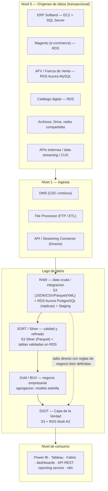

# Estándares de Arquitectura de Datos — Repositorio Empresarial / SSOT

> **Estado:** Borrador conceptual · derivado de la sesión de arquitectura de datos (Osvaldo, arquitectura; con Anderson, William, José, Carlos, Ender, Alfredo referenciado).
> **Fuente:** transcripción de la reunión (automática, con términos corregidos — ver §9).
> **Pendiente:** el **diagrama oficial no está disponible** todavía (Alfredo lo sigue revisando antes de compartirlo). El layout de §3 está **reconstruido a partir de la narrativa**, no del diagrama.
> **Naturaleza:** el modelo es **conceptual** — el propio presentador lo reiteró varias veces. Aplica a ambientes de desarrollo, calidad y producción (con diferencias de gobernanza de cara a producción). Cada negocio tiene matices (SAP vs Softland vs otros ERP).

---

## 1. Propósito y visión

El objetivo del ecosistema es resolver el problema de **dónde ubicar la información según el propósito que tiene**, y ofrecer a los socios de negocio y clientes una **fuente única y oficial de la verdad** — **SSOT** (*Single Source of Truth*, "capa de la verdad").

En lugar de tener los datos dispersos (los pedidos por un lado, la información sobre los pedidos por otro, en plataformas o fuentes separadas), se consolida un repositorio donde:

- Todos consultan **el mismo dato** ("todos vemos lo mismo").
- El dato está a **segundos de fase** de la realidad transaccional (no es tiempo real, pero es **consistente** para todos).
- Aplica **gobernanza de datos** (privilegios, calidad, reglas de negocio, linaje).

Objetivo transversal: que todo el equipo **maneje el mismo lenguaje** (terminología) y entienda el **layout** de cómo el equipo de base de datos estructuró la arquitectura, para consumir y apoyar el desarrollo de las soluciones de cada negocio.

Alineación estratégica: los estándares de desarrollo de la organización se enmarcan dentro de soluciones **AWS**. (Ver §8 sobre límites cuando los orígenes están fuera de la nube.)

---

## 2. Terminología (glosario para hablar el mismo lenguaje)

| Término | Significado |
|---|---|
| **SSOT** (capa de la verdad / fuente oficial) | *Single Source of Truth*. Capa consolidada donde todos los consumos apuntan; una sola versión del dato para todos. |
| **Capa X** | Concepto/proyecto de **integración entre aplicativos** (suscriptor/proveedor de información). En EPA Costa Rica su equivalente se llama **"contacto inicial"**. Conceptualmente se ubica en el nivel de data cruda/integración. |
| **Arquitectura medallón (capas)** | RAW → SORT (Silver) → Gold (BUV) → SSOT. Ver §3. |
| **RAW / data cruda / integración** | Primera capa del lago. El dato se guarda **en su formato nativo, sin alterar**, para trazabilidad y auditoría. En inglés puede aparecer como *raw*. |
| **SORT** | Capa de **calidad y refinado** (de *sorting*). Dato limpio, tipificado, consolidado, sin duplicados, con reglas de validación. Equivalente a la capa **Silver**. |
| **Gold / BUV / capa de negocio empresarial** | Capa de **agregación/visualización**, la más cercana a Power BI. Modela según indicadores del negocio (modelo estrella / *star schema*, emulando un *Data Warehouse*). `[verificar sigla exacta "BUV"]` |
| **CDC** | *Change Data Capture*. Captura los cambios transaccionales y los replica a un destino. |
| **Réplica** | Copia fiel de una entidad/tabla del transaccional, para consultar "cerca de tiempo real" sin castigar el rendimiento del ERP. |
| **Staging** | Esquema dentro de la data cruda con **consultas, cruces y validaciones** (no tablas transaccionales per se) para disponer data analítica. |
| **RAG** | Motor de reglas de negocio para IA (documento/base de conocimiento consultada por los ETL inteligentes). |
| **ETL inteligente / agente ETL** | Pipeline de extracción-transformación-carga cuyas reglas de negocio están **embebidas desde un RAG** y se aplican dinámicamente. |

---

## 3. Layout — arquitectura por capas (reconstruida de la narrativa)

Flujo vertical de abajo (orígenes) hacia arriba (consumo):

**Fallback en texto (por si el diagrama no renderiza):**
`Orígenes (transaccional) → Ingesta (CDC/DMS, File Processor, API/Streaming) → RAW (S3 + RDS Aurora PostgreSQL réplicas + Staging) → SORT/Silver (calidad) → Gold/BUV (negocio, modelo estrella) → SSOT (S3 + RDS Multi-AZ) → Consumo (Power BI, dashboards, API REST, etc.)`. Existe un **atajo** RAW → SSOT cuando hay un archivo de reglas de negocio bien estructurado y no hace falta calidad/modelación intermedia.

### Detalle por capa

- **Nivel 0 — Orígenes (transaccional):** ERP Softland (EC2 + SQL Server), Magento (RDS), AFV/Fuerza de Venta (RDS Aurora MySQL), catálogo digital, archivos (Drive/redes), APIs externas, data streaming (redes sociales), CUS (aplicativo de Mayoreo) `[verificar CUS]`. En otros negocios el "corazón" es **SAP** en vez de Softland.
- **Nivel 1 — Ingesta:** **DMS** (Database Migration Service, CDC continuo — análogo a **Simetric/Cetric** `[verificar nombre de la herramienta CDC]`); **File Processor** (FTP o pipeline de archivos por eventos, ETL clásicos); **API/Streaming Connector** (API REST, Kinesis).
- **RAW (data cruda / integración):** S3 para archivos (JSON, CSV, Parquet, XML); RDS Aurora PostgreSQL para réplicas de los transaccionales; esquema **Staging** (cruces y validaciones para analítica). Se guarda el dato **en formato nativo, sin alterar** (trazabilidad/auditoría).
- **SORT / Silver (calidad y refinado):** limpieza, tipificación, consolidación, dedup, reglas de validación, esquemas limpios de confianza. S3 Silver en **Parquet** (listo para Power BI/Tableau/Fabric); tablas validadas en RDS.
- **Gold / BUV (negocio empresarial):** agregación según necesidad operativa/analítica; agrupación, cruces, dimensiones, **modelo estrella**. La capa más cercana a Power BI.
- **SSOT (capa de la verdad):** consolidado final. **Debe ser un repositorio combinado S3 + RDS Multi-AZ** — es donde se pegan todos los consumos.
- **Nivel de consumo:** Power BI, dashboards, API REST, reporting service, chatbots, n8n, Tableau, Fabric. **La meta es migrar los reportes que hoy apuntan al transaccional hacia el SSOT** (o a lo sumo a la capa de negocio empresarial), para que todos vean el mismo dato.

---

## 4. Capas transversales — orquestación y gobernanza técnica

Servicios que entrelazan la información entre capas:

| Servicio | Función |
|---|---|
| **EventBridge** | Manejo de eventos entre capas. |
| **Step Functions** | Orquestación de pasos/ejecuciones (ETL, invocación de Lambda, etc.). **Estándar preferido** sobre Glue Workflows (ver §6). |
| **AWS Glue** (Jobs / notebooks) | ETL. Glue Jobs en modo *batch* para traslados masivos entre capas. |
| **Glue Data Catalog** | Catálogo de metadatos y **linaje** (seguimiento de cómo pasa un dato de una capa a otra). |
| **IAM Roles** | Gobernanza de privilegios por capa (p. ej. "puedes ver la capa Gold pero no la BUV"), según el usuario de base de datos. |
| **CloudWatch** | Observabilidad y monitoreo. |
| **SNS (+ Lambda)** | Notificaciones. `[verificar acompañamiento con Lambda]` |

---

## 5. Capa de IA / RAG — ETL inteligente (estándar emergente)

Estándar en construcción para **agentes ETL inteligentes** gobernados por reglas de negocio cambiantes:

- Las reglas de negocio se **embeben en las transformaciones/validaciones** y se leen dinámicamente desde un **RAG** (documento/base de conocimiento).
- Implementación: **notebooks interactivos de Glue** (código Python y **PySpark**), que desde la nube llaman a servicios de IA como **Bedrock** vía la librería **boto3**.
  - Ejemplo: una extracción validada por SQL consulta la base de conocimiento y filtra aguas arriba (p. ej. "solo artículos activos") aplicando la regla dentro del notebook.
- **Bedrock Guardrails** es **obligatorio** para evitar **inyección de prompts** (prompt injection) y proteger el *system prompt* / la data ante documentos maliciosos.
- **SageMaker** para machine learning / forecasting (p. ej. la app de *forecasting* para reposición `[verificar "Streamline" → posiblemente Streamlit]`): modelos de pronóstico con ventas, maestro de artículos y órdenes de compra en backorder/tránsito, para puntos de reorden.

**Gobernanza de datos por IA — tres pilares vinculados al RAG:** (1) **catálogo de metadatos** (significado operativo por columna), (2) **calidad**, (3) **reglas de negocio**. Principio rígido: **claridad sin ambigüedad** — bajo una misma instrucción el sistema **no debe** generar dos resultados distintos. Las reglas de negocio las **define el cliente**; los desarrolladores + arquitectura construyen los agentes/ETL.

---

## 6. Buenas prácticas de infraestructura y orquestación

- **RDS con doble instancia** en capas de integración continua (lectura/escritura): **2 instancias de lectura + 1 de escritura**.
- **Multi-AZ** para alta disponibilidad en varias zonas de AWS, o **single-AZ** cuando no se justifica el costo. **El SSOT sí requiere S3 + RDS Multi-AZ.**
- **Orquestación: Step Functions sobre Glue Workflows.** Los Workflows (más lineales y semisecuenciales) siguen siendo válidos, pero el estándar preferido son las *state machines* de Step Functions: más versátiles, permiten invocar Lambda/SageMaker/otros servicios en el camino, con costo similar. Patrón visto: un **payload JSON** parametriza cuántas entidades procesa la máquina, reutilizando **un solo objeto ETL genérico** (staging, SORT, manejo de error/éxito, Lambda de correos consolidados) en vez de un ETL por entidad.

---

## 7. Certificación de datos (indicadores de éxito)

Para "garantizar" el dato al cliente, la capa de captura debe ser **confiable, resiliente y con manejo de errores**. Dos mecanismos de certificación:

1. **Completitud uno-a-uno:** monitorear la réplica/CDC con alta precisión — si se mueven 100 registros de facturación/pedido/proveedor, poder afirmar que se movieron exactamente esos 100 (vía CloudWatch + capas de auditoría).
2. **Indicador comercial:** que el valor de negocio coincida (p. ej. "1 millón en ventas ayer" debe decir lo mismo en cualquier capa). **Es el indicador que el cliente certifica como válido** — no le importa el conteo de registros, sino que la venta diga lo mismo que su reporte transaccional.

---

## 8. Alcance, límites y ambientes

- **Pensado para AWS:** la capa de la verdad (S3 + RDS) está pensada para vivir en la nube AWS.
- **Los orígenes pueden estar fuera de la nube:** vía relaciones de confianza y túneles de comunicación (ejemplo: **Cofersa** trabajando con su ERP Softland fuera de AWS, en **CPG** `[verificar CPG — ¿datacenter/on-prem?]`).
- **Gobernanza entre ambientes:** el mismo concepto aplica a dev, calidad y producción, con **diferencias de gobernanza** más estrictas de cara a producción.
- **Por negocio:** cada negocio tiene su matiz de origen (SAP para Caín — en migración a SAP y estudio de data histórica; Softland para Mayoreo/Cofersa; Magento/AFV; etc.). El diagrama consolida el **concepto**, no un despliegue único.

---

## 9. Correcciones de terminología aplicadas (de la transcripción)

La transcripción automática distorsionó varios nombres. Correcciones aplicadas (confírmalas):

| En la transcripción | Corregido a |
|---|---|
| Jason | **JSON** |
| CCB | **CSV** |
| Parket | **Parquet** |
| afb / AFB / "fuerza de venta FB" | **AFV / FV (Fuerza de Venta)** |
| S2 | **EC2** |
| WS / ACS / NUWS / "Able BC" / "a WS" | **AWS** |
| más SQL | **MySQL** |
| Reddes Aurora Postgress | **RDS Aurora PostgreSQL** |
| RP / RP Soft / RPS Flancoof | **ERP / ERP Softland** |
| DMS o Cetric / Simetric | **DMS** (CDC); herramienta análoga `[verificar nombre]` |
| CDCEL / "Shains Data Captore" | **CDC (Change Data Capture)** |
| Kainesis | **Kinesis** |
| eleven bridge | **EventBridge** |
| step function | **Step Functions** |
| blue / oas / GLP / GLU | **AWS Glue** |
| catalog de group | **Glue Data Catalog** |
| IM Roll / IAM Roll | **IAM Roles** |
| Picepark | **PySpark** |
| boto 3 | **boto3** |
| RAC / raca | **RAG** |
| Wardrail / Wrrail | **Guardrails (Bedrock Guardrails)** |
| Sage Maker / maker | **SageMaker** |
| tablo | **Tableau** |
| fabric | **Microsoft Fabric** |
| WF | **Glue Workflows** |
| STGing / STI | **Staging** |
| SOR / sort | **SORT** (capa de calidad/Silver) |
| BUVI / BBI | **BUV** `[verificar]` |
| multiaceta / multiaceto | **Multi-AZ** |
| RS | **RDS** |
| appires Red / AP Red | **API REST** |
| Streamline | **Streamlit** `[verificar]` |
| SNS ... unanda | **SNS** (+ Lambda) `[verificar]` |

---

## 10. Preguntas abiertas / pendientes

- [ ] **Diagrama oficial:** obtenerlo cuando Alfredo termine su revisión y lo comparta. Este documento se ajusta al recibirlo.
- [ ] **Homólogo agnóstico a la nube:** cómo aplicar el mismo concepto de capa de la verdad **fuera de AWS** (pregunta de Anderson — Osvaldo se la llevó de tarea).
- [ ] **Optimización de costos AWS:** varios negocios piden reducir gasto de infraestructura; validar impacto de este modelo.
- [ ] **Roadmap de adopción:** este modelo implica un plan para migrar los reportes que hoy apuntan al transaccional hacia el SSOT.
- [ ] Confirmar nombres marcados `[verificar]`: herramienta CDC (Simetric/Cetric), BUV, CUS, CPG, Streamlit, SNS+Lambda.
- [ ] **Ejercicio propuesto:** cada quien ubica su fuente transaccional (FB/AFV, e-commerce, catálogo, Caín/SAP) dentro de estas capas y define cómo alcanza su fuente única de la verdad.

---

## 11. Relación con el módulo OMS

El **OMS es una fuente/productor transaccional** dentro de este ecosistema: toma pedidos del WMS, calcula prioridad e **inserta el pedido priorizado en el lago de datos**. En términos de este estándar:

- El OMS produce hacia el **nivel de orígenes / integración**, y su salida (pedido con `priority_score`, `priority_tier`, `ready_to_prep_date`) debe ser **consumible** por las capas superiores.
- Debe **orientarse a la "Capa X"** (integración entre aplicativos), tal como se pidió que todo el desarrollo se alinee a ese concepto.
- Su base transaccional (PostgreSQL, tablas `route_dispatch_schedule`, `order_priority_*`) es un **origen**; las réplicas y la analítica sobre esos datos viven en las capas RAW → SORT → Gold → SSOT descritas aquí.
