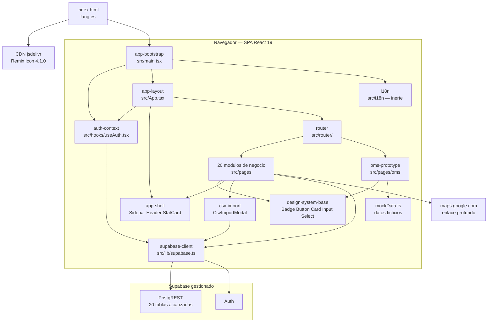
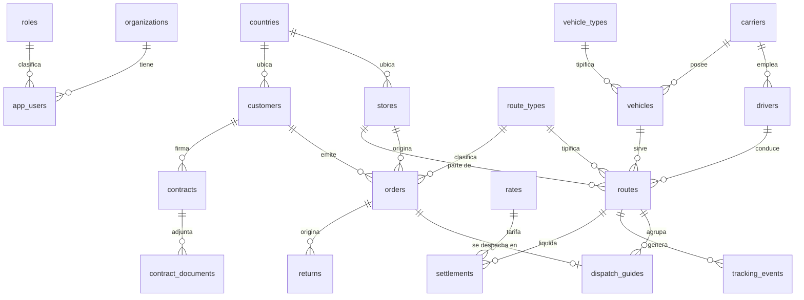
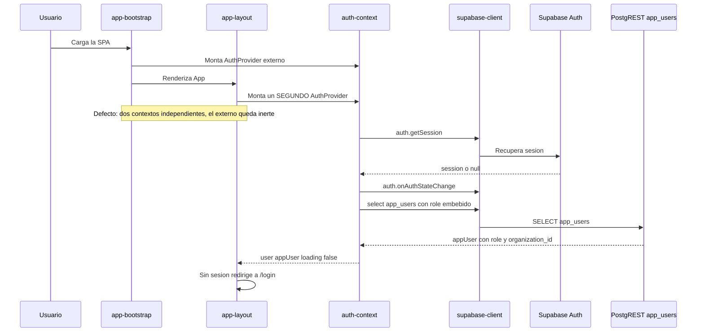
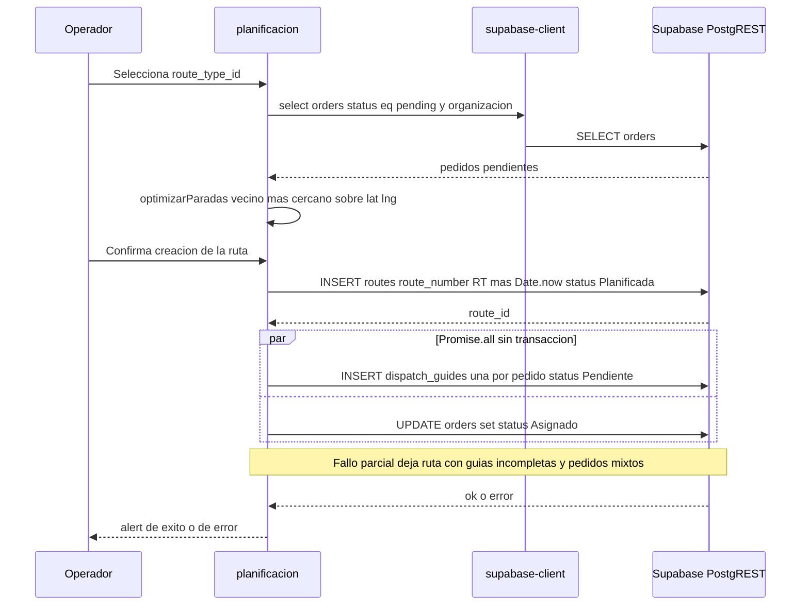
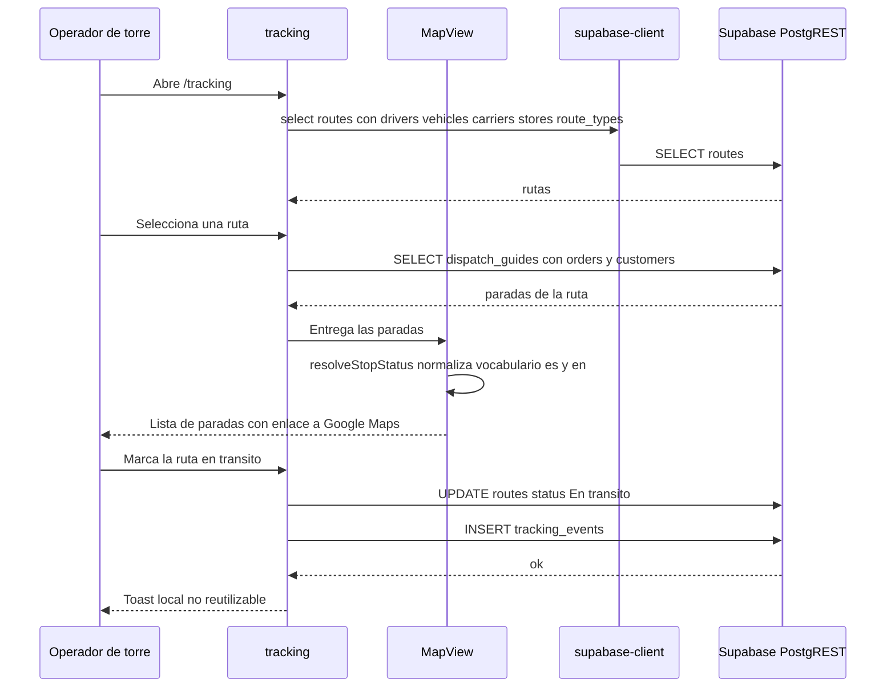
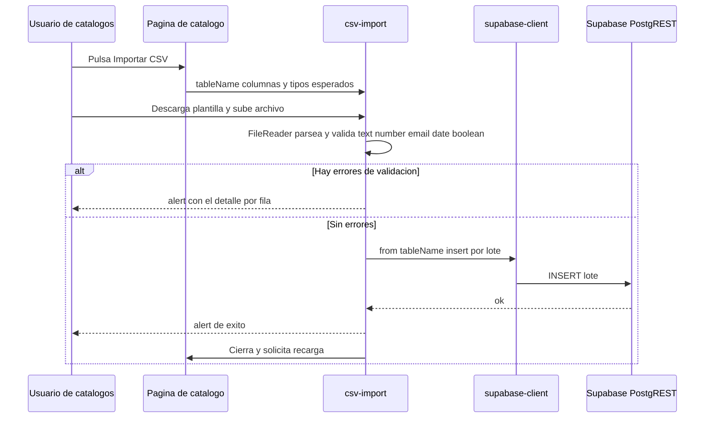
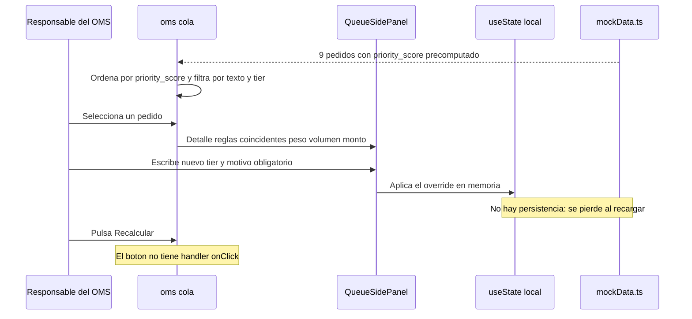
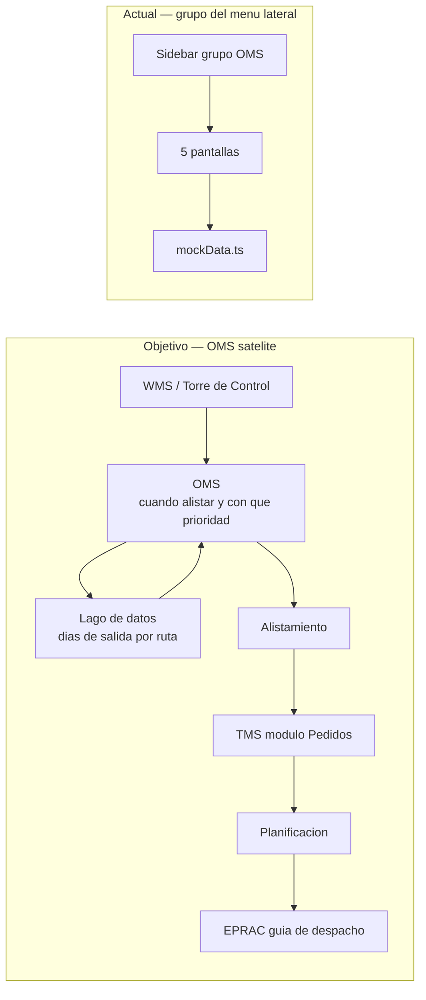

# Arquitectura — STO / TMS OLO

> Arquitectura **observada** en el repositorio `sto_tms_olo` el 2026-08-27. No
> es una propuesta: cada afirmación se sostiene en código leído. Las brechas
> contra la arquitectura objetivo se listan en `## Oportunidades de mejora`.

## Visión general del sistema

`sto_tms_olo` es una **SPA de React 19 en TypeScript** que habla **directamente
con Supabase** desde el navegador. No hay backend propio en el repositorio: cero
endpoints servidos, cero handlers, cero Edge Functions, cero infraestructura como
código.

La consecuencia arquitectónica dominante es que **toda la lógica de negocio vive
en el navegador**, dentro de los componentes de página. No existe capa de
servicios, ni capa `api`, ni controladores: cada `page.tsx` construye sus propias
consultas PostgREST y escribe sus propias mutaciones.

Escala observada: **79 archivos y 19.323 líneas** en `src/` más
`eslint-rules/`. El reparto es revelador: **91,6 % del código vive en
`src/pages/`** (~17.700 líneas), 5,4 % en `src/components/` (~1.050) y 1,0 % en
`src/hooks`, `src/lib`, `src/router` e `src/i18n` juntos (~200). Ese perfil es la
huella exacta de la ausencia de capa de servicios.

## Estilo arquitectónico

**Monolito de frontend sobre BaaS** (Backend as a Service), con acceso a datos
en el cliente.

Evidencia:

- Un único paquete: `package.json` con `"private": true` y `"version": "0.0.0"`.
  `pnpm-workspace.yaml` existe pero **no declara `packages:`** — solo
  `allowBuilds` / `onlyBuiltDependencies`. **No hay monorepo real**; el archivo
  de workspace se usa como lista de aprobación de scripts de build de pnpm.
- Un único cliente de datos, `src/lib/supabase.ts`, importado desde los
  componentes.
- Cero `supabase.rpc(...)`, cero `supabase.functions`, cero `supabase.storage`,
  cero `supabase.channel` / realtime. Supabase se usa exclusivamente como
  **PostgREST + Auth**.
- Ningún artefacto de despliegue: sin `template.yaml`, sin SAM, sin CDK, sin
  CloudFormation, sin Amplify.

Esto **no** es el estilo que prescriben ni la documentación de proyecto ni el
estándar organizacional; ver `## Oportunidades de mejora`.

## Diagrama de componentes

**Fallback en texto.** `index.html` carga el CSS de Remix Icon desde el CDN de
jsdelivr y arranca `app-bootstrap` (`src/main.tsx`). `app-bootstrap` monta
`auth-context`, inicializa `i18n` y renderiza `app-layout` (`src/App.tsx`).
`app-layout` vuelve a montar `auth-context` — defecto conocido —, monta
`app-shell` (Sidebar, Header, StatCard) y delega el contenido a `router`.
`router` resuelve 26 rutas hacia los 20 módulos de negocio y hacia
`oms-prototype`. Los módulos de negocio consumen `design-system-base`,
`app-shell` y `csv-import`, y llaman a `supabase-client`; `oms-prototype` consume
`design-system-base` pero lee de `mockData.ts` y **no llama a Supabase**.
`supabase-client` habla con PostgREST (20 tablas) y con Auth. Un módulo
(`tracking`) abre enlaces profundos a `maps.google.com`.

## Modelo de datos observado

No hay esquema versionado en el repositorio: ni migraciones, ni políticas RLS,
ni DDL. El modelo se **infiere** de las 20 tablas que el código alcanza.

**Fallback en texto.** `organizations` y `roles` clasifican `app_users`.
`countries` ubica `stores` y `customers`. `customers` emite `orders`, que también
referencian `stores` (origen) y `route_types`. `carriers` emplea `drivers` y
posee `vehicles`, tipificados por `vehicle_types`. `routes` referencia
`route_type_id`, `driver_id`, `vehicle_id`, `carrier_id` y `store_id`, agrupa
`dispatch_guides` (una por pedido) y genera `tracking_events`. `orders` origina
`returns`. `routes` se liquida en `settlements`, que consulta `rates`.
`customers` firma `contracts`, que adjuntan `contract_documents`.

Tablas declaradas en el tipo `Database` de `src/lib/supabase.ts` pero **nunca
consultadas**: `users`, `order_items`. Tablas en uso **omitidas** de ese tipo:
`app_users`, `roles`, `route_types`, `vehicle_types`, `contracts`,
`contract_documents`. El tipo tampoco se importa en ningún sitio
(`createClient` se invoca sin genérico), así que la única representación del
esquema en el repositorio es **incorrecta e inerte**.

## Flujo de datos

Un solo patrón, repetido 26 veces con variantes:

1. El componente de página monta y dispara uno o varios `useEffect`.
2. Cada `useEffect` llama a `supabase.from('<tabla>').select(...)` con joins
   PostgREST embebidos, a veces filtrando por `appUser.organization_id`.
3. El resultado se guarda en `useState`, con frecuencia tipado `any[]`.
4. Las mutaciones son `insert` / `update` directos desde el handler del
   componente, seguidos de una recarga manual del listado.
5. El error se comunica con `console.*` y con `alert()`; en varios `catch` se
   traga el error y la UI queda vacía sin avisar.

No hay `AbortController` en todo `src/`, ni caché, ni deduplicación de peticiones,
ni gestión de estado servidor (React Query, SWR, Zustand, Redux: ninguno).

## Diagramas de Interacción

Las cuatro transacciones de negocio que el código realmente ejecuta, más las dos
del prototipo del OMS.

### 1. Arranque de sesión y autenticación

**Fallback en texto.** El usuario carga la SPA. `app-bootstrap` monta un
`AuthProvider` y renderiza `app-layout`, que monta un **segundo** `AuthProvider`.
Cada provider pide `auth.getSession()`, se suscribe a `onAuthStateChange` y hace
un `SELECT` a `app_users` con el rol embebido; por eso el arranque duplica dos
llamadas de red y el provider externo queda inerte. Con la sesión y el `appUser`
resueltos, `app-layout` decide si redirige a `/login` o pinta el layout
autenticado.

### 2. Planificación: pedido → ruta → guía de despacho

Es la **transacción central del negocio** y el **único punto de escritura** de la
cadena en todo el código (`src/pages/planificacion/page.tsx:243-300`).

**Fallback en texto.** El operador elige un `route_type_id`. Planificación carga
los `orders` con `status` `'pending'` de esa ruta y organización, y calcula la
secuencia de paradas con un algoritmo de vecino más cercano sobre la distancia
euclídea de latitud y longitud. Al confirmar, inserta una fila en `routes`
—`route_number` generado en el cliente como `'RT-'` más `Date.now()`, `status`
escrito `'Planificada'`, `capacity_percentage` calculado— y a continuación,
mediante `Promise.all` y **sin transacción**, inserta una `dispatch_guides` por
pedido (`guide_number` como `'GD-'` más `Date.now()` más el número de parada,
`status` `'Pendiente'`) y actualiza `orders.status` a `'Asignado'`. Un fallo
parcial deja rutas con guías incompletas y pedidos en estado mixto, sin
compensación. El desenlace se comunica con `alert()`.

**Fragilidades de esta transacción, relevantes para el OMS:**

- Sin transacción ni compensación en el fan-out de escrituras.
- `route_number` y `guide_number` se generan con `Date.now()` **en el cliente**,
  sin unicidad garantizada bajo concurrencia.
- Sin bloqueo optimista: dos planificadores pueden asignar el mismo pedido a dos
  rutas distintas.
- El estado escrito (`'Asignado'`, `'Planificada'`, `'Pendiente'`) pertenece a un
  vocabulario **distinto** del que leen los demás módulos; ver
  `code-quality-assessment.md` → deuda 1.

### 3. Seguimiento: avance de ruta y eventos

**Fallback en texto.** Tracking carga las rutas con conductor, vehículo,
transportista, punto de origen y tipo de ruta embebidos. Al seleccionar una ruta,
consulta sus `dispatch_guides` con el pedido y el cliente embebidos y entrega las
paradas a `MapView`, que —pese al nombre— **no renderiza ningún mapa**: es una
lista de paradas con insignias y un `href` a `maps.google.com`. `MapView` incluye
`resolveStopStatus()`, que normaliza a mano los vocabularios de estado en español
y en inglés: el defecto de vocabulario ya era conocido y se parcheó localmente en
lugar de corregirse en el modelo. El avance de estado escribe `routes.status`
(`'En tránsito'`, `'Completada'`) e inserta `tracking_events`. Tracking es el
único módulo con notificaciones tipo toast, implementadas en un
`ToastContainer` local no reutilizable.

### 4. Importación masiva de un catálogo maestro

**Fallback en texto.** Cinco catálogos (`conductores`, `paises`, `tiendas`,
`transportistas`, `vehiculos`) abren `CsvImportModal` pasándole el nombre de
tabla y el contrato de columnas con su tipo. El modal ofrece una plantilla
descargable, parsea el archivo con `FileReader` y valida cada campo por tipo
(`text`, `number`, `email`, `date`, `boolean`). Si hay errores los informa con
`alert()`; si no, inserta el lote con `supabase.from(tableName).insert(...)` y
pide a la página que recargue. **`pedidos` y el OMS no lo usan**: la entrada
masiva de pedidos no está implementada.

### 5. Prototipo del OMS: cola de priorización y override manual

**Fallback en texto.** `oms/cola` lee 9 pedidos de `mockData.ts` con el
`priority_score` **precomputado** —no hay motor de cálculo—, los ordena de mayor a
menor y los filtra por texto y por `tier`. Al seleccionar un pedido,
`QueueSidePanel` muestra el detalle, las reglas coincidentes y un formulario de
override que exige motivo (`disabled={!reason.trim()}`). El override solo muta
`useState`, así que se pierde al recargar. El botón "Recalcular" **no tiene
handler**. Esta pantalla es la que materializa la intervención humana permitida
—alterar la prioridad de un pedido puntual— y **no** existe ninguna pantalla ni
paso de aprobación previa al alistamiento, consistente con el hecho vigente
registrado en `business-overview.md`.

### 6. Posicionamiento objetivo del OMS frente al actual

**Fallback en texto.** En el diseño objetivo el OMS es un satélite: recibe el
pedido del WMS o de la Torre de Control, lee y mantiene los días de salida por
ruta en el lago de datos, decide cuándo alistar y con qué prioridad, y solo
después el pedido se hace visible en el módulo Pedidos del TMS, que alimenta
Planificación, que a su vez alimenta EPRAC para la guía de despacho. En el
repositorio actual el OMS es un grupo del menú lateral con cinco pantallas que
leen `mockData.ts`: no está entre el WMS y el TMS, está dentro del TMS.

## Decisiones de diseño observadas

Cada entrada registra la decisión que el código encarna, sus consecuencias y la
alternativa que la documentación o el estándar prescribían. No son decisiones
nuevas: son lecturas de lo ya construido.

| Decisión observada | Consecuencias | Alternativa que el estándar prescribía |
|---|---|---|
| Acceso a datos directo desde el componente, sin capa `api` ni controlador | 91,6 % del código en `src/pages/`; ninguna consulta reutilizable; el vocabulario de estado divergió por módulo | `Page → use<Modulo>Controller → <modulo>Api → axiosApiGateway` con carpetas `src/views/<modulo>/{api,routes,pages,hooks,components}` (`Estandares_Desarrollo_AWS_Intelix.md` §11) |
| Supabase gestionado como único backend | Cero código de servidor que mantener, pero toda la autorización depende de RLS **no verificable desde este repositorio** | PostgreSQL propio sobre Docker en servidor propio (`CONTEXTO_PROYECTO_TMS.md` §3); serverless-first sobre AWS con SAM (estándar §11) |
| `strict: false` y 10 flags de rigor apagados en `tsconfig.app.json` | El tipado no puede detectar los defectos de vocabulario ni los nombres de columna inexistentes | `tsconfig.node.json` del mismo repositorio usa `strict: true`; asimetría deliberada |
| Aislamiento multi-tenant por filtro en el cliente | 13 archivos consultan sin mencionar `organization_id`; el perímetro real depende de RLS | Aislamiento en el servidor por RLS versionada |
| Prototipo del OMS sobre `mockData.ts` | Permite avanzar la Regla 1 sin resolver el origen de datos; **decisión intencional y documentada** como desechable (`PLAN_MODULO_OMS.md` §9) | Esperar a que el equipo de datos defina las tablas del lago |
| Iconografía por CDN, no versionada | Una caída del CDN de jsdelivr deja la app sin iconos en las 26 páginas | Dependencia declarada en `package.json` |
| Gráficos de reportería hechos a mano | Cuatro componentes calculan alturas con aritmética propia, mientras `recharts@3.2.0` está instalado y sin usar | Usar la librería ya instalada |
| Enrutado con dos APIs distintas en el mismo array | 24 rutas con `element` más `lazy()`, 2 rutas (`/guias`, `/tracking`) con `lazy: async`; la regla ESLint local solo vigila `element` | Una sola convención |

## Oportunidades de mejora

Ordenadas por impacto sobre el trabajo del OMS. El detalle y la ubicación de
cada punto están en `code-quality-assessment.md`.

1. **Unificar el vocabulario de estado** de `orders`, `routes`, `vehicles`,
   `drivers` y `dispatch_guides`. Hoy conviven tres vocabularios incompatibles en
   las mismas columnas y el estado se muestra al revés en `pedidos`. Ninguna
   regla de priorización es fiable mientras `status` sea ambiguo.
2. **Versionar el esquema**: migraciones, políticas RLS y tipos generados. Sin
   esto no se puede afirmar que el aislamiento multi-tenant existe, y `orders`
   —la tabla que el OMS va a poblar— está entre las consultadas sin filtro de
   organización.
3. **Introducir infraestructura de pruebas y CI**. Hoy son cero. No hay red de
   seguridad para ninguna refactorización sobre `orders`, `routes` o
   `dispatch_guides`.
4. **Extraer una capa de acceso a datos** por módulo, aunque sea mínima, para que
   el vocabulario de estado y los nombres de columna tengan un único dueño.
5. **Hacer transaccional la cadena ruta → guías → pedidos**, con unicidad de
   `route_number` y `guide_number` en la base y bloqueo optimista.
6. **Construir el submódulo 1 del OMS** (`/oms/rutas-despacho`), inexistente hoy
   y precondición declarada de la Regla 1: sin días de salida por ruta la regla
   no tiene de dónde leer.
7. **Cerrar las tres piezas de esquema que la Regla 1 exige** y que no existen:
   días de salida por ruta, excepciones por cliente y la relación explícita
   cliente ↔ ruta, más `ready_to_prep_date` o equivalente.
8. **Retirar el andamiaje inerte**: `i18n` vacío con la UI en español codificada
   a mano, las 4 dependencias de producción nunca importadas, la provenance del
   generador, el código muerto y la página `/seed` sin guarda.

## Sources

- `package.json`, `pnpm-workspace.yaml`, `pnpm-lock.yaml`, `vite.config.ts`,
  `tsconfig*.json`, `eslint.config.ts` — estilo arquitectónico y build.
- `src/main.tsx`, `src/App.tsx`, `src/router/config.tsx`, `src/router/index.ts` —
  composición y enrutado.
- `src/lib/supabase.ts`, `src/hooks/useAuth.tsx` — capa de datos y sesión.
- `src/pages/planificacion/page.tsx:243-300` — transacción central.
- `src/pages/tracking/page.tsx`, `src/pages/tracking/components/MapView.tsx:32-37`
  y `:92` — seguimiento y `resolveStopStatus`.
- `src/components/feature/CsvImportModal.tsx` — importación masiva.
- `src/pages/oms/` (8 archivos) — prototipo del OMS.
- `CONTEXTO_PROYECTO_TMS.md` §2.4, §3, §4;
  `PLAN_MODULO_OMS.md` §6.1-§6.3, §9;
  `Estandares_Desarrollo_AWS_Intelix.md` §11-§15 — arquitectura objetivo y
  estándar.
- `aidlc/spaces/default/knowledge/documents/2026-08-26-reunion-oms-roles.md`,
  Adenda 2026-08-26 — ausencia de paso de aprobación en el flujo del OMS.

## Assumptions & Open Questions

- Las políticas RLS de Supabase no son verificables desde este repositorio; el
  perímetro de autorización real es **indeterminado** hasta que se versione el
  esquema.
- Los joins que nombran columnas mutuamente excluyentes (`drivers(full_name)`
  frente a `drivers(name)` frente a `drivers(first_name, last_name)`) implican
  que a lo sumo una variante existe; **cuál** es la real no se puede decidir sin
  el esquema.
- El destino de plataforma (Supabase, PostgreSQL propio o AWS serverless) no está
  decidido en ningún artefacto del repositorio.
