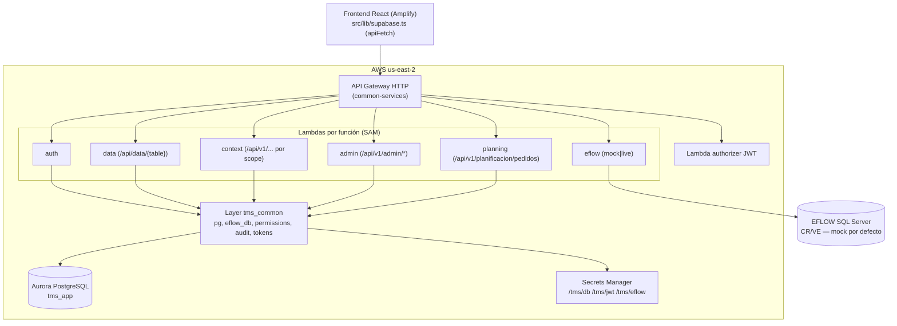

# Arquitectura — STO / TMS OLO

> Arquitectura **observada** en el código real de la rama `oms` el 2026-09-30
> (re-corrida por el pivote WMH). Reemplaza el análisis previo (SPA+Supabase).
> Cada afirmación se sostiene en código leído.

## Visión general

Dos mitades desplegadas por separado, sobre el estándar Intelix AWS:

- **Backend**: **serverless, Python 3.13 + AWS Lambda + SAM**, un stack por
  módulo, colgando de un **API Gateway HTTP compartido**. Persistencia en
  **Aurora PostgreSQL** (`us-east-2`). (Esto confirma el DECIDED C1; el `server/`
  Express es legacy — referencia de contrato, pendiente de retiro.)
- **Frontend**: **SPA React 19 + Vite + TypeScript**, que consume el API vía un
  shim (`src/lib/supabase.ts`) que imita supabase-js pero habla HTTP contra el
  backend. Se despliega a Amplify.

## Estilo arquitectónico del backend

**SAM, un stack por módulo** (no un monolito, no una Lambda por compañía).
Evidencia: 8 `template.yaml` con `Transform: AWS::Serverless-2016-10-31`,
`Runtime: python3.13`, `Handler: app.handler`, `Architectures: [x86_64]`:
`backend/{secrets,common-services,auth,data,context,eflow,admin,planning}/`.

- **`common-services`** publica el HTTP API compartido (`AWS::ApiGatewayV2`), un
  **Lambda authorizer JWT** (`src/authorizer/`), la **Layer `tms_common`** y el
  rol IAM. Los demás stacks cuelgan sus rutas de ese API con `Fn::ImportValue`
  (`${CommonStackName}-HttpApiId`, `-JwtAuthorizerId`, `-LambdaRoleArn`,
  `-DbSecretName`) creando `AWS::ApiGatewayV2::Route` + `Integration` (AWS_PROXY,
  payload 2.0). La Layer se referencia por parámetro **SSM**
  (`/<env>/tms/common-layer-arn`), no por export (un export en uso bloquea
  publicar versiones nuevas).
- **Lambdas por FUNCIÓN**: cada módulo es una `AWS::Serverless::Function` por
  dominio (auth, data, context, eflow, admin, planning). `admin` tiene además una
  Lambda programada `AuditMaintenanceFunction` (EventBridge ScheduleV2, cron días
  hábiles 06:00 CR, particiones mensuales de `audit.events`; Aurora se apaga
  fuera de horario, ver `infra/horarios`).

### Handler pattern uniforme

Cada `app.py` declara un dict `ROUTES = {"MÉTODO /path": funcion}` y exporta
`handler = tms_handler(ROUTES)` (de la Layer `tms_common/handler.py`).
`dispatch()` resuelve por `route_key(event)` (método+path de API Gateway v2) y en
rutas de escritura hace `audit.bind(event)` para que el trigger de BD registre el
actor. Forma de error uniforme `{data:null, error:{message}}`.

### Diagrama (backend)

```mermaid
flowchart TB
  fe["Frontend React (Amplify)<br/>src/lib/supabase.ts (apiFetch)"]
  subgraph aws["AWS us-east-2"]
    api["API Gateway HTTP<br/>(common-services)"]
    authz["Lambda authorizer JWT"]
    subgraph lambdas["Lambdas por función (SAM)"]
      auth["auth"]
      data["data (/api/data/{table})"]
      ctx["context (/api/v1/... por scope)"]
      eflow["eflow (mock|live)"]
      admin["admin (/api/v1/admin/*)"]
      plan["planning (/api/v1/planificacion/pedidos)"]
    end
    layer["Layer tms_common<br/>pg, eflow_db, permissions, audit, tokens"]
    aurora[("Aurora PostgreSQL<br/>tms_app")]
    sm["Secrets Manager<br/>/tms/db /tms/jwt /tms/eflow"]
  end
  eflowsrc[("EFLOW SQL Server<br/>CR/VE — mock por defecto")]

  fe --> api
  api --> authz
  api --> auth & data & ctx & eflow & admin & plan
  auth & data & ctx & admin & plan --> layer
  layer --> aurora
  layer --> sm
  eflow --> eflowsrc
```

**Fallback en texto.** El frontend llama al API Gateway HTTP compartido; el
authorizer JWT valida el bearer; cada ruta enruta a la Lambda de su módulo. Todas
usan la Layer `tms_common` para hablar con Aurora (usuario `tms_app`) y leer
secretos. `eflow` habla con los SQL Server de EFLOW (mock por defecto).

## Frontend

React 19 SPA (Vite + TS). El acceso a datos NO usa Supabase real: `src/lib/
supabase.ts` es un **shim** — `apiFetch(path)` antepone `${VITE_API_BASE}/api`,
adjunta `Authorization: Bearer` desde `localStorage` (`tms_session`), y una clase
`QueryBuilder` traduce `.from(table).select().eq()...` a HTTP contra
`/api/data/{table}`. En dev, Vite proxya `/api` a `:4000` (Lambdas locales de
`backend/local/serve.py`). La lógica de negocio pesada (tarifas, priorización,
armado de viajes) vive en módulos TS puros bajo `src/lib/` y `src/pages/*/`.

## Multi-tenancy — por SCOPE, no por compañía

Confirmado en `backend/context/src/scopes.py`: `resolve_scopes()` lee
`user_scopes` (role_id, country_id, warehouse_id, customer_id) por `app_user`; un
scope con país/almacén/cliente todos null = **GLOBAL**; `covers()` implementa la
cascada (un scope de país cubre sus almacenes y clientes); `authorize()` es
**fail-closed** (sin scope → 403). `data/src/app.py` filtra lecturas y escrituras
por los países del rol (`caller.country_filter`, `_require_allowed_countries`).
**No existe ninguna Lambda por compañía**: cada módulo es una función por
dominio. Esto confirma el DECIDED C3-SUPERSEDE (reglas con scope
CUSTOMER→WAREHOUSE→COUNTRY→GLOBAL en Lambdas compartidas).

## Persistencia y datos del OMS

- Aurora PostgreSQL, usuario app `tms_app` (sin DDL). Jerarquía
  **País→Almacén→Cliente→Cliente Final→Punto de entrega** ya implementada
  (`context` module: `countries`, `warehouses`, `customers`, `final_customers`,
  `delivery_points`, `addresses`, `contacts`).
- Puente OMS→Planificación: tabla staging **`wms_expediciones`** (situación
  `GENE` sin viaje WMH; `fecha_planificada` = fecha de entrega). Es el header;
  **no trae peso/volumen** (vienen de `EXPEDICIONESCABECERA` en EFLOW, hoy mock).
- Bitácora de auditoría: trigger de BD escribe `audit.events` (solo inserción,
  particionada por mes), con before/after y actor.

## Decisiones de arquitectura observadas

| Decisión observada | Consecuencia | Nota |
|---|---|---|
| Backend serverless SAM, Lambda por función | Escala por función; despliegue selectivo por módulo | Confirma C1 (Python/SAM); Express legacy |
| Multi-tenancy por scope país→almacén→cliente | Un mismo perfil ve varias compañías; aislamiento en repositorio, no en UI | Confirma C3-SUPERSEDE |
| Lógica de reglas en TS de frontend (`src/lib/tarifas/`, `priorityEngine.ts`) | El backend aún no tiene motor de reglas | Deuda del pivote (C2, abierta) |
| API genérica `/api/data` con lista blanca + permisos por módulo | CRUD uniforme; `app_users`/`roles`/`user_scopes` solo por `/admin` (403 en genérica) | Cierra hueco de auto-escalada de rol |
| EFLOW tras interfaz mock/live | Todo el sistema desarrollable sin credenciales reales | `EflowMode=mock` default |

## Sources

- `backend/README.md`, `backend/admin/template.yaml` (estilo SAM/serverless).
- `backend/common-services/` (API compartido, authorizer, Layer).
- `backend/context/src/scopes.py` (multi-tenancy por scope).
- `backend/data/src/app.py`, `table_modules.py` (API genérica + permisos).
- `backend/planning/src/app.py` (puente OMS→Planificación).
- `backend/eflow/src/app.py` (mock/live).
- `src/lib/supabase.ts` (shim del frontend).
- `docs/decisions/0002-backend-lambdas-python-sam.md`, `docs/arquitectura-tms-oms/`.

## Assumptions & Open Questions

- La réplica de `EFLOW_OLO` no existe; EFLOW corre en mock.
- El motor de reglas del backend no existe aún (C2 abierta): ¿se porta el AST de
  `src/lib/tarifas/` (TS) a Python en el backend? Riesgo de regresión en
  Liquidaciones (ya en uso).
- Rutas EFLOW son públicas (sin authorizer, heredado del Express) — pendiente de
  seguridad reconocido.
