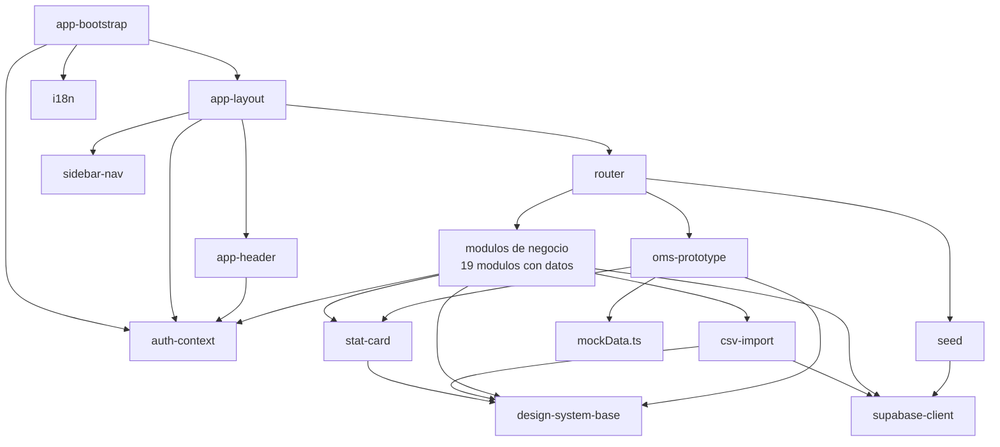

# Inventario de componentes — STO / TMS OLO

> Inventario completo de los componentes lógicos del repositorio `sto_tms_olo`
> al 2026-08-27, con responsabilidad y dependencias de cada uno.

## Cómo leer este inventario

Cada componente es un encabezado de tercer nivel cuyo texto es su **nombre
canónico**. Esos nombres son los que `reverse-engineering-timestamp.md` referencia
en `analyzed.components`, así que se escriben en forma de identificador estable y
no se traducen.

Cada entrada indica:

- **Ruta**: ubicación en el repositorio.
- **Responsabilidad**: qué hace y qué no hace.
- **Depende de**: componentes internos y superficies externas que consume.
- **Profundidad de análisis**: `profundo` cuando el código se leyó y entendió;
  `superficial` cuando solo se inventarió por búsqueda, sin lectura íntegra.

Los componentes marcados `superficial` **no** aparecen en `analyzed.components`
del bloque de alcance: su descripción aquí es de inventario, no de análisis.

## Composición y plataforma

### app-bootstrap

- **Ruta**: `src/main.tsx`
- **Responsabilidad**: arranque de React 19 con `createRoot` y `StrictMode`;
  monta `AuthProvider` e inicializa `i18n`; renderiza `app-layout`.
- **Depende de**: `auth-context`, `app-layout`, `i18n`, `react-dom`.
- **Defecto conocido**: monta `AuthProvider` en la línea 10, y `app-layout`
  vuelve a montarlo — dos contextos independientes; el externo queda inerte.
- **Profundidad de análisis**: profundo.

### app-layout

- **Ruta**: `src/App.tsx`
- **Responsabilidad**: layout autenticado y guardas de sesión; monta el shell de
  navegación y delega el contenido al enrutador; redirige a `/login` sin sesión.
- **Depende de**: `auth-context`, `sidebar-nav`, `app-header`, `router`.
- **Defecto conocido**: envuelve `AppLayout` en un segundo `AuthProvider`
  (`src/App.tsx:65`), duplicando `auth.getSession()`, la suscripción
  `onAuthStateChange` y el `SELECT` a `app_users`.
- **Profundidad de análisis**: profundo.

### router

- **Ruta**: `src/router/config.tsx`, `src/router/index.ts`
- **Responsabilidad**: declara 26 rutas con `React.lazy` y las resuelve con
  `useRoutes`; expone un puente global `window.REACT_APP_NAVIGATE`.
- **Depende de**: `react-router-dom` 7.18.2, todos los módulos de página.
- **Defectos conocidos**: `HomePage` declarado con `lazy()` en
  `config.tsx:4` y nunca usado; `navigatePromise` exportado en `index.ts:14` sin
  importadores; `window.REACT_APP_NAVIGATE` asignado en un `useEffect` **sin
  array de dependencias** (`index.ts:20-24`), reasignado en cada render; dos APIs
  de ruta en el mismo array (`element` en 24 rutas, `lazy: async` en `/guias` y
  `/tracking`).
- **Profundidad de análisis**: profundo.

### supabase-client

- **Ruta**: `src/lib/supabase.ts`
- **Responsabilidad**: único cliente Supabase del sistema y única declaración de
  esquema (`Database`).
- **Depende de**: `@supabase/supabase-js` 2.57.4, variables
  `VITE_PUBLIC_SUPABASE_URL` y `VITE_PUBLIC_SUPABASE_ANON_KEY`.
- **Defectos conocidos**: `throw` a nivel de módulo si faltan las variables
  (`:7-9`), lo que da pantalla en blanco sin diagnóstico en un clon limpio sin
  `README` ni `.env.example`; el tipo `Database` declara 16 tablas **todas
  `any`**, incluye `users` y `order_items` que nadie consulta, **omite** 6 tablas
  en uso (`app_users`, `roles`, `route_types`, `vehicle_types`, `contracts`,
  `contract_documents`) y **no se importa en ningún sitio** —`createClient` se
  invoca sin genérico.
- **Profundidad de análisis**: profundo.

### auth-context

- **Ruta**: `src/hooks/useAuth.tsx`
- **Responsabilidad**: contexto de sesión sobre Supabase Auth y carga del perfil
  de aplicación desde `app_users` con `role:roles(...)` embebido; expone
  `user`, `appUser`, `loading` y las acciones de inicio y cierre de sesión.
- **Depende de**: `supabase-client`.
- **Consumido por**: `app-bootstrap`, `app-layout`, `app-header`, y los módulos
  que filtran por `appUser.organization_id`.
- **Profundidad de análisis**: profundo.

### i18n

- **Ruta**: `src/i18n/index.ts`, `src/i18n/local/index.ts`
- **Responsabilidad**: **inerte en la práctica.** Inicializa i18next con
  `lng: 'en'` y `fallbackLng: 'en'`, y recorre `import.meta.glob('./*/*.ts')`
  sobre un directorio **sin ningún subdirectorio de idioma**, así que `messages`
  siempre es `{}`.
- **Depende de**: `i18next` 25.4.1, `react-i18next` 15.7.4,
  `i18next-browser-languagedetector` 8.2.1.
- **Defectos conocidos**: `useTranslation` y `Trans` están auto-importados y
  declarados como globales de ESLint pero **no se usan en ninguna de las 26
  páginas**; todo el texto visible está en español literal en el JSX; hay un
  comentario en chino sin traducir en `src/i18n/local/index.ts:18`.
- **Profundidad de análisis**: profundo.

## Design system

### design-system-base

- **Ruta**: `src/components/base/` — 5 archivos, 179 líneas
- **Responsabilidad**: el vocabulario visual completo del sistema. Todos por
  debajo del límite de 120 líneas del estándar.
- **Depende de**: nada más que React y Tailwind.

| Componente | Líneas | Responsabilidad | API |
|---|---|---|---|
| `Button.tsx` | 42 | Botón único del sistema | `variant: primary\|secondary\|danger\|success\|ghost`, `size: sm\|md\|lg`, `icon`; hereda `ButtonHTMLAttributes` |
| `Input.tsx` | 52 | Campo de texto con label, error e icono | `label`, `error`, `icon` (`ReactNode` o clase `ri-*`); `forwardRef` |
| `Select.tsx` | 43 | Desplegable | `label`, `error`, `options: {value,label}[]` o `children`; `forwardRef` |
| `Badge.tsx` | 28 | Píldora de estado | `variant: default(slate)\|success(emerald)\|warning(amber)\|danger(red)\|info(teal)`, `size: sm\|md` |
| `Card.tsx` | 14 | Contenedor de superficie | `padding?: boolean`, `className` |

Las 5 variantes de `Badge` son el **único vocabulario visual de estado** del
sistema, y `PLAN_MODULO_OMS.md` §4 las reserva explícitamente para
`priority_tier` y para el estado de las reglas.

- **Profundidad de análisis**: profundo (los 5 archivos íntegros).

## Componentes de dominio compartidos

`sidebar-nav`, `app-header` y `stat-card` forman en conjunto el shell de la
aplicación; `csv-import` es transversal a los catálogos.

### sidebar-nav

- **Ruta**: `src/components/feature/Sidebar.tsx` — 200 líneas
- **Responsabilidad**: navegación primaria. 11 entradas planas más 2 grupos
  colapsables — **OMS** con 5 hijos y **Catálogos** con 7. Colapsable a 80 px;
  resaltado por `location.pathname`.
- **Depende de**: `react-router-dom`.
- **Nota**: el grupo **OMS** materializa el prototipo dentro de la SPA, lo que
  contradice el posicionamiento del OMS como satélite externo al TMS. `/seed` no
  aparece en el menú aunque sí está enrutada.
- **Profundidad de análisis**: profundo.

### app-header

- **Ruta**: `src/components/feature/Header.tsx` — 199 líneas
- **Responsabilidad**: barra fija con buscador global, panel de notificaciones,
  menú de perfil con iniciales, insignia de rol y cierre de sesión.
- **Depende de**: `auth-context`, `react-router-dom`.
- **Defectos conocidos**: el buscador global **no tiene lógica**; las
  notificaciones son **3 entradas codificadas a mano**; mapea 5 roles a colores
  (`SuperUsuario`, `Admin`, `Operaciones`, `Chofer`, `Cliente`), que coinciden
  solo parcialmente con los 4 de `CONTEXTO_PROYECTO_TMS.md` §4 — `Chofer` es
  adicional en el código.
- **Profundidad de análisis**: profundo.

### stat-card

- **Ruta**: `src/components/feature/StatCard.tsx` — 47 líneas
- **Responsabilidad**: tarjeta de KPI con título, valor, icono `ri-*`, tendencia
  opcional y 5 colores.
- **Depende de**: `design-system-base` (`Card`).
- **Consumido por**: `dashboard`, `oms-prototype` (panel).
- **Profundidad de análisis**: profundo.

### csv-import

- **Ruta**: `src/components/feature/CsvImportModal.tsx` — 467 líneas
- **Responsabilidad**: importación CSV genérica en 3 pasos: plantilla
  descargable, parseo en cliente con `FileReader`, validación por tipo
  (`text | number | email | date | boolean`) e inserción por lote vía
  `supabase.from(tableName).insert(...)`.
- **Depende de**: `design-system-base` (`Button`), `supabase-client`,
  `FileReader`.
- **Consumido por** 5 catálogos: `conductores`, `paises`, `tiendas`,
  `transportistas`, `vehiculos`. **No** lo usan `pedidos` ni el OMS.
- **Defectos conocidos**: 467 líneas frente al límite de 200 del estándar;
  3 usos de `alert()` como canal de error y de éxito.
- **Profundidad de análisis**: profundo (contrato de props, validación y
  consumidores).

## Módulos de página analizados en profundidad

### dashboard

- **Ruta**: `src/pages/dashboard/page.tsx` — 215 líneas; rutas `/` y `/dashboard`
- **Responsabilidad**: 4 KPIs por `count: 'exact', head: true` más las 5 rutas
  más recientes.
- **Depende de**: `stat-card`, `design-system-base`, `supabase-client`; tablas
  `orders`, `routes`, `dispatch_guides`, `returns`.
- **Defectos conocidos**: **sin filtro por organización**; filtra
  `routes.status` por `'in_progress'` (`:25`) y `dispatch_guides.delivery_status`
  por `'delivered'` (`:26`), vocabulario que solo produce el sembrador, así que
  los KPIs cuentan casi únicamente datos de `seed`; `catch` que traga el error y
  deja la UI vacía (`:47-49`); usa `drivers(full_name)` (`:31`).
- **Profundidad de análisis**: profundo.

### pedidos

- **Ruta**: `src/pages/pedidos/page.tsx` — 192 líneas; ruta `/pedidos`
- **Responsabilidad**: listado de pedidos con cliente y punto de entrega
  embebidos. **Es el listado del que parte el OMS.**
- **Depende de**: `design-system-base`, `supabase-client`; `orders` con join a
  `customers` y `stores`.
- **Defectos conocidos**: subtítulo "Gestión de pedidos desde WMS" pero el botón
  "Importar Pedidos" **no tiene handler**; paginación no funcional;
  `useState<any[]>` (`:10`); **sin filtro por organización**; `catch` que traga
  el error (`:36-38`); su `statusMap` (`:44-49`) espera
  `pending | assigned | in_route | delivered | cancelled` mientras
  `planificacion` escribe `'Asignado'`, de modo que un pedido asignado se pinta
  como **"Pendiente"** — el estado se muestra al revés.
- **Profundidad de análisis**: profundo.

### oms-prototype

- **Ruta**: `src/pages/oms/` — 8 archivos, 844 líneas; rutas `/oms/*`
- **Responsabilidad**: prototipo visual de la priorización de alistamiento.
  5 pantallas (`panel`, `cola`, `reglas`, `simulador`, `auditoria`) más
  `PriorityBadge` y `QueueSidePanel`.
- **Depende de**: `design-system-base`, `stat-card` y `src/pages/oms/mockData.ts`.
  **Cero llamadas a Supabase.**
- **Alineación con el design system**: perfecta — usa exclusivamente `Card`,
  `Button`, `Badge`, `Input`, `Select` y `StatCard`, sin kits nuevos ni colores
  fuera de slate y teal más los 5 de estado. Es el único módulo del repositorio
  que **cumple** los límites de tamaño del estándar (pantallas 75-129,
  componentes 22 y 130).
- **Deuda intencional y documentada** (`PLAN_MODULO_OMS.md` §9 lo declara
  desechable): el override manual (`cola/page.tsx:26-34`) y el alta de reglas
  (`reglas/page.tsx:22-34`) solo mutan `useState`; el botón "Recalcular" no
  tiene handler; la condición de las reglas es **texto libre**, no estructura
  evaluable; el `priority_score` viene precomputado, sin motor de cálculo; el
  simulador tiene una sola regla codificada
  (`BOOST_RULE_LABEL = 'Producto perecedero'`, `BOOST_POINTS = 25`);
  `panel/page.tsx:46` navega con `<a href="/oms/cola">` en vez de `<Link>`;
  `QueueSidePanel.tsx:104` invierte la prop `padding` de `Card`.
- **Alineación con el negocio vigente**: el override manual del panel lateral es
  la **única** intervención humana prevista —alterar la prioridad de un pedido
  puntual—, y **no existe** ninguna pantalla de aprobación previa al
  alistamiento, lo que coincide con el hecho confirmado de que el cálculo es
  100 % automático.
- **Faltante estructural**: el submódulo 1 del plan, "Mantenimiento de Rutas y
  Días de Despacho" en `/oms/rutas-despacho`, **no existe** ni en el enrutador,
  ni en el menú, ni en el árbol.
- **Profundidad de análisis**: profundo (los 8 archivos íntegros).

### planificacion

- **Ruta**: `src/pages/planificacion/page.tsx` — 392 líneas más 4 componentes,
  1.129 en total; ruta `/planificacion`
- **Responsabilidad**: **único escritor real de la cadena pedido → ruta → guía.**
  Selecciona tipo de ruta, carga pedidos pendientes, secuencia paradas con
  `optimizarParadas()` (vecino más cercano sobre distancia euclídea de latitud y
  longitud) y crea `routes` más una `dispatch_guides` por pedido.
- **Depende de**: `design-system-base`, `supabase-client`; `route_types`,
  `vehicles`, `carriers`, `drivers`, `orders`, `routes`, `dispatch_guides`.
- **Defectos conocidos**: escrituras con `Promise.all` **sin transacción** ni
  compensación (`:243-300`); `route_number` y `guide_number` generados con
  `Date.now()` en el cliente; sin bloqueo optimista; escribe
  `orders.status = 'Asignado'` (`:297`) pero filtra por `'pending'` (`:169`);
  escribe `routes.status = 'Planificada'` (`:267`) y
  `dispatch_guides.status = 'Pendiente'` (`:288`); usa `drivers(full_name)`
  (`:143`); 3 usos de `alert()`.
- **Profundidad de análisis**: profundo la página; superficial sus 4
  componentes (solo interfaces y props).

### tracking

- **Ruta**: `src/pages/tracking/page.tsx` — 668 líneas más 3 componentes, 1.377
  en total; ruta `/tracking`
- **Responsabilidad**: avance de estado de ruta y registro de eventos de
  seguimiento; vista de paradas.
- **Depende de**: `design-system-base`, `supabase-client`; `routes`,
  `route_types`, `dispatch_guides` con `orders` y `customers`, `tracking_events`.
- **Componente destacado**: `components/MapView.tsx` (372 líneas) **no renderiza
  ningún mapa**: es una lista de paradas con insignias y un `href` a
  `maps.google.com` (`:92`). Incluye `resolveStopStatus()` (`:32-37`), que
  normaliza a mano el vocabulario de estado en español y en inglés — evidencia de
  que el defecto de vocabulario era conocido y se parcheó localmente en vez de en
  el modelo.
- **Defectos conocidos**: escribe `'En tránsito'` y `'Completada'` en
  `routes.status`; `catch` que traga el error y hace
  `setSelectedRouteStops([])` (`:279-281`); `ToastContainer` local no
  reutilizable; usa `drivers(full_name)` (`:188`).
- **Profundidad de análisis**: profundo las interfaces, consultas y mutaciones de
  estado de la página, y `MapView` íntegro; superficial `RouteCard.tsx` y
  `TrackingTimeline.tsx`.

### guias

- **Ruta**: `src/pages/guias/page.tsx` — 318 líneas más `GuideModal` 263, 581 en
  total; ruta `/guias`
- **Responsabilidad**: gestión de guías de despacho.
- **Depende de**: `design-system-base`, `supabase-client`; `dispatch_guides`,
  `routes`, `drivers`, `vehicles`.
- **Defectos conocidos**: usa `drivers(name)` (`:59`), variante **probablemente
  inexistente**; tipa `delivery_status` como
  `'pending' | 'in_transit' | 'delivered' | 'failed'` (`:20`) mientras
  `planificacion` escribe `status = 'Pendiente'` en la misma tabla; cascada de
  `useEffect` (`:45-49`); **sin filtro por organización**; `catch` que traga el
  error; ruta declarada con `lazy: async` en lugar de `element`.
- **Profundidad de análisis**: profundo la página; superficial `GuideModal`.

### devoluciones

- **Ruta**: `src/pages/devoluciones/page.tsx` — 400 líneas más `ReturnModal` 246,
  646 en total; ruta `/devoluciones`
- **Responsabilidad**: logística inversa. 4 estados:
  `pending | approved | rejected | completed`.
- **Depende de**: `design-system-base`, `supabase-client`; `returns`, `orders`.
- **Defectos conocidos**: renderiza un `<Header />` propio (`:168`) además del
  que ya monta `app-layout`, superponiendo cabeceras fijas; cascada de
  `useEffect` (`:69-73`); **sin filtro por organización**.
- **Profundidad de análisis**: profundo la página; superficial `ReturnModal`.

### liquidaciones

- **Ruta**: `src/pages/liquidaciones/page.tsx` — 539 líneas más `SettlementModal`
  893, 1.432 en total; ruta `/liquidaciones`, etiquetada "Tarifas" en el menú
- **Responsabilidad**: liquidación por ruta cruzando transportista, conductor,
  tarifas, guías y devoluciones.
- **Depende de**: `design-system-base`, `supabase-client`; `settlements`,
  `routes`, `carriers`, `drivers`, `rates`, `dispatch_guides`, `returns`.
- **Defectos conocidos**: `SettlementModal` es el componente más grande del
  repositorio (893 líneas frente al límite de 200) y usa **dos variantes del
  join de `drivers` en el mismo archivo** (`full_name` en `:126`, `name` en
  `:155`); la página usa `drivers(name, document)` (`:52`), una **tercera**
  variante; `useState<any[]>` en `:10,25,26`; renderiza `<Sidebar />` y
  `<Header />` propios (`:201,204`); discrepancia entre la ruta y su etiqueta de
  menú.
- **Profundidad de análisis**: profundo la página; superficial sus componentes.

### contratos

- **Ruta**: `src/pages/contratos/page.tsx` — 338 líneas más `ContractModal` 412 y
  `DocumentsList` 277, 1.027 en total; ruta `/contratos`
- **Responsabilidad**: contratos con autorrenovación (`auto_renew`) y alerta de
  vencimiento (`alert_days_before`); documentos asociados.
- **Depende de**: `design-system-base`, `supabase-client`; `contracts` (24
  columnas), `contract_documents`.
- **Nota positiva**: **único módulo que usa el alias `@/`** (3 archivos, 17
  imports) y la entidad `Contract` está completamente tipada — el mejor tipado
  del repositorio.
- **Defectos conocidos**: `contract_documents.file_url` es texto libre, sin
  subida real de archivos; `DocumentsList` formatea con `'es-ES'` mientras otros
  módulos usan `'es-CL'`.
- **Profundidad de análisis**: profundo la página; superficial sus componentes.

### reportes

- **Ruta**: `src/pages/reportes/page.tsx` — 528 líneas más 4 gráficos, 939 en
  total; ruta `/reportes`
- **Responsabilidad**: reportería operativa con 4 gráficos.
- **Depende de**: `design-system-base`, `supabase-client`; `orders`, `routes`,
  `returns`, `drivers`.
- **Defectos conocidos**: los 4 gráficos están **hechos a mano** con elementos
  HTML y Tailwind mientras `recharts@3.2.0` está instalado y sin usar —
  `OrdersChart.tsx` calcula alturas con `(item.value / maxValue) * 100`;
  exportación implementada con `alert()`; usa
  `drivers(first_name, last_name)` (`:232`), una **cuarta** variante del join;
  compara `orders.status` con `'delivered'` y `'cancelled'`; **sin filtro por
  organización**; formatea con `'es-ES'`.
- **Profundidad de análisis**: profundo la página y `OrdersChart.tsx`;
  superficial `RoutesChart.tsx`, `ReturnsChart.tsx` y `DriversRanking.tsx`.

### clientes

- **Ruta**: `src/pages/clientes/page.tsx` — 348 líneas más `CustomerModal` 473,
  821 en total; ruta `/clientes`
- **Responsabilidad**: maestro de clientes con zona de entrega y coordenadas.
- **Depende de**: `design-system-base`, `supabase-client`; `customers`,
  `countries`.
- **Nota de modelo**: `customers` usa `is_active` booleano en lugar de una
  columna `status`, a diferencia del resto del esquema; tiene `delivery_zone`,
  `latitude` y `longitude`, todos reutilizables por el OMS.
- **Defectos conocidos**: **sin filtro por organización** ni en la página ni en
  `CustomerModal`; 2 usos de `alert()`; `catch` que traga el error.
- **Profundidad de análisis**: profundo la página; superficial `CustomerModal`.

### seed

- **Ruta**: `src/pages/seed/page.tsx` — 912 líneas; ruta `/seed`
- **Responsabilidad**: siembra datos de prueba con `supabase.insert()` directo:
  5 países, 3 transportistas, 8 vehículos, 8 conductores, 8 tiendas y 4 rutas.
- **Depende de**: `supabase-client`.
- **Riesgo**: **escritura en producción, enrutada y sin guarda.** Accesible por
  URL a cualquier usuario autenticado; no aparece en el menú pero sí está en el
  array de rutas, sin comprobación de rol ni de entorno.
- **Impacto sobre el OMS**: **no siembra `orders` ni `customers`** — las dos
  tablas que el OMS necesita para probar la Regla 1. Además inserta vocabulario
  de estado propio (`routes.status` `completed | in_progress | planned`,
  `vehicles.status` `'Disponible'`, `drivers.status` `'Activo'`) que los filtros
  del resto del código no encuentran.
- **Profundidad de análisis**: profundo.

### not-found

- **Ruta**: `src/pages/NotFound.tsx` — 17 líneas; ruta `*`
- **Responsabilidad**: página de ruta desconocida.
- **Defecto conocido**: conserva el texto del generador **en inglés** ("This page
  has not been generated", "Tell me more about this page, so I can generate it"),
  visible al usuario final de una aplicación en español.
- **Profundidad de análisis**: profundo.

### home-dead-code

- **Ruta**: `src/pages/home/page.tsx` — 11 líneas; **sin ruta**
- **Responsabilidad**: ninguna. **Código muerto.** Navega a `'/'` en un
  `useEffect`, lo que sería un bucle si se enrutara. `HomePage` se declara con
  `lazy()` en `src/router/config.tsx:4` y nunca se usa: la ruta `/` apunta a
  `dashboard`.
- **Profundidad de análisis**: profundo.

## Módulos de página inventariados en superficie

Estos módulos se inventariaron por búsqueda —tablas que tocan, tamaño,
componentes— **sin lectura íntegra del JSX**. No forman parte de
`analyzed.components`.

### catalogos-tiendas

- **Ruta**: `src/pages/tiendas/` — 586 más `StoreModal` 612 más 40, 1.238 en
  total; ruta `/tiendas`, etiquetada "Puntos de Entrega"
- **Datos**: `stores` (~22 columnas: `latitude`, `longitude`, `capacity`,
  `area_m2`, `delivery_zone`, `is_origin`, `store_type` con
  `distribution_center | warehouse | store`), `countries`, `app_users`.
- **Consume** `csv-import`. **Profundidad**: superficial.

### catalogos-paises

- **Ruta**: `src/pages/paises/` — 482 más `CountryModal` 349 más 48, 879 en
  total; ruta `/paises`
- **Datos**: `countries` (`code`, `iso_code`, `currency`, `timezone`,
  `phone_code`, `flag_emoji`, `capital`, `language`), `stores`, `app_users`.
- **Consume** `csv-import`. **Profundidad**: superficial.

### catalogos-rutas

- **Ruta**: `src/pages/rutas/` — 377 más 172 más 140 más 82, 771 en total; ruta
  `/rutas`
- **Datos**: `routes`, `route_types`. **`route_types` es el catálogo del que
  depende la Regla 1 del OMS.**
- **Defectos conocidos**: renderiza `<Sidebar />` y `<Header />` propios en dos
  bloques (`:114-134`); 4 usos de `alert()`;
  `RouteTypeDeleteModal.tsx` consulta **sin filtro por organización**.
- **Profundidad**: superficial.

### catalogos-vehiculos

- **Ruta**: `src/pages/vehiculos/` — 671 más 327 más 197 más 69, 1.264 en total;
  ruta `/vehiculos`, con pestañas `vehiculos | tipos`
- **Datos**: `vehicles` (`capacity_kg`, `capacity_m3`, `plate`),
  `vehicle_types`, `carriers`.
- **Defectos conocidos**: `VehicleModal.tsx:29,65` escribe `status` `'activo'`
  mientras `seed` inserta `'Disponible'` en 8 filas y otras consultas filtran
  `.eq('status','active')` — tres valores incompatibles; renderiza `<Sidebar />`
  y `<Header />` propios (`:196,198`); `VehicleTypeDeleteModal.tsx` consulta sin
  filtro por organización.
- **Consume** `csv-import`. **Profundidad**: superficial.

### catalogos-conductores

- **Ruta**: `src/pages/conductores/` — 503 más `DriverModal` 292, 795 en total;
  ruta `/conductores`
- **Datos**: `drivers`, `carriers`, `app_users`.
- **Defectos conocidos**: `seed` inserta `drivers.status` `'Activo'` en 8 filas
  mientras 6 consultas filtran `.eq('status','active')`; usa `auth.getUser()`
  disperso en lugar del contexto.
- **Consume** `csv-import`. **Profundidad**: superficial.

### catalogos-transportistas

- **Ruta**: `src/pages/transportistas/` — 483 más `CarrierModal` 258, 741 en
  total; ruta `/transportistas`
- **Datos**: `carriers`, `countries`, `vehicles`, `drivers`, `app_users`.
- **Consume** `csv-import`. Usa `auth.getUser()` disperso. **Profundidad**:
  superficial.

### configuracion

- **Ruta**: `src/pages/configuracion/` — 390 más 383 más 284 más 275 más 165,
  1.497 en total; ruta `/configuracion`, con pestañas
  `organization | users | roles | preferences`
- **Datos**: `organizations`, `app_users`, `roles`.
- **Defectos conocidos**: `UserModal.tsx:103` hace **`auth.signUp()` desde el
  cliente**; `RolesTab.tsx` y `RoleModal.tsx` consultan **sin filtro por
  organización**.
- **Profundidad**: superficial.

### login

- **Ruta**: `src/pages/login/page.tsx` — 254 líneas; ruta `/login`
- **Datos**: a través de `auth-context`.
- **Profundidad**: superficial.

## Tooling propio

### eslint-rule-route-element-jsx

- **Ruta**: `eslint-rules/route-element-jsx.js`
- **Responsabilidad**: plugin ESLint ESM local que exige que
  `RouteObject.element` sea JSX. Se aplica **solo** a `src/router/config.tsx`
  con severidad `error`.
- **Limitación**: no vigila las rutas declaradas con `lazy: async`, que son las
  dos excepciones reales (`/guias` y `/tracking`).
- **Nota**: es uno de los 3 únicos sitios del repositorio con comentario de
  documentación.
- **Profundidad de análisis**: profundo.

## Matriz de dependencias internas

**Fallback en texto.** `app-bootstrap` depende de `auth-context`, `app-layout` e
`i18n`. `app-layout` depende de `auth-context`, `sidebar-nav`, `app-header` y
`router`. `router` alcanza los 19 módulos de negocio con datos, `oms-prototype` y
`seed`. `app-header` depende de `auth-context`. `stat-card` y `csv-import`
dependen de `design-system-base`, y `csv-import` además de `supabase-client`. Los
módulos de negocio dependen de `design-system-base`, `stat-card`, `csv-import`,
`supabase-client` y `auth-context`. `seed` depende solo de `supabase-client`.
`oms-prototype` depende de `design-system-base`, `stat-card` y `mockData.ts`, y
**de nada más** — en particular no de `supabase-client`.

Observación de acoplamiento: `design-system-base` y `supabase-client` son los dos
únicos componentes con dependencia entrante desde casi todo el árbol. El primero
es acoplamiento sano (design system); el segundo es el síntoma de la ausencia de
capa de servicios: 26 páginas dependen del cliente de datos crudo.

## Sources

- `src/components/base/` (5 archivos íntegros);
  `src/components/feature/Sidebar.tsx`, `Header.tsx`, `StatCard.tsx`,
  `CsvImportModal.tsx`.
- `src/main.tsx:10`, `src/App.tsx:65`, `src/router/config.tsx:4`,
  `src/router/index.ts:14,20-24`, `src/lib/supabase.ts:7-9`,
  `src/hooks/useAuth.tsx`, `src/i18n/index.ts`, `src/i18n/local/index.ts:18`.
- `src/pages/oms/` (8 archivos íntegros); `src/pages/pedidos/page.tsx`;
  `src/pages/planificacion/page.tsx`; `src/pages/tracking/page.tsx` y
  `components/MapView.tsx`; `src/pages/dashboard/page.tsx`;
  `src/pages/reportes/page.tsx` y `components/OrdersChart.tsx`;
  `src/pages/guias/page.tsx`; `src/pages/devoluciones/page.tsx`;
  `src/pages/clientes/page.tsx`; `src/pages/contratos/page.tsx`;
  `src/pages/liquidaciones/page.tsx`; `src/pages/seed/page.tsx`;
  `src/pages/NotFound.tsx`; `src/pages/home/page.tsx`.
- `eslint-rules/route-element-jsx.js`.
- `Estandares_Desarrollo_AWS_Intelix.md` §11 — límites de tamaño;
  `PLAN_MODULO_OMS.md` §4, §9;
  `CONTEXTO_PROYECTO_TMS.md` §4 — roles.

## Assumptions & Open Questions

- Los 8 módulos marcados `superficial` se describen a partir de inventario por
  búsqueda: tablas tocadas, tamaños y nombres de componentes. Sus patrones
  internos y sus defectos locales pueden ser mayores de lo listado.
- `PedidosDisponibles.tsx` (182 líneas) se exporta sin importadores; no se leyó
  íntegro y no se le asigna componente en este inventario.
- Los componentes de `planificacion/components/`, `tracking/components/RouteCard`
  y `TrackingTimeline`, y los 3 gráficos de `reportes` distintos de
  `OrdersChart`, se conocen solo por firmas e interfaces.
