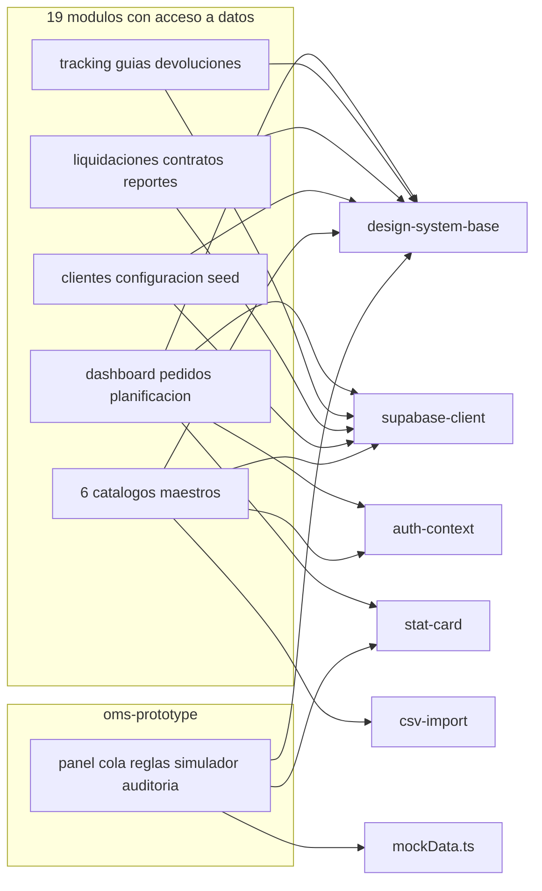

# Dependencias — STO / TMS OLO

> Dependencias externas, de datos e internas del repositorio `sto_tms_olo` al
> 2026-08-27. Las versiones exactas están en `technology-stack.md`.

## Dependencias externas de paquete

**No hay relación paquete → paquete**: el repositorio es de **paquete único**.
`pnpm-workspace.yaml` existe pero **no declara `packages:`**, así que no hay
grafo de build interno que resolver. La cadena efectiva es
`pnpm install` → `vite build` → `out/`.

### En uso real

| Paquete | Consumidores dentro de `src/` |
|---|---|
| `react`, `react-dom` | Todo el árbol; `react-dom` solo en `src/main.tsx` |
| `react-router-dom` | `src/router/config.tsx`, `src/router/index.ts`, `src/App.tsx`, `Sidebar.tsx`, `Header.tsx` y la navegación de cada módulo |
| `@supabase/supabase-js` | `src/lib/supabase.ts` — punto único; 26 páginas y ~40 componentes lo consumen indirectamente |
| `i18next`, `react-i18next`, `i18next-browser-languagedetector` | **Solo** `src/i18n/index.ts`; ninguna página consume el binding |

### Instaladas y nunca importadas

| Paquete | Riesgo |
|---|---|
| `firebase@12.0.0` | Peso muerto en el bundle; además está en `onlyBuiltDependencies`, así que **ejecuta scripts de build en cada instalación** |
| `@stripe/react-stripe-js@4.0.2` (arrastra `@stripe/stripe-js@7.9.0`) | Peso muerto; sugiere una intención de pagos nunca materializada |
| `recharts@3.2.0` | Peso muerto **y** duplicación de esfuerzo: los 4 gráficos de Reportes están hechos a mano con HTML y Tailwind |
| `date-fns@4.4.0` | Peso muerto; el formateo de fechas se hace con `toLocaleDateString` fijado a `'es-CL'` o `'es-ES'` según el módulo |
| `source-map@0.7.6` (dev) | Sin uso aparente |

### No declaradas

| Dependencia | Naturaleza | Riesgo |
|---|---|---|
| **Remix Icon 4.1.0** | CSS por `<link>` a `cdn.jsdelivr.net` desde `index.html` | **Única iconografía del proyecto** (clases `ri-*` en las 26 páginas) y **no está en `package.json`**. Una caída del CDN deja la aplicación sin iconos, sin fallback |

## Dependencias de servicio y de datos

| Dependencia | Tipo | Acoplamiento | Notas |
|---|---|---|---|
| **Supabase PostgREST** | Datos | **Crítico y total** | 20 tablas alcanzadas; el esquema **es** la API y **no está versionado** en este repositorio |
| **Supabase Auth** | Identidad | **Crítico** | 6 métodos en uso; `auth.signUp()` se invoca desde el cliente |
| **Políticas RLS de Postgres** | Autorización | **Crítico e inverificable** | Única defensa real del aislamiento multi-tenant; sin migraciones ni políticas en el repositorio. `CONTEXTO_PROYECTO_TMS.md` §2 y §4 confirman que la capa RLS está en desarrollo |
| **`cdn.jsdelivr.net`** | Assets | Alto en apariencia | Iconografía completa |
| **`maps.google.com`** | Navegación | Bajo | Enlace profundo (`href`), no API |
| **WMS** | Origen de pedidos | **Declarado, no implementado** | El botón "Importar Pedidos" de `/pedidos` no tiene handler; no hay integración |
| **Lago de datos** | Origen de días de salida por ruta | **Declarado, no implementado** | Precondición de la Regla 1 del OMS; tablas y sistema de origen pendientes de definir |
| **EPRAC** | Generación de guía de despacho | **Fuera de alcance del OMS** | No hay integración en el repositorio |
| Servidores MCP de `.mcp.json` | Tooling de desarrollo | Nulo para la aplicación | `context7` por HTTP más 4 servidores AWS por `uvx` |

## Dependencias internas entre módulos

Todos los módulos dependen del mismo pequeño núcleo, y **ningún módulo de
negocio depende de otro módulo de negocio**: el acoplamiento entre módulos es
cero a nivel de código y total a nivel de datos, porque comparten tablas sin
contrato compartido.

**Fallback en texto.** Los 19 módulos con acceso a datos —dashboard, pedidos,
planificación, tracking, guías, devoluciones, liquidaciones, contratos,
reportes, clientes, configuración, seed y los 6 catálogos maestros— dependen de
`design-system-base` y de `supabase-client`, y varios además de `auth-context`
para el filtro por `organization_id`. `dashboard` usa `stat-card`. Los 5
catálogos importables usan `csv-import`. `oms-prototype` depende de
`design-system-base`, `stat-card` y `mockData.ts`, **y de nada más** — en
particular no depende de `supabase-client`, lo que lo hace hoy el módulo más
desacoplado del repositorio y también el único sin persistencia.

### Acoplamiento por tabla compartida

El acoplamiento real entre módulos no está en los imports, está en las tablas.
Las tablas con más módulos escritores o lectores son los puntos donde un cambio
de vocabulario rompe a distancia:

| Tabla | Módulos que la tocan | Consecuencia observada |
|---|---|---|
| `routes` | 9 módulos | Tres vocabularios de `status` incompatibles; los KPIs del tablero solo cuentan las filas del sembrador |
| `orders` | 6 módulos | `planificacion` escribe `'Asignado'` y `pedidos` espera `assigned`: el estado se muestra al revés |
| `dispatch_guides` | 6 módulos | Dos columnas de estado (`status` y `delivery_status`) con vocabularios distintos; `MapView` ya normaliza a mano |
| `drivers` | 8 módulos | Cuatro nombres mutuamente excluyentes de la columna de nombre en los joins |
| `app_users` | 10 archivos | La resolución de organización se repite en cada módulo en lugar de centralizarse |

## Dependencias de las reglas activas del método

Estas son dependencias del proceso, no del código, y hoy están **incumplidas**;
el detalle está en `code-quality-assessment.md`.

| Regla activa | Estado en el repositorio |
|---|---|
| `org.md` → `## Testing Posture`: piso del 80 % de cobertura de línea y ejecución en CI antes del merge para el scope `classic` | **Cero** infraestructura de pruebas y **cero** CI |
| `org.md` → `## Code Style`: formateador (Prettier) y linter en CI antes del merge | Linter presente pero **no ejecutado por ningún pipeline**; formateador **ausente** |
| `org.md` → `## Deployment`: deploy on merge a staging, aprobación manual a producción | **Ningún** pipeline de despliegue existe |
| `phases/construction.md` → `## Error Handling`: los errores se surfacean o se registran, nada de fallos silenciosos | Varios `catch` **tragan el error** y dejan la UI vacía sin avisar |
| `phases/construction.md` → `## Security`: nada de credenciales en el código | `.env` **versionado en git** |

## Sources

- `package.json`, `pnpm-lock.yaml` (bloque `importers:`), `pnpm-workspace.yaml`
  — dependencias declaradas y resueltas.
- Barrido transversal sobre `src/`: usos reales de `recharts`, `date-fns`,
  `firebase` y `stripe`; imports de `Header` y `Sidebar`; alias `@/`;
  librerías de mapas.
- `index.html` — dependencia de CDN no declarada.
- `src/lib/supabase.ts`, `src/hooks/useAuth.tsx` — acoplamiento con Supabase.
- Barrido transversal: cada `.from('<tabla>')` y cobertura de `organization_id`.
- `src/pages/planificacion/page.tsx`, `src/pages/pedidos/page.tsx`,
  `src/pages/dashboard/page.tsx`, `src/pages/tracking/components/MapView.tsx`,
  `src/pages/liquidaciones/components/SettlementModal.tsx` — acoplamiento por
  tabla compartida.
- `.mcp.json` — servidores de tooling.
- `CONTEXTO_PROYECTO_TMS.md` §2, §4 — estado de la capa RLS;
  `PLAN_MODULO_OMS.md` §2 — dependencias del OMS con WMS, lago de datos y EPRAC.
- `aidlc/spaces/default/memory/org.md`,
  `aidlc/spaces/default/memory/phases/construction.md` — reglas activas.

## Assumptions & Open Questions

- El árbol transitivo completo de dependencias no está inventariado: solo se
  leyó el bloque `importers:` de `pnpm-lock.yaml`; los 133 KB restantes se
  omitieron.
- No se ejecutó auditoría de vulnerabilidades (`pnpm audit` o equivalente), así
  que no hay lectura sobre CVE conocidos en el árbol instalado.
- La existencia y el contenido de las políticas RLS de Supabase son
  **inverificables desde este repositorio**; el acoplamiento con esa capa se
  declara crítico por inferencia, no por lectura.
