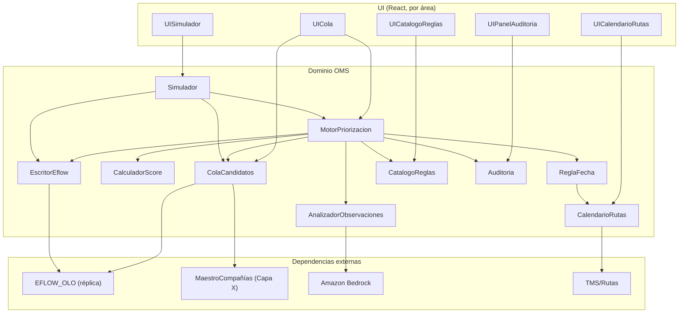

# Catálogo de componentes — Módulo OMS

> Intent: `260826-modulo-oms`. Etapa: Domain Design (Inception). Lead: arquitecto;
> apoyo: plataforma AWS, diseño. Deriva de `requirements.md` v2 (14 FR),
> `stories.md` (34 historias, US1–US33 + US11b) y las decisiones firmes de
> `project.md` (`## Decided`). Decisiones de descomposición: ver
> `domain-design-questions.md` (Q1=C, Q2–Q6=A) y `decisions.md` (ADRs).
>
> **Alcance de esta etapa**: bloques lógicos de software (componentes con lógica,
> entidades y ciclo de vida propios). NO topología de despliegue (Units
> Generation), NO stack, NO NFR. La captura de entidades es a nivel
> **propiedad + forma** (dueño, identificador, atributos, referencias); el
> esquema completo es de Functional Design.
>
> **Invariantes firmes que gobiernan el diseño** (project.md): el OMS termina en
> "alistado"; NO escribe fechas; escribe solo a nivel WMS/EFLOW (nunca WMH ni
> intermedias); prioridad numérica invertida (menor = más urgente) por score
> ponderado; el viaje lo crea el TMS/Planificación; el motor de reglas es un
> catálogo (lógica en código); todas las tablas del OMS llevan `compañía`/`país`.

## Parte A — Catálogo (fuente de verdad)

```yaml
components:
  - name: ColaCandidatos
    summary: Resuelve la cola de pedidos candidatos a priorizar leyendo la réplica de EFLOW/WMS.
    behaviour: >
      Encapsula el lado LECTURA del OMS sobre EFLOW (FR1). Resuelve la cola en
      `expedición_cabecera`: pedidos con `fecha_de_cierre IS NULL` y
      estado/situación = `DISP` y sin `NUMEROVIAJEWMH` (sin viaje asignado) —
      equivale al anti-join con `almacén_movimiento_carcam` (los no procesados).
      Cruza con `expedición_detalle` y `almacén_movimiento_carcam` por
      `pedido+almacén+compañía+sucursal` para progreso/detalle. Lee siempre contra
      la RÉPLICA de EFLOW_OLO (NFR9), nunca el transaccional. Resuelve el NOMBRE de
      la compañía contra el maestro (Capa X), no consultando EFLOW en cada lectura.
      Es el adaptador de lectura: aísla el esquema de EFLOW del resto del OMS.
    responsibilities:
      - Filtrar y devolver los pedidos candidatos (contrato de la query de la cola)
      - Aislar el esquema de EFLOW/WMS del dominio del OMS (adaptador de lectura)
      - Resolver el nombre de compañía vía el maestro de Capa X
    depends_on: []
    dependents:
      - component: MotorPriorizacion
        interaction: le pide el conjunto de pedidos candidatos de una compañía para priorizar
        style: sync
      - component: Simulador
        interaction: le pide el subconjunto de pedidos (por situación) para una corrida de simulación
        style: sync
      - component: UICola
        interaction: alimenta la tabla de la Cola (con filtros, columnas por usuario)
        style: sync
    external_dependencies:
      - name: EFLOW_OLO (réplica de lectura)
        kind: database
        purpose: origen de los pedidos (expedición_cabecera/detalle, almacén_movimiento_carcam); réplica aún inexistente (OQ-2)
      - name: MaestroCompañías (Capa X)
        kind: third-party-api
        purpose: resolver el nombre de compañía a partir del código
    entities:
      - name: PedidoCandidato
        identifier: pedido+almacén+compañía+sucursal
        attributes: [pedido, almacén, compañía, país, sucursal, situación, estado, fechaDeCierre, fechaExpediciónPlanificada, numeroViajeWmh, observaciones]
        references:
          - entity: RegistroPrioridad
            owned_by: MotorPriorizacion
            relationship: cada PedidoCandidato priorizado obtiene un RegistroPrioridad

  - name: MotorPriorizacion
    summary: Orquesta la corrida de priorización — reglas activas, score, umbral de inyección y orden.
    behaviour: >
      Núcleo automático del OMS (FR2, FR3, NFR1). Por cada corrida: toma los
      candidatos de ColaCandidatos, consulta la configuración activa en
      CatalogoReglas, invoca las reglas ejecutables (ReglaFecha,
      AnalizadorObservaciones), pide a CalculadorScore el score ponderado de cada
      pedido, ordena por prioridad numérica invertida (menor = más urgente) con
      desempate estable (fecha entrega, hora entrada, id), aplica el UMBRAL DE
      INYECCIÓN (solo prepara pedidos hasta cierta prioridad; el resto espera,
      NFR4/FR3.4) y ordena a EscritorEflow generar los que pasan. Corre al menos
      1 vez/día y en las horas de corte, revisitando prioridades (lo no alcanzado
      hoy sube mañana). El override manual (FR4) es una operación de este
      componente: cambia la prioridad de un pedido puntual (rol autorizado, motivo
      obligatorio) y registra en Auditoria como manual. NO escribe fechas
      (invariante). NO crea viajes (eso es del TMS).
    responsibilities:
      - Orquestar la corrida de priorización (reglas → score → umbral → orden)
      - Aplicar el umbral de inyección (corte por capacidad)
      - Ejecutar el override manual (única intervención humana sobre el cálculo)
      - Aplicar el EFECTO "cliente retira" (marca de agrupación en viaje/cliente dummy sobre RegistroPrioridad; la prioridad máxima proviene del peso vía CalculadorScore)
      - Emitir el registro de cada priorización (auto/manual) a Auditoria
    depends_on:
      - component: ColaCandidatos
        interaction: obtiene los pedidos candidatos a priorizar
        style: sync
      - component: CatalogoReglas
        interaction: lee qué reglas están activas y con qué peso/parámetros por compañía
        style: sync
      - component: ReglaFecha
        interaction: evalúa la regla T-1 sobre cada pedido
        style: sync
      - component: AnalizadorObservaciones
        interaction: clasifica las observaciones (cliente retira) por lote
        style: sync
      - component: CalculadorScore
        interaction: obtiene el score ponderado y la prioridad numérica de cada pedido
        style: sync
      - component: EscritorEflow
        interaction: ordena la escritura DISP→GENERADA + prioridad de los pedidos que pasan el umbral
        style: sync
      - component: Auditoria
        interaction: registra cada priorización ejecutada (auto y override manual)
        style: sync
    dependents:
      - component: Simulador
        interaction: el Simulador invoca la misma orquestación de cálculo con un subconjunto de reglas/pedidos
        style: sync
      - component: UICola
        interaction: dispara override manual desde el detalle del pedido
        style: sync
    external_dependencies: []
    entities:
      - name: RegistroPrioridad
        identifier: pedido+almacén+compañía+sucursal+corrida
        attributes: [pedido, compañía, país, prioridad, score, tipoOrigen, umbralAplicado, corrida, clienteRetira, grupoViajeDummy]
        references:
          - entity: ConfiguracionRegla
            owned_by: CatalogoReglas
            relationship: cada RegistroPrioridad se calcula con las reglas activas de su compañía

  - name: CalculadorScore
    summary: Calcula el score ponderado y la prioridad numérica invertida de un pedido (módulo puro).
    behaviour: >
      Componente de cálculo PURO y sin efectos (FR3.2). Dado un pedido y el
      conjunto de reglas aplicables con sus pesos, suma los pesos (mayor peso =
      cliente retira, luego fecha) para producir el SCORE, y deriva la PRIORIDAD
      NUMÉRICA INVERTIDA (menor número = mayor urgencia). Incluye el desempate
      estable. Entra en el alcance DESDE la primera entrega. Se aísla como módulo
      propio por ser responsabilidad distinta del orquestador y para poder
      probarse sin montar el resto del motor (regla firme Testing Posture,
      project.md 2026-08-28).
    responsibilities:
      - Sumar pesos de reglas aplicables → score
      - Derivar la prioridad numérica invertida a partir del score
      - Aplicar el desempate estable determinista
    depends_on: []
    dependents:
      - component: MotorPriorizacion
        interaction: le pide el score/prioridad de cada pedido durante la corrida
        style: sync
    external_dependencies: []
    entities: []

  - name: ReglaFecha
    summary: Regla T-1 — decide si un pedido debe prepararse hoy según su fecha de entrega.
    behaviour: >
      Regla ejecutable 1 (FR2/FR6.1, primera entrega). Usa la
      `fecha de expedición planificada` (fecha de entrega del cliente) como
      INSUMO y NO la modifica. Calcula T-1 = entrega − 1 día, ajustado por
      duración de la ruta y horas de corte (FR2.2/FR2.3). Fallback (FR2.5): si la
      compañía no envía la fecha (caso Cofersa hoy), aplica la regla de ruta (día
      de salida por ruta) leída de CalendarioRutas. Aporta su peso al score. NO
      escribe nada (solo evalúa).
    responsibilities:
      - Evaluar la regla T-1 (con ajuste por ruta y cortes)
      - Aplicar el fallback por ruta cuando falta la fecha de entrega
    depends_on:
      - component: CalendarioRutas
        interaction: lee días de salida y horas de corte por ruta para el ajuste y el fallback
        style: sync
    dependents:
      - component: MotorPriorizacion
        interaction: el motor invoca la regla durante la corrida
        style: sync
    external_dependencies: []
    entities: []

  - name: AnalizadorObservaciones
    summary: Interpreta el texto libre de observaciones con IA (Bedrock) para clasificar "cliente retira".
    behaviour: >
      Regla ejecutable 2/3 (FR6.2/FR6.3/FR7, primera entrega). Interpreta el
      texto libre de `observaciones` con un modelo nativo de Amazon Bedrock
      (ultraligero); la primera salida a implementar es "cliente retira" (patrón →
      prioridad más alta + viaje/cliente dummy). Invoca POR LOTE (una corrida
      sobre las ~400 observaciones/día), no una llamada por pedido (FR7.4). El
      prompt vive en el código (Lambda), NO es editable desde la UI (FR7.2).
      Degrada sin bloquear: si Bedrock falla/timeout, el pedido se prioriza por
      las demás reglas. Aporta su peso al score. FRONTERA: este componente solo
      DETECTA/clasifica (produce la marca "cliente retira"); el EFECTO no es suyo.
      La prioridad máxima la aplica CalculadorScore (mayor peso) vía
      MotorPriorizacion, y la marca de agrupación en el viaje/cliente "dummy" la
      fija MotorPriorizacion sobre el RegistroPrioridad (el viaje real lo abre el
      TMS, no el OMS).
    responsibilities:
      - Clasificar las observaciones por lote (cliente retira como primera salida)
      - Degradar sin bloquear el motor ante fallo de Bedrock
      - (NO es responsabilidad suya el efecto: prioridad máxima y viaje/cliente dummy)
    depends_on: []
    dependents:
      - component: MotorPriorizacion
        interaction: el motor invoca la clasificación por lote durante la corrida
        style: sync
    external_dependencies:
      - name: Amazon Bedrock
        kind: third-party-api
        purpose: clasificación del texto libre de observaciones (modelo ultraligero, prompt en código)
    entities: []

  - name: EscritorEflow
    summary: Escribe el resultado en EFLOW/WMS — situación DISP→GENERADA y prioridad, de forma atómica.
    behaviour: >
      Encapsula el lado ESCRITURA del OMS sobre EFLOW (FR8). Para cada pedido que
      el motor decide generar: escribe `estado=DISP` + `situación=GENERADA` + la
      prioridad calculada, en una ESCRITURA ATÓMICA (nunca GENERADA sin
      prioridad). NO escribe fechas (invariante NFR7): la
      `fecha de expedición planificada` queda intacta. Escribe SOLO a nivel
      WMS/EFLOW; NO toca el WMH ni las tablas intermedias (invariante C1/FR8.2).
      Tras dejar GENERADA, el pedido sale del alcance del OMS ("alistado"). Es el
      adaptador de escritura: aísla el esquema de EFLOW del dominio.
    responsibilities:
      - Escribir atómicamente situación+prioridad en EFLOW
      - Garantizar los invariantes de escritura (no fechas, solo WMS/EFLOW)
    depends_on: []
    dependents:
      - component: MotorPriorizacion
        interaction: el motor ordena la escritura de los pedidos que pasan el umbral
        style: sync
      - component: Simulador
        interaction: al "aplicar" una simulación, escribe por esta misma vía
        style: sync
    external_dependencies:
      - name: EFLOW_OLO (réplica / escritura)
        kind: database
        purpose: destino de la escritura situación+prioridad a nivel WMS/EFLOW
    entities: []

  - name: CatalogoReglas
    summary: Catálogo semi-configurable de reglas por compañía — dueño de la configuración persistida.
    behaviour: >
      Catálogo de las reglas IMPLEMENTADAS (FR5). Por regla y por compañía:
      estado (on/off), peso/score y parámetros editables (días de T-1, horas de
      corte, umbral de inyección, patrón/prioridad/ventana de cliente retira).
      NO es un constructor dinámico: no se crean reglas nuevas desde la UI; la
      lógica y los prompts viven en código (FR5.4/C6). Un selector de compañía
      cambia la lista (una Lambda por compañía). Es dueño de la CONFIGURACIÓN; las
      reglas ejecutables (ReglaFecha, AnalizadorObservaciones) la LEEN al correr.
    responsibilities:
      - Persistir la configuración de reglas por compañía (on/off, peso, parámetros)
      - Servir la configuración activa al MotorPriorizacion y a las reglas
      - Impedir la creación de reglas nuevas desde la UI (solo configurar las existentes)
    depends_on: []
    dependents:
      - component: MotorPriorizacion
        interaction: lee la configuración activa para orquestar la corrida
        style: sync
      - component: UICatalogoReglas
        interaction: edita estado/peso/parámetros por compañía
        style: sync
    external_dependencies: []
    entities:
      - name: ConfiguracionRegla
        identifier: reglaId+compañía
        attributes: [reglaId, nombre, descripción, compañía, país, activa, peso, parámetros]
        references: []

  - name: Simulador
    summary: Configurador de simulaciones — define, persiste, programa y aplica simulaciones de priorización.
    behaviour: >
      Configurador de simulaciones (FR9). Un modal previo trae las reglas activas
      y permite elegir un subconjunto y filtrar pedidos por situación (incluido
      re-simular sobre prioridades ya asignadas). INVOCA a MotorPriorizacion (no
      duplica el cálculo): el motor es la única fuente del score. El resultado se
      muestra como tabla-Cola. La Simulación es una ENTIDAD PERSISTIDA (bitácora:
      fecha, autor, reglas, filtro, estado simulada/aplicada, compañía); puede
      haber varias simuladas pero solo UNA aplicada por compañía. Aplicación
      manual/automática/mixta (con hora de corte). Config por compañía: nº de
      simulaciones/día, frecuencia, filtro, modo. Al "aplicar" escribe vía
      EscritorEflow.
    responsibilities:
      - Configurar y persistir simulaciones y su configuración por compañía
      - Invocar el motor para calcular una corrida acotada
      - Garantizar "una aplicada por compañía" y aplicar (manual/auto/mixta)
    depends_on:
      - component: MotorPriorizacion
        interaction: invoca la orquestación de cálculo con un subconjunto de reglas/pedidos
        style: sync
      - component: ColaCandidatos
        interaction: obtiene el subconjunto de pedidos por situación para la corrida
        style: sync
      - component: EscritorEflow
        interaction: al aplicar una simulación, escribe la priorización resultante
        style: sync
    dependents:
      - component: UISimulador
        interaction: configura, ejecuta, revisa y aplica simulaciones
        style: sync
    external_dependencies: []
    entities:
      - name: Simulacion
        identifier: simulacionId
        attributes: [simulacionId, compañía, país, fecha, autor, reglasUsadas, filtro, estado, resultado]
        references: []
      - name: ConfiguracionSimulacion
        identifier: compañía
        attributes: [compañía, país, numeroSimulacionesDia, frecuencia, horarios, filtroSituación, modoAplicacion]
        references: []

  - name: Auditoria
    summary: Registro de solo lectura de las priorizaciones ejecutadas — distingue auto vs. manual.
    behaviour: >
      Dueño único del registro auditable (FR11.3, FR14.3, NFR6). Registra cada
      priorización ejecutada distinguiendo automático vs. manual (en manual:
      usuario y motivo). Toda acción de escritura del OMS registra el id del
      usuario. Es de SOLO LECTURA (no se edita ni borra, criterio negativo NFR6);
      retención de métricas ~3–5 meses. También sirve los datos para los
      indicadores del Panel (p. ej. % de override en ventana configurable).
    responsibilities:
      - Persistir el registro auditable (auto/manual, usuario, motivo) inmutable
      - Servir consultas de solo lectura al Panel y a la Auditoría
    depends_on: []
    dependents:
      - component: MotorPriorizacion
        interaction: escribe el registro de cada priorización (auto y override manual)
        style: sync
      - component: UIPanelAuditoria
        interaction: lee registros y KPIs (salud del motor, % override en ventana)
        style: sync
    external_dependencies: []
    entities:
      - name: RegistroAuditoria
        identifier: registroId
        attributes: [registroId, pedido, compañía, país, tipoOrigen, usuario, motivo, prioridadAnterior, prioridadNueva, timestamp]
        references: []

  - name: CalendarioRutas
    summary: Consulta/mantiene el calendario de rutas y días de despacho por compañía (fuente de verdad TMS).
    behaviour: >
      El OMS CONSUME el calendario de rutas cuya fuente de verdad es el TMS
      (FR12). Ofrece el CRUD gated a rol administrador (implementación de UI de
      alta diferida — DECIDED), pero su verdad vive en el TMS/Rutas. El calendario
      es por cliente/compañía (acuerdos Olo↔cliente con implicación tarifaria) y
      soporta calendarios por país. ReglaFecha lo lee para el ajuste T-1 y el
      fallback por ruta.
    responsibilities:
      - Servir días de salida y horas de corte por ruta/compañía (consumo)
      - Ofrecer el CRUD gated (verdad en el TMS)
    depends_on: []
    dependents:
      - component: ReglaFecha
        interaction: lee días de salida y horas de corte para T-1 y fallback
        style: sync
      - component: UICalendarioRutas
        interaction: consulta (y CRUD gated) del calendario
        style: sync
    external_dependencies:
      - name: TMS/Rutas
        kind: third-party-api
        purpose: fuente de verdad del calendario de rutas (el OMS lo consume)
    entities:
      - name: RutaDespacho
        identifier: rutaId+compañía
        attributes: [rutaId, compañía, país, díasSalida, horasCorte, tipo]
        references: []

  - name: UICola
    summary: Pantalla de la Cola de Priorización (React).
    behaviour: >
      Área de UI de la Cola (FR10). Entra filtrada en DISP + fecha_de_cierre IS
      NULL; mantiene el filtro de almacén; ofrece selector/filtro de compañía (no
      por perfil); muestra el nombre de la compañía; columnas elegibles por
      usuario (persistidas en User Preference JSON); detalle del pedido en MODAL;
      desde el detalle se dispara el override (rol autorizado). 5 estados de UX
      (vacío/carga/éxito/parcial/error), focus-trap en el modal.
    responsibilities:
      - Presentar la cola con filtros, columnas por usuario y detalle en modal
      - Disparar el override manual desde el detalle
    depends_on:
      - component: ColaCandidatos
        interaction: obtiene los pedidos de la cola
        style: sync
      - component: MotorPriorizacion
        interaction: ejecuta el override manual
        style: sync
    dependents: []
    external_dependencies: []
    entities: []

  - name: UIPanelAuditoria
    summary: Pantalla de Panel (salud del motor + KPIs) y Auditoría (React).
    behaviour: >
      Área de UI del Panel y la Auditoría (FR11). Panel: salud del motor e
      indicadores (pedidos generados hoy, % override con VENTANA CONFIGURABLE
      24h/12h/semana, pedidos en proceso ~capacidad). Auditoría: registro de solo
      lectura de las priorizaciones (auto/manual, usuario/motivo).
    responsibilities:
      - Presentar KPIs del Panel con ventana configurable
      - Presentar la Auditoría de solo lectura
    depends_on:
      - component: Auditoria
        interaction: lee registros y KPIs
        style: sync
    dependents: []
    external_dependencies: []
    entities: []

  - name: UICatalogoReglas
    summary: Pantalla del Motor de Reglas (catálogo semi-configurable) con selector de compañía (React).
    behaviour: >
      Área de UI del catálogo de reglas (FR5). Lista las reglas implementadas de
      la compañía seleccionada (nombre, descripción, estado, peso, parámetros);
      permite activar/desactivar, ajustar peso y editar parámetros; NO permite
      crear reglas nuevas. Selector de compañía cambia la lista.
    responsibilities:
      - Presentar y editar la configuración de reglas por compañía
      - Impedir el alta de reglas desde la UI (solo configurar)
    depends_on:
      - component: CatalogoReglas
        interaction: lee y edita la configuración de reglas por compañía
        style: sync
    dependents: []
    external_dependencies: []
    entities: []

  - name: UISimulador
    summary: Pantalla del Simulador-configurador (React).
    behaviour: >
      Área de UI del Simulador (FR9). Modal previo de configuración (reglas
      activas + filtro de situación); resultado como tabla-Cola; aplicar
      (manual/auto/mixta) con confirmación de alto impacto ("sustituye la
      priorización vigente de {compañía}"); configuración de simulaciones por
      compañía.
    responsibilities:
      - Configurar, ejecutar, revisar y aplicar simulaciones
      - Confirmar la acción de alto impacto al aplicar
    depends_on:
      - component: Simulador
        interaction: configura/ejecuta/aplica simulaciones
        style: sync
    dependents: []
    external_dependencies: []
    entities: []

  - name: UICalendarioRutas
    summary: Pantalla del Calendario de rutas (consulta + CRUD gated) (React).
    behaviour: >
      Área de UI del calendario (FR12). Consulta rutas y días de salida por
      compañía/país; CRUD gated a rol administrador (alta de UI diferida por
      decisión). Recuerda que la fuente de verdad es el TMS.
    responsibilities:
      - Consultar el calendario por compañía/país
      - Ofrecer el CRUD gated (alta diferida)
    depends_on:
      - component: CalendarioRutas
        interaction: consulta (y CRUD gated) del calendario
        style: sync
    dependents: []
    external_dependencies: []
    entities: []
```

## Parte B — Vista humana

### Diagrama de componentes



**Fallback en texto.** Las 5 áreas de UI consumen 1:1 su componente de dominio:
`UICola`→`ColaCandidatos` (+ `MotorPriorizacion` para el override),
`UIPanelAuditoria`→`Auditoria`, `UICatalogoReglas`→`CatalogoReglas`,
`UISimulador`→`Simulador`, `UICalendarioRutas`→`CalendarioRutas`. El
`MotorPriorizacion` orquesta: toma candidatos de `ColaCandidatos`, lee
`CatalogoReglas`, invoca `ReglaFecha` y `AnalizadorObservaciones`, pide score a
`CalculadorScore`, aplica el umbral, ordena escribir a `EscritorEflow` y registra
en `Auditoria`. `ReglaFecha` lee `CalendarioRutas`. `Simulador` reusa
`MotorPriorizacion`, `ColaCandidatos` y `EscritorEflow`. `ColaCandidatos` lee de
la réplica `EFLOW_OLO` y del maestro de compañías (Capa X); `AnalizadorObservaciones`
usa Amazon Bedrock; `EscritorEflow` escribe en `EFLOW_OLO`; `CalendarioRutas`
consume `TMS/Rutas`.

### Resumen de componentes

| Componente | Propósito | Depende de | Dependientes | Entidades propias |
|---|---|---|---|---|
| ColaCandidatos | Resuelve la cola leyendo la réplica EFLOW | — | MotorPriorizacion, Simulador, UICola | PedidoCandidato |
| MotorPriorizacion | Orquesta la corrida (reglas→score→umbral→orden) + override | ColaCandidatos, CatalogoReglas, ReglaFecha, AnalizadorObservaciones, CalculadorScore, EscritorEflow, Auditoria | Simulador, UICola | RegistroPrioridad |
| CalculadorScore | Score ponderado + prioridad numérica (módulo puro) | — | MotorPriorizacion | — |
| ReglaFecha | Regla T-1 (con ajuste por ruta y fallback) | CalendarioRutas | MotorPriorizacion | — |
| AnalizadorObservaciones | Clasifica observaciones con IA (cliente retira) | — | MotorPriorizacion | — |
| EscritorEflow | Escritura atómica DISP→GENERADA + prioridad | — | MotorPriorizacion, Simulador | — |
| CatalogoReglas | Config de reglas por compañía (catálogo, no builder) | — | MotorPriorizacion, UICatalogoReglas | ConfiguracionRegla |
| Simulador | Configurador de simulaciones (reusa el motor) | MotorPriorizacion, ColaCandidatos, EscritorEflow | UISimulador | Simulacion, ConfiguracionSimulacion |
| Auditoria | Registro de solo lectura (auto/manual) | — | MotorPriorizacion, UIPanelAuditoria | RegistroAuditoria |
| CalendarioRutas | Calendario de rutas (verdad en TMS, el OMS consume) | — | ReglaFecha, UICalendarioRutas | RutaDespacho |
| UICola | Pantalla Cola de Priorización | ColaCandidatos, MotorPriorizacion | — | — |
| UIPanelAuditoria | Pantalla Panel + Auditoría | Auditoria | — | — |
| UICatalogoReglas | Pantalla Motor de Reglas | CatalogoReglas | — | — |
| UISimulador | Pantalla Simulador-configurador | Simulador | — | — |
| UICalendarioRutas | Pantalla Calendario de rutas | CalendarioRutas | — | — |

### Propiedad de entidades

| Entidad | Componente dueño | Identificador | Atributos | Referencias |
|---|---|---|---|---|
| PedidoCandidato | ColaCandidatos | pedido+almacén+compañía+sucursal | pedido, almacén, compañía, país, sucursal, situación, estado, fechaDeCierre, fechaExpediciónPlanificada, numeroViajeWmh, observaciones | → RegistroPrioridad (MotorPriorizacion) |
| RegistroPrioridad | MotorPriorizacion | pedido+almacén+compañía+sucursal+corrida | pedido, compañía, país, prioridad, score, tipoOrigen, umbralAplicado, corrida, clienteRetira, grupoViajeDummy | → ConfiguracionRegla (CatalogoReglas) |
| ConfiguracionRegla | CatalogoReglas | reglaId+compañía | reglaId, nombre, descripción, compañía, país, activa, peso, parámetros | — |
| Simulacion | Simulador | simulacionId | simulacionId, compañía, país, fecha, autor, reglasUsadas, filtro, estado, resultado | — |
| ConfiguracionSimulacion | Simulador | compañía | compañía, país, numeroSimulacionesDia, frecuencia, horarios, filtroSituación, modoAplicacion | — |
| RegistroAuditoria | Auditoria | registroId | registroId, pedido, compañía, país, tipoOrigen, usuario, motivo, prioridadAnterior, prioridadNueva, timestamp | — |
| RutaDespacho | CalendarioRutas | rutaId+compañía | rutaId, compañía, país, díasSalida, horasCorte, tipo | — |

### Dependencias externas

| Componente | Dependencia | Tipo | Propósito |
|---|---|---|---|
| ColaCandidatos | EFLOW_OLO (réplica lectura) | database | Origen de pedidos (réplica inexistente, OQ-2) |
| ColaCandidatos | MaestroCompañías (Capa X) | third-party-api | Resolver nombre de compañía |
| AnalizadorObservaciones | Amazon Bedrock | third-party-api | Clasificación IA de observaciones |
| EscritorEflow | EFLOW_OLO (escritura) | database | Escritura situación+prioridad a nivel WMS/EFLOW |
| CalendarioRutas | TMS/Rutas | third-party-api | Fuente de verdad del calendario |

### Racional (por qué cada bloque es separado)

| Componente | Por qué es un bloque distinto |
|---|---|
| ColaCandidatos | Distinta concern (adaptador de lectura); aísla el esquema de EFLOW del dominio; contrato de query estable |
| MotorPriorizacion | Distinta concern (orquestación); dueño del ciclo de corrida y del override |
| CalculadorScore | Distinta concern (cálculo puro); testable sin montar el motor (regla Testing Posture); score desde 1ª entrega |
| ReglaFecha | Distinta lógica de negocio (T-1); cambia con las reglas de fecha/cortes |
| AnalizadorObservaciones | Distinta concern (IA/Bedrock); distinto ritmo de cambio (prompt/modelo) y degradación propia |
| EscritorEflow | Distinta concern (adaptador de escritura); dueño de los invariantes de escritura |
| CatalogoReglas | Distinta data ownership (configuración persistida); separar config editable de lógica en código |
| Simulador | Distinto ciclo de vida (entidad Simulacion persistida, programación); reusa el motor sin duplicarlo |
| Auditoria | Distinta data ownership (registro inmutable de solo lectura); un solo dueño del auditable |
| CalendarioRutas | Distinta data ownership (consume verdad del TMS); frontera con el núcleo compartido |
| UI* (5) | Distinta concern (presentación); una por área funcional, 1:1 con su backend, como el prototipo |

**Alternativas rechazadas** (detalle en `decisions.md`): motor monolítico (Q1-B);
score dentro del orquestador (Q1-A, rechazado por regla de testing); catálogo y
ejecutor fusionados (Q2-B); Simulador con cálculo propio (Q3-B); adaptadores
propios por dependencia externa (Q4-B); UI monolítica (Q5-B);
override+auditoría fusionados (Q6-B).

## Sources

- `aidlc/spaces/default/intents/260826-modulo-oms/inception/requirements-analysis/requirements.md`
  (FR1–FR14, NFR1–NFR9, restricciones C1–C7).
- `aidlc/spaces/default/intents/260826-modulo-oms/inception/user-stories/stories.md`
  (US1–US33 + US11b).
- `aidlc/spaces/default/memory/project.md` (`## Decided`: alcance WMS/EFLOW,
  invariantes del motor, catálogo de reglas, Simulador-configurador,
  multi-compañía, Capa X, BD `logistica_olo`).
- `aidlc/spaces/default/codekb/sto_tms_olo/component-inventory.md`,
  `architecture.md` — componentes existentes y design system (el §6 "lago de
  datos" del architecture.md es codekb stale, no target).
- `aidlc/spaces/default/intents/260826-modulo-oms/inception/domain-design/domain-design-questions.md`
  (Q1=C, Q2–Q6=A).

## Assumptions & Open Questions

- Las OQ-1..OQ-7 (`requirements.md`) se tratan como dependencias externas /
  parámetros, no como fronteras de componentes: BD oficial (OQ-1), réplica EFLOW
  inexistente (OQ-2), fecha de Cofersa (OQ-3 → fallback en ReglaFecha), tabla de
  prioridades (OQ-4 → parámetro de CalculadorScore/CatalogoReglas), score-vs-filtro
  y umbral (OQ-5 → parámetro del MotorPriorizacion), cortes (OQ-6 → CalendarioRutas),
  viaje cliente retira (OQ-7 → contexto de AnalizadorObservaciones/TMS). No bloquean
  el diseño de dominio.
- La topología de despliegue (una Lambda por compañía, agrupación en unidades
  desplegables) la decide **Units Generation**, no esta etapa. Aquí "una Lambda
  por compañía" se refleja como un invariante de comportamiento, no como frontera
  de componente.
- **Partición multi-compañía (arrastrar a Units/Deployment)**: el modelo lógico
  de las reglas (ReglaFecha, AnalizadorObservaciones) es GENÉRICO y su
  configuración por compañía vive en CatalogoReglas (`ConfiguracionRegla` por
  `reglaId+compañía`). La DECIDED "una Lambda por compañía; la regla identifica su
  compañía; no se parametriza en código" NO significa colapsar la lógica
  específica de cada compañía en una única regla genérica: la partición por
  compañía (una Lambda/unidad desplegable por compañía, con su lógica específica
  cuando difiera) es tema de **Units Generation / Deployment**, no de esta capa
  lógica. Domain Design deja el modelo genérico + config-por-compañía; Units
  decide cómo se materializa por compañía sin que la especificidad se pierda.
