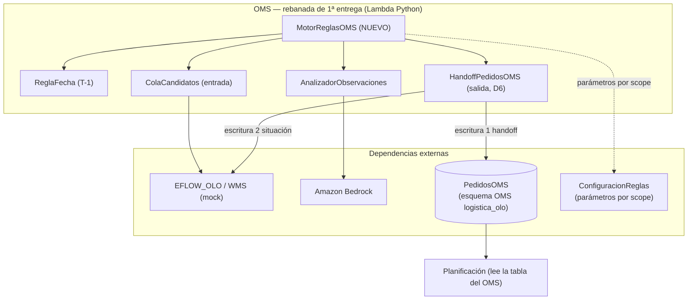

# Catálogo de componentes — Módulo OMS (rebanada delgada de 1ª entrega)

> Intent: `260826-modulo-oms`. Etapa: Domain Design (Inception, **re-corrida por
> el pivote WMH, 2026-09-30**). Lead: arquitecto; apoyo: plataforma AWS, diseño.
> Deriva de `requirements.md` v3 (FR12 retirado), `stories.md` v3 y las
> decisiones firmes de `project.md` (`## Decided` D1–D6, C3-SUPERSEDE, C2-RESUELTO).
>
> **ALCANCE ACOTADO (decisión de secuencia del usuario)**: esta corrida detalla
> **solo los 5 componentes de la rebanada delgada de 1ª entrega** (motor propio
> del OMS + 2 reglas + lectura de cola + handoff de dos escrituras), para que
> Code Generation arranque por el **esqueleto del `MotorReglasOMS` en Lambda**. El
> resto del OMS queda **DIFERIDO** (listado abajo, no eliminado). `CalendarioRutas`
> queda **ELIMINADO** (D5). La captura de entidades es a nivel propiedad+forma; el
> esquema completo es de Functional Design.
>
> **Invariantes firmes** (project.md): el OMS lee del WMS/EFLOW; **no escribe
> fechas**; prioridad numérica invertida por score ponderado; motor de reglas
> **propio del OMS, nuevo, en Lambda Python** (C2-RESUELTO: no portar AST, no
> motor compartido, no tocar Liquidaciones); multi-compañía **por scope**
> CUSTOMER→WAREHOUSE→COUNTRY→GLOBAL (C3-SUPERSEDE, no Lambda por compañía);
> **dos escrituras** en el handoff (D6: tabla propia del OMS + situación WMS); el
> viaje lo arma Planificación DESPUÉS (ruteo dinámico, D5).

## Parte A — Catálogo (fuente de verdad)

```yaml
components:
  - name: MotorReglasOMS
    summary: Motor de reglas propio del OMS (NUEVO, Lambda Python) que orquesta la corrida de priorización.
    behaviour: >
      Núcleo automático del OMS (FR2, FR3, FR6, NFR1), construido NUEVO y propio
      del OMS en Lambda Python (C2-RESUELTO: no se porta el AST de
      src/lib/tarifas/, no se comparte motor con el TMS, no se toca Liquidaciones;
      OMS y TMS son módulos separados que se comunican). Por cada corrida: toma los
      candidatos de ColaCandidatos, resuelve las reglas aplicables POR SCOPE
      (CUSTOMER→WAREHOUSE→COUNTRY→GLOBAL, la más específica gana), invoca las reglas
      ejecutables (ReglaFecha, AnalizadorObservaciones), calcula el SCORE PONDERADO
      (submódulo puro de cálculo: suma de pesos → prioridad numérica INVERTIDA
      menor=más urgente, con desempate estable fecha→hora→id), aplica el UMBRAL DE
      INYECCIÓN (FR3.4/NFR4) y ordena a HandoffPedidosOMS generar los que pasan.
      Aplica el EFECTO "cliente retira" (marca de agrupación en viaje/cliente dummy
      + prioridad máxima vía el peso). Corre ≥1 vez/día y en horas de corte,
      revisitando prioridades. NO escribe fechas. NO arma viajes (eso es de
      Planificación). El cálculo de score se mantiene como submódulo PURO testeable
      sin montar el motor (regla Testing Posture, project.md 2026-08-28).
    responsibilities:
      - Orquestar la corrida (resolver reglas por scope → invocar reglas → score → umbral → orden)
      - Calcular el score ponderado y la prioridad numérica invertida (submódulo puro)
      - Aplicar el umbral de inyección (corte por capacidad)
      - Aplicar el efecto "cliente retira" (marca de agrupación en viaje/cliente dummy)
      - Ordenar el handoff de los pedidos que pasan el umbral
    depends_on:
      - component: ColaCandidatos
        interaction: obtiene los pedidos candidatos a priorizar
        style: sync
      - component: ReglaFecha
        interaction: evalúa la regla T-1 sobre cada pedido (con parámetros de ruta por scope)
        style: sync
      - component: AnalizadorObservaciones
        interaction: clasifica las observaciones (cliente retira) por lote
        style: sync
      - component: HandoffPedidosOMS
        interaction: ordena las dos escrituras (tabla OMS + situación WMS) de los pedidos que pasan el umbral
        style: sync
    dependents: []
    external_dependencies:
      - name: ConfiguracionReglas (parámetros por scope)
        kind: other
        purpose: >
          Pesos, umbral de inyección y PARÁMETROS DE RUTA (días de salida, horas de
          corte, duración estimada) resueltos POR SCOPE (CUSTOMER→WAREHOUSE→COUNTRY→
          GLOBAL). En la rebanada se consumen como configuración/parámetros del
          motor (no hay componente CatalogoReglas-UI todavía — DIFERIDO); su edición
          desde UI es trabajo posterior.
    entities:
      - name: RegistroPrioridad
        identifier: pedido+almacén+compañía+sucursal+corrida
        attributes: [pedido, almacén, compañía, país, sucursal, prioridad, score, tipoOrigen, umbralAplicado, corrida, clienteRetira, grupoViajeDummy]
        references:
          - entity: PedidoCandidato
            owned_by: ColaCandidatos
            relationship: cada RegistroPrioridad corresponde a un PedidoCandidato leído de la cola

  - name: ReglaFecha
    summary: Regla T-1 — decide cuándo preparar un pedido según su fecha de entrega (regla 1 de 1ª entrega).
    behaviour: >
      Regla ejecutable 1 (FR2/FR6.1). Usa como fecha base el campo
      **`FECHAEXPEDICIONPLANIFICADA` de EXPEDICIONESCABECERA** (datetime **NOT NULL**;
      la fecha de entrega que envía el cliente) — la lee como INSUMO y NO la modifica
      (invariante: no escribe fechas). Cálculo: listo = fecha de entrega − 1 día,
      **ajustado por la duración de ruta (ESTIMADA) y las horas de corte**. CONTRATO
      EXPLÍCITO: como las rutas son DINÁMICAS y Planificación las arma DESPUÉS de que
      el OMS prioriza, el OMS **no conoce la duración real de la ruta** al priorizar →
      la "duración de ruta" del T-1 es un **estimado/parámetro de configuración por
      cliente/zona**, resuelto por scope (CUSTOMER→WAREHOUSE→COUNTRY→GLOBAL, C3), NO
      una constante global ni la ruta real. Aporta su peso al score. NO escribe nada
      (solo evalúa). FALLBACK (US8, nombres DDL confirmados 2026-10-01): como
      `FECHAEXPEDICIONPLANIFICADA` es NOT NULL, el fallback por ruta **NO se dispara
      por NULL** sino por **valor por defecto/centinela** (caso "el cliente no envía
      fecha y se llena por default", p. ej. Cofersa). El contrato define el
      disparador como "fecha = centinela/default conocido", no "fecha nula".
    responsibilities:
      - Evaluar la regla T-1 con FECHAEXPEDICIONPLANIFICADA como insumo (sin modificarla)
      - Ajustar por duración de ruta ESTIMADA (parámetro por scope) y horas de corte
      - Disparar el fallback por ruta (US8) ante fecha = centinela/default (no por NULL)
    depends_on: []
    dependents:
      - component: MotorReglasOMS
        interaction: el motor invoca la regla durante la corrida
        style: sync
    external_dependencies: []
    entities: []

  - name: AnalizadorObservaciones
    summary: Interpreta observaciones con IA (Bedrock) para clasificar "cliente retira" (reglas 2-3 de 1ª entrega).
    behaviour: >
      Reglas ejecutables 2/3 (FR6.2/FR6.3/FR7). Interpreta el texto libre de
      `OBSERVACIONESEXPEDICION` (varchar(500), nivel cabecera) con un modelo nativo
      de Amazon Bedrock (ultraligero); la
      primera salida a implementar es "cliente retira". Invoca POR LOTE (una corrida
      sobre las ~400 observaciones/día), no una llamada por pedido (FR7.4). El prompt
      vive en el código de la Lambda, NO es editable desde la UI (FR7.2). Degrada
      sin bloquear: si Bedrock falla/timeout, el pedido se prioriza por las demás
      reglas. FRONTERA: solo DETECTA/clasifica (produce la marca "cliente retira");
      el EFECTO (prioridad máxima vía peso + marca de agrupación en viaje/cliente
      dummy) lo aplica MotorReglasOMS. Testabilidad: la clasificación se prueba con
      clasificador STUB en unitarios; la integración real con Bedrock es test de
      contrato aparte.
    responsibilities:
      - Clasificar las observaciones por lote (cliente retira como primera salida)
      - Degradar sin bloquear el motor ante fallo/timeout de Bedrock
      - (NO aplica el efecto; eso es de MotorReglasOMS)
    depends_on: []
    dependents:
      - component: MotorReglasOMS
        interaction: el motor invoca la clasificación por lote durante la corrida
        style: sync
    external_dependencies:
      - name: Amazon Bedrock
        kind: third-party-api
        purpose: clasificación del texto libre de observaciones (modelo ultraligero, prompt en código; hoy no integrado — a construir)
    entities: []

  - name: ColaCandidatos
    summary: Lee del WMS/EFLOW los pedidos candidatos a priorizar (borde de ENTRADA, adaptador de lectura).
    behaviour: >
      Encapsula el lado LECTURA del OMS sobre EFLOW (FR1). Resuelve la cola en
      `EFLOW_OLO.dbo.EXPEDICIONESCABECERA` (SQL Server). Filtro real (nombres DDL
      confirmados 2026-10-01): `FECHACIERRE IS NULL` (datetime NULL) + estado
      `TPEXES = 'DISP'` + situación `TPEXSI = 'DISP'` (ambos varchar(6), FK
      TIPOSINTEGRACION) + `NUMEROVIAJEWMH IS NULL` (bigint NULL = sin viaje). Equivale
      al anti-join de "no procesados" con `ALMACENMOVIMIENTOS_CARCAM` por
      `IDALMACEN+IDCOMPANIA+IDSUCURSAL+IDEXPEDICION`. Mantiene el filtro de almacén.
      Expone `FECHAEXPEDICIONPLANIFICADA` (datetime NOT NULL) y `OBSERVACIONESEXPEDICION`
      (varchar(500)) como insumos de las reglas. Lee sobre la réplica de EFLOW_OLO
      (NFR9; hoy EFLOW en mock, réplica inexistente OQ-2). Aísla el esquema del WMS
      del dominio del OMS (adaptador de lectura).
    responsibilities:
      - Filtrar y devolver los candidatos (TPEXES/TPEXSI='DISP', FECHACIERRE IS NULL, NUMEROVIAJEWMH IS NULL)
      - Exponer FECHAEXPEDICIONPLANIFICADA y OBSERVACIONESEXPEDICION como insumos de las reglas
      - Aislar el esquema del WMS/EFLOW del dominio del OMS (adaptador de lectura)
    depends_on: []
    dependents:
      - component: MotorReglasOMS
        interaction: le pide el conjunto de pedidos candidatos de un scope para priorizar
        style: sync
    external_dependencies:
      - name: EFLOW_OLO / WMS (réplica de lectura, SQL Server)
        kind: database
        purpose: origen de los pedidos (EXPEDICIONESCABECERA, ALMACENMOVIMIENTOS_CARCAM); hoy mock, réplica inexistente (OQ-2)
    entities:
      - name: PedidoCandidato
        identifier: IDALMACEN+IDCOMPANIA+IDSUCURSAL+IDEXPEDICION (PK de EXPEDICIONESCABECERA)
        attributes: [IDEXPEDICION, IDALMACEN, IDCOMPANIA, IDSUCURSAL, TPEXES, TPEXSI, FECHACIERRE, FECHAEXPEDICIONPLANIFICADA, NUMEROVIAJEWMH, OBSERVACIONESEXPEDICION, PRIORIDAD, PESOPEDIDO_TOTAL, CUBICAJEPEDIDO_TOTAL]
        references: []

  - name: HandoffPedidosOMS
    summary: Borde de SALIDA (D6) — dos escrituras — tabla propia del OMS (handoff) + situación en el WMS (dispara picking).
    behaviour: >
      Encapsula el lado ESCRITURA del OMS (FR8, D6) con DOS ESCRITURAS, DOS
      PROPÓSITOS. **Escritura 1 (handoff)**: persiste el pedido priorizado en la
      TABLA DE PEDIDOS PROPIA DEL OMS (esquema OMS de `logistica_olo`, Aurora) con la
      `PRIORIDAD` (int) + status + situación = generada, en escritura ATÓMICA (nunca
      generada sin prioridad). Esta tabla es la superficie que lee Planificación (no
      el WMS); puede cargar `PESOPEDIDO_TOTAL`/`CUBICAJEPEDIDO_TOTAL` cuando vengan
      (OQ-8, informada). **Escritura 2 (disparo de picking)** (nombres DDL
      confirmados 2026-10-01): actualiza `TPEXSI → 'GENE'` (situación) en
      `EFLOW_OLO.dbo.EXPEDICIONESCABECERA`; el **estado `TPEXES` PERMANECE en 'DISP'**
      (solo cambia la situación) para que el WMS genere el picking. ORDEN: escritura
      1 (Aurora) ANTES de escritura 2 (WMS/SQL Server). FALLO PARCIAL: si la 2 falla
      tras la 1, el registro OMS queda "disparo pendiente" y se REINTENTA de forma
      idempotente sin re-crear el handoff. SIN 2PC entre Aurora y SQL Server EFLOW
      (ponytail: dos stores, orden + reintento idempotente; upgrade = outbox/
      reconciliación). IDEMPOTENCIA de corrida por la **PK (IDALMACEN, IDCOMPANIA,
      IDSUCURSAL, IDEXPEDICION)**: re-correr no duplica el handoff ni re-dispara el
      picking. NO escribe fechas (invariante). NO toca el WMH.
    responsibilities:
      - Escritura 1 — persistir el pedido priorizado (PRIORIDAD int + status + situación) en la tabla propia del OMS (atómica, handoff)
      - Escritura 2 — actualizar TPEXSI='GENE' en EXPEDICIONESCABECERA (TPEXES permanece 'DISP') para disparar picking
      - Garantizar orden, reintento idempotente de la 2, e idempotencia de corrida por la PK
      - Garantizar invariantes de escritura (no fechas, no WMH)
    depends_on: []
    dependents:
      - component: MotorReglasOMS
        interaction: el motor ordena las dos escrituras de los pedidos que pasan el umbral
        style: sync
    external_dependencies:
      - name: PedidosOMS (tabla propia, esquema OMS de logistica_olo, Aurora)
        kind: database
        purpose: superficie de handoff que lee Planificación (escritura 1); puede cargar peso/volumen (OQ-8)
      - name: EFLOW_OLO / WMS — EXPEDICIONESCABECERA (SQL Server)
        kind: database
        purpose: actualizar TPEXSI='GENE' (TPEXES permanece 'DISP') para disparar el picking (escritura 2); hoy mock
    entities:
      - name: PedidoOMS
        identifier: IDALMACEN+IDCOMPANIA+IDSUCURSAL+IDEXPEDICION (misma PK que EXPEDICIONESCABECERA)
        attributes: [IDEXPEDICION, IDALMACEN, IDCOMPANIA, IDSUCURSAL, prioridad, status, situacion, estadoHandoff, pesoTotal, cubicajeTotal, corrida]
        references:
          - entity: RegistroPrioridad
            owned_by: MotorReglasOMS
            relationship: cada PedidoOMS materializa el RegistroPrioridad calculado por el motor
```

## Parte B — Vista humana

### Diagrama de componentes (rebanada delgada)


```mermaid
flowchart TD
  subgraph oms["OMS — rebanada de 1ª entrega (Lambda Python)"]
    motor["MotorReglasOMS (NUEVO)"]
    rfecha["ReglaFecha (T-1)"]
    robs["AnalizadorObservaciones"]
    cola["ColaCandidatos (entrada)"]
    handoff["HandoffPedidosOMS (salida, D6)"]
  end

  subgraph ext["Dependencias externas"]
    eflow["EFLOW_OLO / WMS (mock)"]
    bedrock["Amazon Bedrock"]
    pedidosoms[("PedidosOMS\n(esquema OMS logistica_olo)")]
    cfg["ConfiguracionReglas\n(parámetros por scope)"]
  end

  plan["Planificación (lee la tabla del OMS)"]

  motor --> cola
  motor --> rfecha
  motor --> robs
  motor --> handoff
  motor -. parámetros por scope .-> cfg
  cola --> eflow
  robs --> bedrock
  handoff -->|escritura 1 handoff| pedidosoms
  handoff -->|escritura 2 situación| eflow
  pedidosoms --> plan
```

**Fallback en texto.** `MotorReglasOMS` (nuevo, Lambda Python) orquesta: toma
candidatos de `ColaCandidatos` (que lee EFLOW/WMS), invoca `ReglaFecha` (T-1 con
parámetros de ruta por scope) y `AnalizadorObservaciones` (Bedrock, cliente
retira), calcula el score internamente, aplica el umbral y ordena a
`HandoffPedidosOMS` las dos escrituras: (1) la tabla propia `PedidosOMS` (handoff,
que lee Planificación) y (2) la situación en el WMS (dispara picking). Los
parámetros de reglas (pesos, umbral, días/cortes/duración estimada de ruta) se
resuelven por scope CUSTOMER→WAREHOUSE→COUNTRY→GLOBAL.

### Resumen de componentes (en alcance)

| Componente | Propósito | Depende de | Dependientes | Entidades propias |
|---|---|---|---|---|
| MotorReglasOMS | Motor propio del OMS (orquesta + score + umbral + efecto cliente-retira) | ColaCandidatos, ReglaFecha, AnalizadorObservaciones, HandoffPedidosOMS | — | RegistroPrioridad |
| ReglaFecha | Regla T-1 (fecha de entrega − 1, ajuste por ruta estimada/scope + cortes) | — | MotorReglasOMS | — |
| AnalizadorObservaciones | Clasifica observaciones con IA (cliente retira) | — | MotorReglasOMS | — |
| ColaCandidatos | Lectura de EFLOW/WMS (adaptador de entrada) | — | MotorReglasOMS | PedidoCandidato |
| HandoffPedidosOMS | Dos escrituras: tabla OMS (handoff) + situación WMS (picking) | — | MotorReglasOMS | PedidoOMS |

### Propiedad de entidades (en alcance)

| Entidad | Componente dueño | Identificador | Atributos | Referencias |
|---|---|---|---|---|
| PedidoCandidato | ColaCandidatos | IDALMACEN+IDCOMPANIA+IDSUCURSAL+IDEXPEDICION (PK) | IDEXPEDICION, IDALMACEN, IDCOMPANIA, IDSUCURSAL, TPEXES, TPEXSI, FECHACIERRE, FECHAEXPEDICIONPLANIFICADA, NUMEROVIAJEWMH, OBSERVACIONESEXPEDICION, PRIORIDAD, PESOPEDIDO_TOTAL, CUBICAJEPEDIDO_TOTAL | — |
| RegistroPrioridad | MotorReglasOMS | PK + corrida | IDEXPEDICION, IDALMACEN, IDCOMPANIA, IDSUCURSAL, prioridad, score, tipoOrigen, umbralAplicado, corrida, clienteRetira, grupoViajeDummy | → PedidoCandidato (ColaCandidatos) |
| PedidoOMS | HandoffPedidosOMS | IDALMACEN+IDCOMPANIA+IDSUCURSAL+IDEXPEDICION (PK) | IDEXPEDICION, IDALMACEN, IDCOMPANIA, IDSUCURSAL, prioridad, status, situacion, estadoHandoff, pesoTotal, cubicajeTotal, corrida | → RegistroPrioridad (MotorReglasOMS) |

### Dependencias externas (en alcance)

| Componente | Dependencia | Tipo | Propósito |
|---|---|---|---|
| ColaCandidatos | EFLOW_OLO / WMS (réplica lectura) | database | Origen de pedidos (hoy mock, réplica OQ-2) |
| AnalizadorObservaciones | Amazon Bedrock | third-party-api | Clasificación IA (a construir) |
| HandoffPedidosOMS | PedidosOMS (esquema OMS) | database | Tabla propia = superficie de handoff (escritura 1) |
| HandoffPedidosOMS | EFLOW_OLO / WMS | database | Voltear situación → picking (escritura 2) |
| MotorReglasOMS | ConfiguracionReglas (por scope) | other | Pesos, umbral, parámetros de ruta por scope |

### Racional (por qué cada bloque es separado)

| Componente | Por qué es un bloque distinto |
|---|---|
| MotorReglasOMS | Núcleo del OMS; propio y nuevo (C2); dueño del ciclo de corrida y del score (submódulo puro testeable) |
| ReglaFecha | Lógica T-1 con contrato propio (fecha como insumo, duración estimada por scope); cambia con reglas de fecha/cortes |
| AnalizadorObservaciones | Concern distinta (IA/Bedrock); ritmo de cambio propio (prompt/modelo), degradación propia; solo detecta |
| ColaCandidatos | Adaptador de lectura; aísla el esquema del WMS del dominio |
| HandoffPedidosOMS | Adaptador de escritura con los invariantes D6 (dos escrituras, orden, idempotencia); dueño de la tabla propia del OMS |

## Componentes DIFERIDOS (fuera de esta corrida acotada — no eliminados)

Se detallarán en corridas posteriores de domain-design cuando se amplíe el
alcance más allá de la rebanada de 1ª entrega:

- **CatalogoReglas** (UI + persistencia de config de reglas por scope): en la
  rebanada, los parámetros se consumen como configuración; su edición desde UI es
  posterior.
- **Simulador** (configurador de simulaciones, entidad persistida): reusará el
  MotorReglasOMS.
- **Auditoría completa** (registro de solo lectura auto/manual, FR11.3/FR14.3): en
  la rebanada basta el registro mínimo del motor; la Auditoría como componente
  con su entidad y consultas es posterior.
- **Override manual** (FR4) y su UI: posterior.
- **Panel OMS** (FR11) y **todas las UI** (Cola, Reglas, Simulador, Panel): la
  rebanada es backend; la UI va después (refined-mockups fue saltada).

## Componente ELIMINADO (D5)

- **CalendarioRutas** — eliminado. Con el ruteo dinámico ("la ruta manda"), las
  rutas dejan de ser fijas; no hay calendario de rutas que el OMS mantenga o
  consulte. Los días de salida / horas de corte / duración que `ReglaFecha`
  necesita son **parámetros de configuración por scope** (estimados), no un
  calendario navegable.

## Sources

- `aidlc/spaces/default/intents/260826-modulo-oms/inception/requirements-analysis/requirements.md` (v3, FR1–FR14 con FR12 retirado, D6).
- `aidlc/spaces/default/intents/260826-modulo-oms/inception/user-stories/stories.md` (v3; US7/US9/US10/US12/US13 de 1ª entrega; US9 dos escrituras).
- `aidlc/spaces/default/memory/project.md` (`## Decided`: D1–D6, C3-SUPERSEDE, C2-RESUELTO).
- `aidlc/spaces/default/codekb/sto_tms_olo/architecture.md`, `component-inventory.md` (backend real Python/SAM; multi-tenancy por scope; EFLOW mock; wms_expediciones).
- `docs/wms-eflow/EFLOW_OLO-ddl.sql` — DDL real del WMS/EFLOW (SQL Server): nombres de tabla/columna/PK confirmados (EXPEDICIONESCABECERA, TPEXES/TPEXSI, FECHAEXPEDICIONPLANIFICADA, PRIORIDAD, OBSERVACIONESEXPEDICION, PESOPEDIDO_TOTAL/CUBICAJEPEDIDO_TOTAL, ALMACENMOVIMIENTOS_CARCAM).

## Assumptions & Open Questions

- Esta corrida es ACOTADA a la rebanada de 1ª entrega; los componentes diferidos
  se detallan en corridas posteriores. Units Generation y Code Generation arrancan
  por el **esqueleto del MotorReglasOMS en Lambda**.
- OQ abiertas que afinan (no bloquean): réplica EFLOW inexistente/mock (OQ-2),
  fecha de Cofersa por default/centinela → fallback por ruta (OQ-3), tabla de
  prioridades del cliente (OQ-4), score-vs-filtro + umbral (OQ-5), cortes/duración
  estimada de ruta por scope (OQ-6), nomenclatura viaje cliente retira (OQ-7).
- **OQ-8 (peso/volumen) — INFORMADA, no cerrada**: `PESOPEDIDO_TOTAL` y
  `CUBICAJEPEDIDO_TOTAL` (float NULL) **sí existen** en EXPEDICIONESCABECERA → el
  handoff PUEDE cargarlos cuando vengan. Sigue abierta porque pueden venir null y es
  dependencia de Planificación, no del cálculo de prioridad del OMS.
- La "duración de ruta" del T-1 es ESTIMADA (parámetro por scope), no la ruta real
  (que Planificación arma después) — contrato explícito de ReglaFecha.
- **Nombres reales del WMS/EFLOW confirmados** (DDL `docs/wms-eflow/EFLOW_OLO-ddl.sql`,
  2026-10-01): PK (IDALMACEN, IDCOMPANIA, IDSUCURSAL, IDEXPEDICION); estado=`TPEXES`,
  situación=`TPEXSI` (varchar(6), FK TIPOSINTEGRACION; DISP/GENE); `PRIORIDAD` int
  NOT NULL (lo escribe el OMS; también `NOMBREPRIORIDAD`); `FECHAEXPEDICIONPLANIFICADA`
  datetime NOT NULL; `FECHACIERRE` datetime NULL; `NUMEROVIAJEWMH` bigint NULL;
  `OBSERVACIONESEXPEDICION` varchar(500); anti-join con `ALMACENMOVIMIENTOS_CARCAM`
  por la PK.
- **Pendiente (no bloquea, pedir catálogos antes de code-generation en vivo)**:
  `TIPOSINTEGRACION` (códigos reales de estado/situación) y `CLIENTES`/
  `ALMACENCOMPANIA` (maestro cliente/compañía para nombre + scope).
