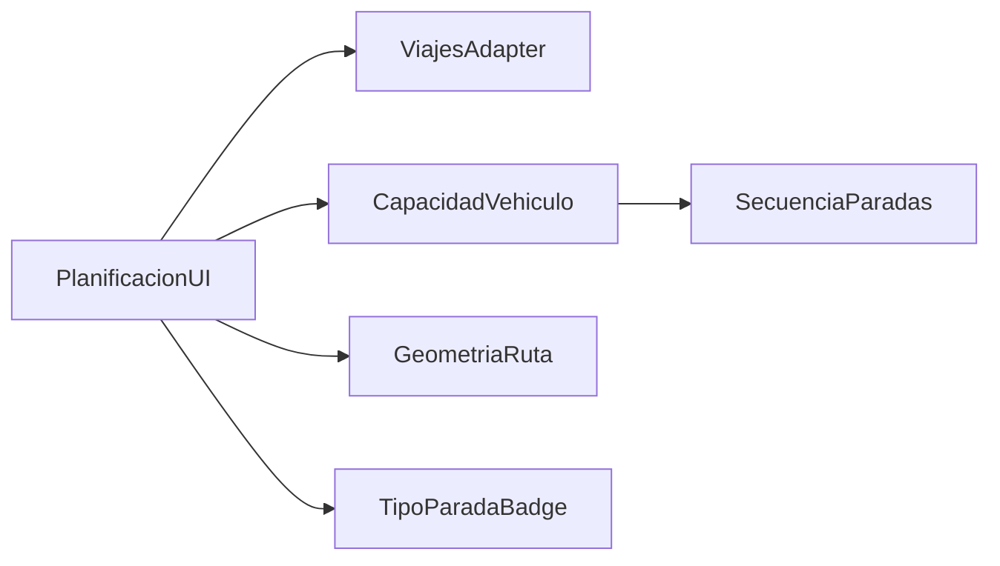

# Component Catalogue — Devoluciones/Pickups (FR16)

Deriva de `../requirements-analysis/requirements.md`. **Pase mínimo**: FR16 no
crea bloques backend nuevos; este catálogo hace explícita la descomposición que
ya existe en `src/pages/planificacion/` (verificada contra los imports reales)
para poder trazar los requisitos. Esquema completo de tipos → Functional Design.

> **rev 2** — corrige el grafo de dependencias y su dirección contra el código
> real (`capacity-fit.ts` importa `optimize-stops.ts`/`time-windows.ts`;
> `route-geometry.ts` es su propio bloque; `use-pedidos-ruta.ts` es el
> orquestador de UI).

## Part A — catálogo (machine-readable)

```yaml
components:
  - name: ViajesAdapter
    summary: Trae del WMS los viajes despachados con sus pedidos y recolecciones conocidas.
    behaviour: >
      Lee los viajes "en el muelle" con número de viaje asignado
      (viajes-api.ts / fallback-viajes.ts). Cada pedido/recolección llega ya
      asignado a un viaje (el TMS no reasigna). Marca cada pedido con tipo
      entrega o devolucion (FR16.1.1). Hoy sobre datos mock; el shape objetivo
      es trips/trip_orders.
    responsibilities:
      - Exponer los viajes seleccionables y sus pedidos con su tipo (FR16.1.1, FR16.1.3)
      - Dueño de las entidades Viaje y Pedido
    depends_on: []
    dependents:
      - component: PlanificacionUI
        interaction: La UI lista los viajes y sus pedidos
    external_dependencies:
      - name: Supabase
        kind: database
        purpose: Origen de viajes/pedidos (mockeado hoy, ver MOCKING.md)
    entities:
      - name: Viaje
        identifier: id
        attributes: [id, trip_number, route_type_id, route_type_name, trip_date, status]
      - name: Pedido
        identifier: id
        attributes: [id, order_number, customer_name, customer_id, store_id, delivery_address, delivery_city, delivery_zone, delivery_latitude, delivery_longitude, total_weight, total_volume, tipo, status, order_date, is_exception, exception_address_raw]
        references:
          - entity: Viaje
            owned_by: ViajesAdapter
            relationship: cada Pedido pertenece a un Viaje
  - name: SecuenciaParadas
    summary: Ordena las paradas de una ruta y calcula sus ETAs.
    behaviour: >
      optimize-stops.ts + time-windows.ts + distance-matrix.ts. Ordena las
      paradas (entregas + devoluciones, FR16.1) minimizando distancia/tiempo con
      la matriz N×N; respeta los pedidos anclados; calcula ETAs y marca "fuera
      de ventana". NO reordena para hacer caber una recolección intermedia (eso
      es FR16.4, fuera de alcance).
    responsibilities:
      - Incluir las devoluciones conocidas como paradas en la secuencia (FR16.1)
      - Producir el orden y los stop_number / eta / outside_window (derivados de Pedido)
    depends_on: []
    dependents:
      - component: CapacidadVehiculo
        interaction: CapacidadVehiculo la invoca para ordenar el subconjunto que cabe
    external_dependencies:
      - name: OSRM
        kind: third-party-api
        purpose: Matriz de distancias reales por calle (self-host o demo público); fallback haversine
    entities: []
  - name: CapacidadVehiculo
    summary: Bin-packing de pedidos/devoluciones contra la capacidad del vehículo (FR2) y punto de entrada del cálculo de ruta.
    behaviour: >
      capacity-fit.ts (`optimizarConCapacidad`, `seleccionarPorCapacidad`,
      `excedeCapacidadAlAnclar`). Suma peso/volumen de cada parada — entrega o
      devolución (FR16.3) — y decide qué cabe con el vehículo COMPLETO (no
      posicional). Una devolución puede quedar excluida o forzar la exclusión de
      otra parada, con el mismo aviso de FR2 (FR16.3.1). Luego llama a
      SecuenciaParadas para ordenar lo incluido.
    responsibilities:
      - Incluir el peso/volumen de las devoluciones en el cálculo (FR16.3, FR16.3.1)
    depends_on:
      - component: SecuenciaParadas
        interaction: Ordena el subconjunto de paradas que cabe
        style: sync
    dependents:
      - component: PlanificacionUI
        interaction: El hook use-pedidos-ruta invoca optimizarConCapacidad
    external_dependencies: []
    entities: []
  - name: GeometriaRuta
    summary: Geometría de la polilínea de la ruta para el mapa.
    behaviour: >
      route-geometry.ts (`obtenerGeometriaRuta`). Pide a OSRM la geometría por
      calle de la secuencia; hoy devuelve una única polilínea plana. Para
      FR16.2.2 debe poder devolver la geometría por leg (par de paradas
      consecutivas) para colorear cada tramo por tipo — approach exacto en
      functional-design.
    responsibilities:
      - Proveer la geometría de la ruta, por leg, para el coloreado de tramos (FR16.2.2)
    depends_on: []
    dependents:
      - component: PlanificacionUI
        interaction: El mapa dibuja las polilíneas con esta geometría
    external_dependencies:
      - name: OSRM
        kind: third-party-api
        purpose: Geometría de ruta por calle
    entities: []
  - name: PlanificacionUI
    summary: Vistas y hooks de la página de Planificación (cards, lista de paradas, mapa, barra de capacidad).
    behaviour: >
      page.tsx + use-pedidos-ruta.ts + components/. Orquesta el flujo
      (seleccionar viaje → optimizar → generar). Distingue visualmente las
      devoluciones (FR16.2): acento indigo + TipoParadaBadge en cards/lista;
      pin indigo y tramo indigo discontinuo en el mapa (FR16.2.2); regla
      tipo(indigo)+estado(badges existentes) separados (FR16.2.3). Muestra la
      nota "incluye N de devoluciones" en la barra de capacidad.
    responsibilities:
      - Render de la distinción visual por tipo (FR16.2, FR16.2.3)
      - Coloreado de los tramos del mapa usando la geometría por leg (FR16.2.2)
    depends_on:
      - component: ViajesAdapter
        interaction: Lista los viajes y sus pedidos
        style: sync
      - component: CapacidadVehiculo
        interaction: Invoca el cálculo de ruta con capacidad
        style: sync
      - component: GeometriaRuta
        interaction: Obtiene la geometría por leg para el mapa
        style: sync
      - component: TipoParadaBadge
        interaction: Renderiza el badge de tipo
        style: sync
    dependents: []
    external_dependencies:
      - name: OpenStreetMap tiles / Leaflet
        kind: third-party-api
        purpose: Tiles del mapa
    entities: []
  - name: TipoParadaBadge
    summary: Componente de UI pequeño que muestra el tipo de una parada.
    behaviour: >
      Renderiza un badge indigo con ícono ri-arrow-go-back-line y texto
      "Devolución" cuando tipo === devolucion; nada para entrega. No interactivo.
    responsibilities:
      - Indicador visual + textual del tipo de parada (FR16.2.1)
    depends_on: []
    dependents:
      - component: PlanificacionUI
        interaction: La UI lo usa dentro de las cards y la lista
    external_dependencies: []
    entities: []
```

## Part B — vista humana

### Component Diagram



Texto: `PlanificacionUI` orquesta y depende de `ViajesAdapter` (datos),
`CapacidadVehiculo` (cálculo de ruta), `GeometriaRuta` (mapa) y
`TipoParadaBadge` (UI). `CapacidadVehiculo` invoca a `SecuenciaParadas` para
ordenar lo que cabe.

### Component Summary

| Component | Purpose | Depends On | Dependents | Entities Owned |
|-----------|---------|-----------|-----------|----------------|
| ViajesAdapter | Trae viajes + pedidos con tipo | — | PlanificacionUI | Viaje, Pedido |
| SecuenciaParadas | Orden de paradas + ETAs | — | CapacidadVehiculo | — |
| CapacidadVehiculo | Bin-packing (FR2) + entrada del cálculo | SecuenciaParadas | PlanificacionUI | — |
| GeometriaRuta | Geometría de la ruta por leg | — | PlanificacionUI | — |
| PlanificacionUI | Orquestación + distinción visual | ViajesAdapter, CapacidadVehiculo, GeometriaRuta, TipoParadaBadge | — | — |
| TipoParadaBadge | Badge de tipo (nuevo) | — | PlanificacionUI | — |

### Entity Ownership

| Entity | Owning Component | Identifier | Attributes | References |
|--------|-----------------|-----------|------------|-----------|
| Viaje | ViajesAdapter | id | id, trip_number, route_type_id, route_type_name, trip_date, status | — |
| Pedido | ViajesAdapter | id | id, order_number, customer_name, customer_id, store_id, delivery_address, delivery_city, delivery_zone, delivery_latitude, delivery_longitude, total_weight, total_volume, **tipo**, status, order_date, is_exception, exception_address_raw | Viaje (ViajesAdapter) |

Derivados en SecuenciaParadas (no de dominio, se detallan en functional-design):
`stop_number`, `eta_min`, `outside_window`.

### External Dependencies

| Component | Dependency | Kind | Purpose |
|-----------|-----------|------|---------|
| ViajesAdapter | Supabase | database | Origen de viajes/pedidos (mock hoy) |
| SecuenciaParadas | OSRM | third-party-api | Matriz de distancias reales (fallback haversine) |
| GeometriaRuta | OSRM | third-party-api | Geometría de ruta por calle |
| PlanificacionUI | OSM tiles / Leaflet | third-party-api | Tiles del mapa |

### Rationale

| Component | Por qué es un bloque separado |
|-----------|-------------------------------|
| ViajesAdapter | Distinta fuente de datos (WMS) y ritmo de cambio; dueño de las entidades. |
| SecuenciaParadas | Algoritmo de orden + ETAs; reutilizable, cambia por razones de optimización. |
| CapacidadVehiculo | Regla de negocio de capacidad (FR2); es el punto de entrada del cálculo y orquesta la secuencia. |
| GeometriaRuta | Concierne solo a la geometría para el mapa; cambia por FR16.2.2 sin tocar el algoritmo de orden. |
| PlanificacionUI | Presentación + orquestación de flujo; cambia por UX. |
| TipoParadaBadge | Único elemento nuevo; aislado para poder promoverlo al design system. |

**Alternatives Rejected:** modelar `Devolucion` como entidad separada — rechazado
(ADR-1 en `decisions.md`).

## Assumptions & Open Questions

- [assumption] La descomposición refleja los imports actuales de
  `src/pages/planificacion/`; `functional-design` la aterriza a archivos.
- Open question (functional-design): cómo `GeometriaRuta` devuelve geometría
  por leg sin degradar rendimiento (aterriza FR16.2.2).
- Open question: `FR16.3.2` (chequeo posicional de capacidad para una
  recolección intermedia) queda `Deferred` a FR16.4 — no se construye en este
  ciclo (ver `traceability.json`).

## Review

**Verdict:** READY
**Reviewer:** aidlc-architecture-reviewer-agent
**Date:** 2026-09-01T14:46:28Z
**Iteration:** 2
**Clase:** advisory (pase único; los hallazgos van al humano en el gate, sin ciclo de correcciones)

### Verificación de hallazgos rev 1

| # rev1 | Severidad | Estado | Evidencia |
|--------|-----------|--------|-----------|
| 1 (Critical) — grafo `depends_on`/`dependents` roto | Critical | Resuelto | El grafo se reconstruyó. Simetría completa: `PlanificacionUI` depends_on {ViajesAdapter, CapacidadVehiculo, GeometriaRuta, TipoParadaBadge} y cada uno lo lista en `dependents`; `CapacidadVehiculo` depends_on `SecuenciaParadas` y `SecuenciaParadas` lo lista en `dependents`. Un solo arco no-UI, sin ciclos. |
| 2 (Major) — dirección invertida vs. código | Major | Resuelto | `capacity-fit.ts` importa `./optimize-stops` y `./time-windows`; `optimizarConCapacidad` llama `seleccionarPorCapacidad` y luego `optimizarParadas`. La dirección `CapacidadVehiculo → SecuenciaParadas` del catálogo coincide con los imports reales. |
| 3 (Major) — entidad `Viaje` sin dueño | Major | Resuelto | `Viaje` y `Pedido` declarados bajo `ViajesAdapter` en el YAML y en la tabla Entity Ownership; `references: [{entity: Viaje, owned_by: ViajesAdapter}]` bajo su dueño. |
| 4 (Major) — FR16.3.2 mal etiquetado `OK` | Major | Resuelto | `traceability.json`: FR16.3.2 → `Deferred`, target FR16.4 / fuera de alcance. Coherente con requirements.md y con el hallazgo advisory de requirements-analysis. |
| 5 (Major) — FR16.2.2 sin dueño | Major | Resuelto | Nuevo componente `GeometriaRuta` (route-geometry.ts / `obtenerGeometriaRuta`); `traceability.json` FR16.2.2 → `GeometriaRuta`. |
| — ADR-1 semántica de pickups | — | Resuelto | ADR-1 "Nota de semántica": `delivery_address` = dirección de recogida y `total_weight`/`total_volume` = carga entrante cuando `tipo === devolucion`; el bin-packing los trata igual para ocupación. Coincide con `capacity-fit.ts` (suma peso/volumen sin discriminar tipo). |

### Hallazgos nuevos

| # | Severidad | Ubicación | Hallazgo | Recomendación |
|---|-----------|-----------|----------|---------------|
| 1 | Minor | components.md — `PlanificacionUI.depends_on` | El hook `use-pedidos-ruta.ts` importa directamente `withStopNumbers` de `./optimize-stops` y `construirMatrizDistancias` de `./distance-matrix`, ambos asignados a `SecuenciaParadas` en el catálogo. En el código PlanificacionUI también depende de `SecuenciaParadas`, no solo vía `CapacidadVehiculo`. El catálogo lo omite. No bloquea (la descomposición es lógica y functional-design aterriza archivos), pero el grafo declarado es una simplificación del real. | Añadir `SecuenciaParadas` a `PlanificacionUI.depends_on` (interacción: `withStopNumbers` para render de paradas y matriz para ETAs), o dejar una nota explícita de que ese arco se resuelve en functional-design. |
| 2 | Minor | domain-design-questions.md — Consolidated Summary | El resumen que el humano confirmó con "Looks correct" dice "Dueño de la entidad `Parada`/`Pedido` … (dueño: `SecuenciaParadas`)". rev 2 movió esa propiedad a `ViajesAdapter` (cambio correcto: la fuente WMS es `ViajesAdapter`), pero diverge del texto aprobado. | Confirmar el cambio de dueño de entidad con el humano en el gate; es una mejora, no una regresión, pero no fue lo aprobado en el Q&A. |
| 3 | Minor | traceability.json — `FR16.2.2` status `OK` | `GeometriaRuta` declara que la geometría por leg "debe poder devolver … approach exacto en functional-design" y hay open question de rendimiento abierta. El requisito tiene dueño pero el diseño no está cerrado; `OK` es optimista frente a `Partial`. Aceptable como diferimiento a functional-design. | Sin acción de bloqueo; verificar que functional-design cierre la geometría por leg y su costo. |

### Validation Tool Results

| Tool | Result | Interpretation |
|------|--------|----------------|
| Revisión manual de simetría del grafo | PASS | Todo `depends_on` tiene su `dependents` recíproco y viceversa. |
| Revisión manual de aciclicidad | PASS | Único arco no-UI `CapacidadVehiculo → SecuenciaParadas`; sin ciclos. |
| Cotejo contra imports reales (`capacity-fit.ts`, `use-pedidos-ruta.ts`, `route-geometry.ts`) | PASS con nota | Direcciones correctas; falta el arco `PlanificacionUI → SecuenciaParadas` (hallazgo nuevo #1). |
| Cobertura de `traceability.json` vs. `requirements.md` | PASS | 14 IDs FR16.x mapeados; `Deferred`/`N/A` justificados. `reverse: []` vacío (aceptable para este pase mínimo). |

### Summary

Los cuatro hallazgos rev 1 (1 Critical, 3 Major) más la nota de semántica de ADR-1 están resueltos con evidencia verificable en código. El grafo de componentes ahora es simétrico, acíclico y su dirección coincide con los imports reales; `Viaje`/`Pedido` tienen dueño (`ViajesAdapter`); FR16.3.2 está correctamente `Deferred` y FR16.2.2 tiene dueño (`GeometriaRuta`). Quedan tres hallazgos Minor no bloqueantes: el arco `PlanificacionUI → SecuenciaParadas` no declarado, la divergencia con el resumen aprobado en el Q&A sobre el dueño de la entidad, y el status `OK` optimista de FR16.2.2. Veredicto advisory: READY.
