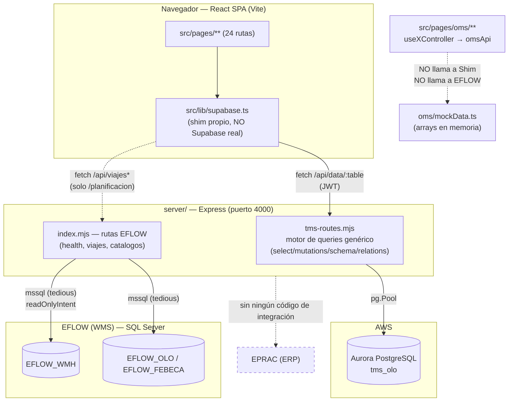
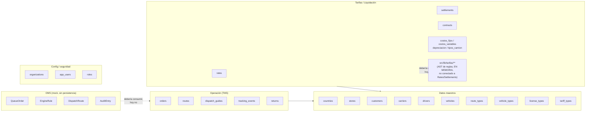

# Documento 1 — Arquitectura AS-IS

> Verificado contra el código el 2026-09-21. Extiende `../reference/analisis-sistema-tms.md`
> (que cubre conectividad y roturas de flujo) con vista de dominio, diagramas
> Mermaid y un inventario explícito de deuda técnica para el rediseño.

## 1. Vista de contenedores

**Lectura clave:** hay dos backends de datos completamente independientes
(Aurora vía `tms-routes.mjs`, y EFLOW QA vía `mssql`), y un tercer "módulo"
(OMS) que no habla con ninguno de los dos — es una maqueta autocontenida.

## 2. Vista de dominio actual (por carpeta, no por diseño intencional)

El código no está organizado en bounded contexts explícitos; la organización
real es por página/ruta. Agrupando por afinidad de datos:

## 3. Módulos frontend (24 rutas) y su estado real

| Módulo | Ruta | Backend real | Estado |
|---|---|---|---|
| Dashboard | `/`, `/dashboard` | Aurora | Funcional |
| Pedidos | `/pedidos` | Aurora | Funcional (catálogo simple, sin reglas) |
| Rutas | `/rutas` | Aurora | Funcional |
| Planificación | `/planificacion` | Aurora + EFLOW QA (lectura) | Parcial — EFLOW sin credenciales aquí |
| Vehículos, Conductores, Clientes, Tiendas, Países, Transportistas | varias | Aurora | Funcional (CRUD catálogo) |
| Tarifario (`/reglas-tarifa`) | Zonas, FX, plantillas, costos, bitácora | **Datos locales en memoria** (`src/lib/tarifas/localData/`) | Kernel de reglas sofisticado, pero **no persiste en Aurora** |
| Liquidaciones | `/liquidaciones` | Aurora (`settlements`) + snapshot local (`settlementSnapshots.ts`) | Mixto — la tabla real no tiene las columnas de margen/desglose que el kernel calcula |
| Configuración, Contratos, Devoluciones, Guías, Reportes, Tracking | varias | Aurora | Funcional |
| **OMS** (Panel, Cola, Reglas, Simulador, Auditoría, Calendario) | `/oms/**` | **Ninguno — 100% mock** | Maqueta funcional, sin persistencia, sin reglas reales |

## 4. Integraciones externas

| Integración | Tipo | Estado real |
|---|---|---|
| EFLOW (WMS) QA | Lectura, `mssql`, por país (CR/VE) | Código existe; **sin credenciales en este entorno**; solo alimenta `/planificacion` |
| EFLOW (WMS) producción (`EFLOW_OLO` CR) | — | **No existe.** Réplica pendiente de solicitar (ya registrado en `project.md`) |
| EPRAC (ERP) | — | **Cero código.** Solo mencionado en documentación de negocio como fuente de una fecha que el OMS lee |
| Softland | — | **Cero código.** `carriers.payment_account`/`softland_code` son columnas de datos, no hay conector |
| Proveedor de mapas | — | No hay abstracción; cualquier geocoding/ETA hoy es manual o no existe |
| Supabase | — | **No existe.** `src/lib/supabase.ts` es un shim propio con la misma interfaz encadenable, contra el backend Express de este repo |

## 5. Deuda técnica identificada (para priorizar en el roadmap)

1. **Tabla `zones` inexistente** — referenciada por `StoreModal` y
   `RouteTypeModal`; rompe esos dos formularios. (Ver `../reference/analisis-sistema-tms.md` §5.3.)
2. **Sin jerarquía País → Almacén → Cliente → Cliente Final** — `organization_id`
   es el único límite de tenant real; `country_id` es un atributo suelto, no
   un nivel de jerarquía con reglas propias.
3. **`stores` mezcla dos conceptos** — bodega/almacén de origen (`is_origin`)
   y punto de entrega de destino en la misma tabla y con las mismas columnas.
4. **Motor de reglas de tarifas desconectado de la base de datos real** —
   `src/lib/tarifas/` calcula con `Rule[]`, `ZoneLaneRate[]`, `FxRate[]` que
   viven en `localData/`, no en `rates`/`carriers`/`countries` de Aurora.
5. **`settlements` no tiene columnas para el desglose de costo/margen** que
   el kernel de tarifas ya calcula (`CostBreakdown`, `MarginResult`) — de ahí
   el snapshot paralelo en `settlementSnapshots.ts`.
6. **OMS sin persistencia ni motor de reglas real** — `EngineRule` en
   `oms/types.ts` es una descripción de texto con un peso editable; no hay
   AST, no hay ejecución, no hay versión, no hay log de ejecución.
7. **`PriorityTier` fijo a 4 niveles y `Country` fijo a `'CR' | 'VE'`** en
   `oms/types.ts` — hardcodeado como unión de TypeScript, no como catálogo de
   datos; agregar un país o cambiar el número de niveles de prioridad requiere
   tocar código, no configuración.
8. **Sin RBAC por scope** — hay `roles`/`app_users`, pero ningún concepto de
   alcance (país/almacén/cliente) en la autorización; cualquier usuario
   autenticado ve todas las organizaciones vía `organization_id` del propio
   usuario, sin aislamiento más fino.
9. **Sin abstracción de integración** — el código que hablará con EFLOW,
   Softland o un proveedor de mapas se acoplaría directamente si se construye
   con el patrón actual (ver `server/db.mjs`, que ya está acoplado a `mssql`
   sin interfaz intermedia).
10. **Sin auditoría de decisiones** — no existe `decision_log` ni
    `rule_execution_log`; el kernel de tarifas sí genera `TraceLine`
    (trazabilidad) pero no la persiste, se descarta al cerrar la sesión del
    navegador salvo que se emita una `Proforma`.

## 6. Lo que YA está bien resuelto (no reinventar)

- **`src/lib/tarifas/` — AST de reglas.** Reglas versionadas, condiciones
  tipadas (`Pred`), expresiones compuestas (`Expr`: `FIXED`, `PER_KM`,
  `PERCENT` con base explícita, `TIERED`, `LOOKUP_ZONE` con fallback, `IF`),
  *stages* ordenados (`BASE → VARIABLE → MODIFIER → SURCHARGE → ADJUSTMENT → TAX`),
  *stacking* (`SUM`/`MAX`/`EXCLUSIVE`), *overrides* que nunca sobreescriben en
  silencio (piden motivo), y snapshots inmutables (`Proforma`) que nunca se
  recalculan retroactivamente. **Esto es, en diseño, casi exactamente el
  motor de reglas genérico que el prompt maestro pide para el OMS** — falta
  generalizarlo y conectarlo a Postgres, no rediseñarlo desde cero.
- **`computeCost()` — separación costo fijo/variable.** Ya distingue
  `COST_KM` (operativo), `COST_DEPRECIATION`, `COST_DRIVER` para flota propia,
  y tarifa plana para outsourcing — alineado con la fórmula de costo/km que
  ya está `DECIDED` en `project.md` (mandato de Jean Carlo).
- **`MarginPolicy`/`MarginResult`** — ya modela `WARN`/`CRITICAL`/`LOSS` y
  `blockOnLoss`, con motivo obligatorio bajo umbral — exactamente el patrón
  de auditabilidad de decisión que el prompt maestro pide en general.
- **`server/tms-relations.mjs`** — whitelist de tablas + mapa de FKs
  centralizado; es un buen punto de apoyo para migrar hacia un modelo con más
  niveles de jerarquía sin reescribir el motor de queries desde cero.
