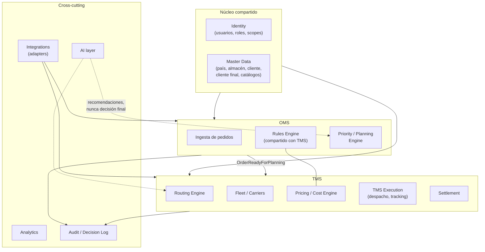
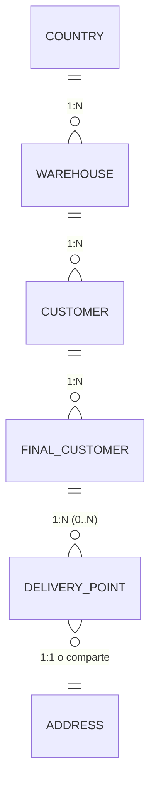
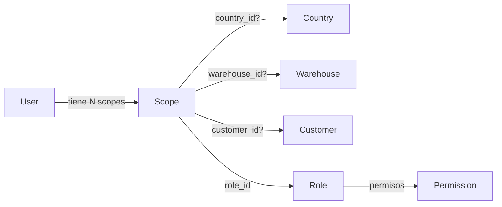
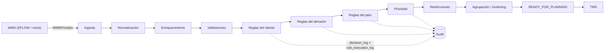
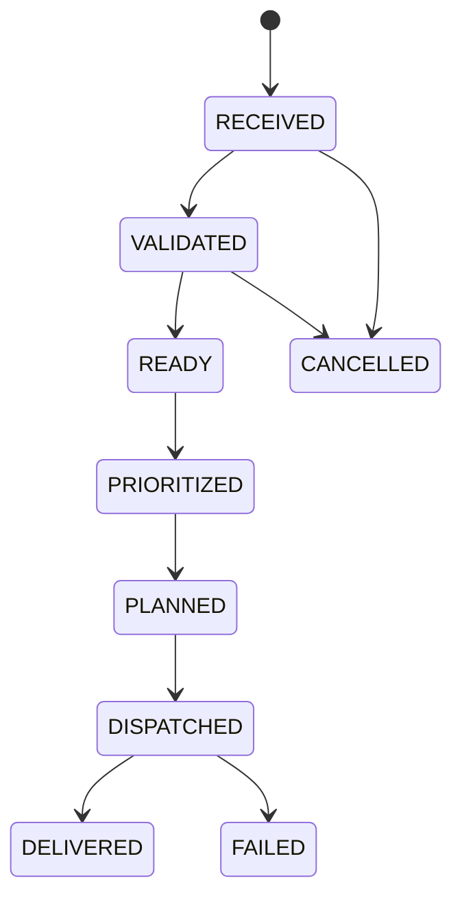
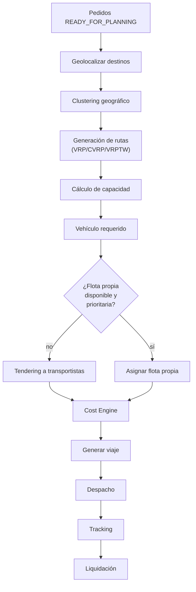
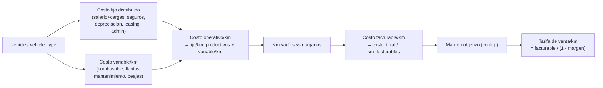
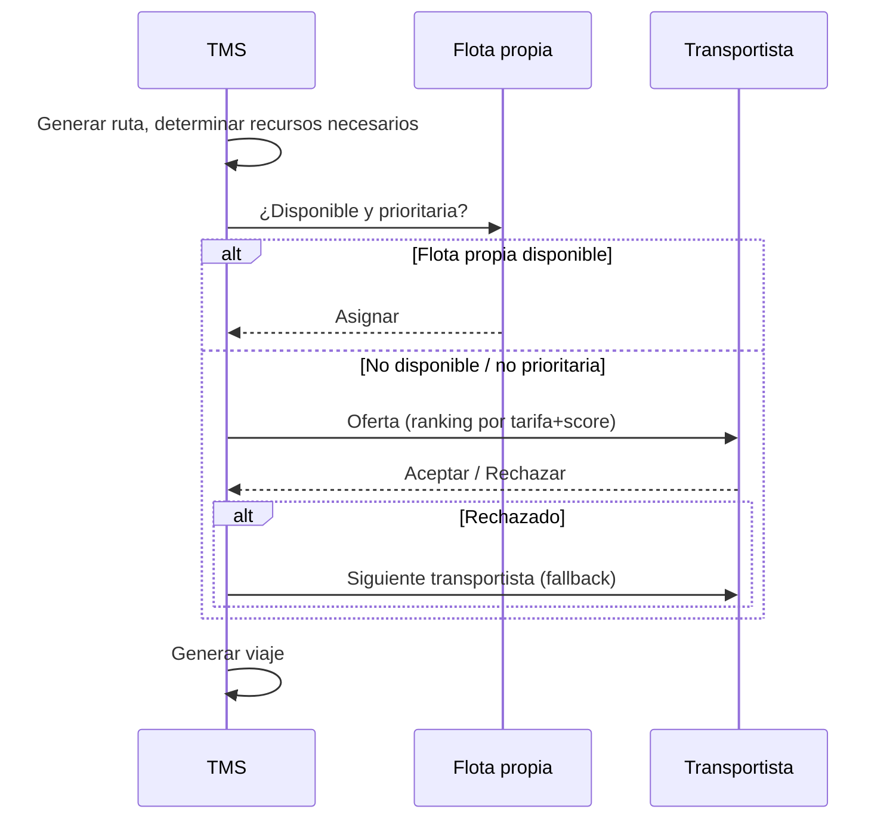
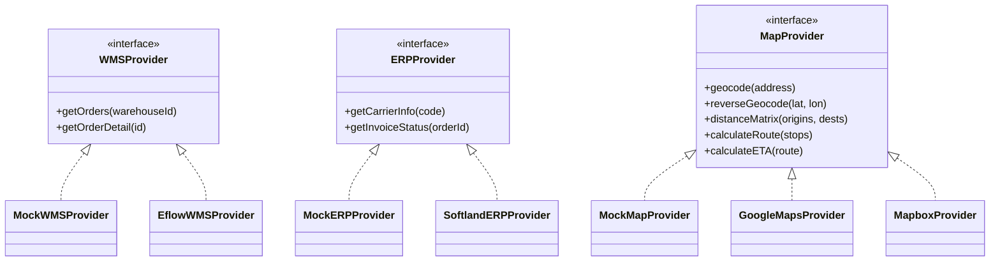
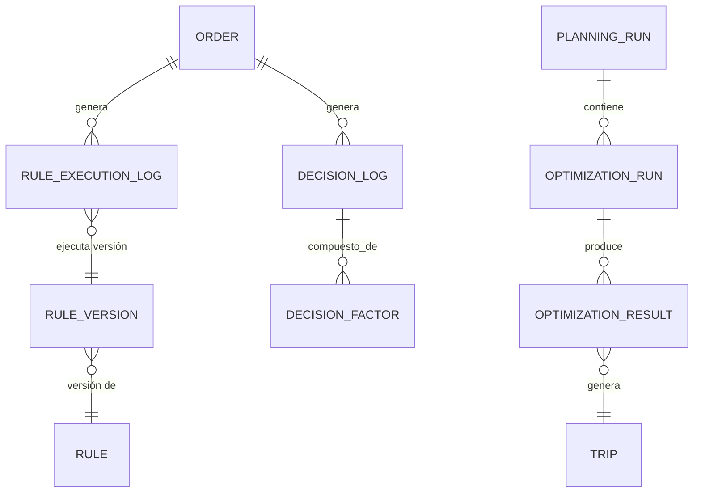

# Documento 2 — Arquitectura TO-BE

> Diseño objetivo. Cada sección liga con la sección correspondiente del
> prompt maestro (`§N`). Las decisiones que necesitan confirmación de negocio
> están marcadas `❓ DECISIÓN REQUERIDA` en línea y se repiten, resumidas, en
> §11.

## 1. Principio arquitectónico: Modular Monolith (§44)

Se descarta microservicios/Kafka/event-sourcing completo *para esta fase*.
Se propone un **modular monolith** con bounded contexts explícitos como
carpetas/paquetes con fronteras de import controladas (lint de dependencias
entre contextos), desplegado como el mismo backend Express que ya existe,
evolucionando gradualmente el motor de queries genérico actual hacia
repositorios por contexto.

Bounded contexts propuestos (§44):



`Rules Engine` es **un solo componente compartido**, no dos motores
separados: generaliza `src/lib/tarifas/` (ver `01-as-is.md` §6) para que
tanto las reglas de priorización de pedidos (OMS) como las reglas de tarifa
(TMS) sean instancias del mismo AST versionado, con distinto vocabulario de
variables (`VarKey`) por dominio.

## 2. Jerarquía País → Almacén → Cliente → Cliente Final (§4, §6, §8)



**Decisión de modelado (§4 pide evaluar si conviene separar
`final_customers`/`delivery_points`/`addresses`/`contacts`/`geo_locations`):**

Se propone **sí separar**, por estas razones concretas del dominio real:

- Un cliente final (ferretería de Cofersa, tienda de EPA) puede tener **más
  de un punto de entrega** (bodega + tienda, o varias sucursales bajo el
  mismo cliente final) — `stores`/`customers` hoy asumen una sola dirección
  por fila.
- Los **contactos** (teléfono de recepción, encargado de bodega) cambian con
  más frecuencia que la dirección y no deberían forzar un update de la fila
  de cliente final.
- La **geolocalización** (lat/lon) es un dato que se recalcula/corrige
  independientemente del resto (geocoding, corrección manual) — separarlo
  permite reintentar geocoding sin tocar la entidad de negocio.

Modelo propuesto (detalle de columnas en `03-modelo-datos-erd.md`):

```
countries
warehouses            (antes: implícito, no existía como entidad)
customers             (Cofersa, EPA — cliente del almacén, ya existe, se re-scope a warehouse_id)
final_customers       (cliente final de un customer — ej. ferretería X de Cofersa)
delivery_points       (0..N por final_customer; incluye is_default)
addresses             (1:1 con delivery_point, o compartida si aplica)
contacts              (0..N por final_customer o delivery_point)
```

`UNIQUE(customer_id, external_code)` en `final_customers`, **no**
`UNIQUE(external_code)` global (§8) — un mismo código externo puede repetirse
entre clientes distintos de OLO.

❓ **DECISIÓN REQUERIDA (ya abierta en `project.md` como "unificar
Clientes y Puntos de Entrega"):** confirmar que este es exactamente el
"unificar" al que se refería el mandato de Jean Carlo — la propuesta aquí
es la interpretación más segura y auditable, pero es una decisión de
negocio, no solo técnica.

## 3. Multi-país desde el diseño (§5)

Cada uno de estos atributos se modela como **dato de configuración por país**,
nunca como constante de código:

| Atributo | Tabla/mecanismo propuesto |
|---|---|
| Moneda, timezone, locale, formato de fecha | `countries` (columnas) |
| Unidades de medida | `countries.unit_system` o config heredable (§34) |
| Tipos de identificación | `id_document_types` con `country_id` |
| Tipos de licencia | `driver_license_types` con `country_id` (§10) |
| Reglas regulatorias | `rules` con `scope='COUNTRY'` |
| Proveedor de mapas | `map_provider_config` por país (§16) |
| Tipos de vehículo, tarifas, combustible | ya tienen/tendrán `country_id` |
| WMS/ERP/credenciales por país | `integration_credentials` por `country_id` + `provider`, en Secrets Manager, nunca en código (§39) |
| Transportistas | `carriers.country_id` (ya existe) |

Costa Rica es el primer **valor de dato** en `countries`, no un caso especial
de código. El criterio de aceptación de esta sección: **ningún módulo nuevo
debe compilar un `if (country === 'CR')`** — si aparece, es una señal de que
falta una tabla/columna de configuración.

## 4. Aislamiento de datos y RBAC por scope (§6, §39)



- Toda entidad transaccional relevante lleva `country_id` + `warehouse_id` (y
  `customer_id` cuando aplica) — no solo `organization_id`.
- Autorización: RBAC con **scopes múltiples por usuario**
  (`user_scopes(user_id, role_id, country_id?, warehouse_id?, customer_id?)`),
  evaluados como intersección — un usuario "Operativo EPA" tiene
  `customer_id = EPA`, y toda query de datos de negocio filtra por scope
  antes de devolver filas (a nivel de repositorio/query, no solo en el
  frontend).
- Test crítico (§42): "EPA nunca obtiene clientes de Cofersa" se implementa
  como test de integración contra el repositorio de datos, no como regla de
  UI.

## 5. OMS — Torre de Control inteligente (§, dominio completo)



Este pipeline reemplaza al `omsApi` mock actual. Cada flecha con reglas pasa
por el **Rules Engine compartido** (§1), con `scope` `CUSTOMER` → `WAREHOUSE`
→ `COUNTRY` → `GLOBAL` evaluado en ese orden (más específico gana, salvo que
una regla declare `stacking='EXCLUSIVE'`).

**Máquina de estados de `orders` propuesta (§30)** — sustituye a los strings
mixtos español/inglés que hoy coexisten en la tabla real (`'assigned'`,
`'Asignado'`, `'delivered'`, etc., ver `03-modelo-datos-erd.md` para el gap):



## 6. TMS — planificación, ruteo, costo, ejecución (§14–§24)

**Principio de planificación (§14): "la ruta manda".** El transportista no
determina la ruta; el sistema genera la ruta y luego evalúa qué
recurso (flota propia o transportista) la ejecuta, considerando capacidad,
disponibilidad, licencia, costo, SLA y reglas del cliente.



**Algoritmo de ruteo (§15):** no implementar heurística propia si una
solución robusta ya existe. Recomendación: **Google OR-Tools** (VRPTW) como
motor de optimización — límites de capacidad, ventanas de entrega, múltiples
depósitos (cuando exista `warehouse_id`) y costo por arco están soportados
de fábrica; correr como *job* asíncrono (§43), no bloqueando el request HTTP.

**Priorización de flota propia (§13):** se modela como una regla del motor
compartido (`scope` configurable por país/almacén/cliente/tipo de servicio),
nunca como `if (fleetType === 'OWN')` en el código de asignación — el
`fleetType` de `src/lib/tarifas/types.ts` ya existe como dato; falta que la
*decisión* de priorizarlo sea una regla evaluada, no una constante de código.

## 7. Cost Engine (§17–§23)

Se propone **formalizar, no reinventar**, `computeCost()`
(`src/lib/tarifas/cost.ts`), generalizándolo así:



Esto es **exactamente** la fórmula ya `DECIDED` en `project.md` (mandato de
Jean Carlo, 2026-09-16/21). El trabajo de TO-BE no es diseñar la fórmula —
ya está decidida — es: (a) mover el cálculo de `src/lib/tarifas/` (memoria,
por trip) a un `CostEngine` persistente por vehículo/tipo de vehículo con
snapshot (§23: *"un viaje histórico NO debe recalcularse con el precio de
combustible actual"* — `Proforma` ya implementa exactamente esto), y (b)
conectarlo a las tablas reales (`rates`, `settlements`, `vehicles`) en vez de
`localData/`.

❓ **DECISIÓN REQUERIDA** (ya abierta en `project.md`): base del % de
ocupación (peso, volumen, o ambos — §22 sugiere `MAX(weight_utilization,
volume_utilization, pallet_utilization)` pero pide analizarlo antes de
implementar) y origen del % de margen (¿por cliente? ¿por país? ¿global con
override?).

## 8. Tarifas — tipos soportados (§21)

`PER_KM`, `PER_UNIT`, `FIXED`, `VOLUME`, `WEIGHT`, `ZONE`, `TENDERING`,
`HYBRID` — de estos, `PER_KM`/`FIXED`/`PER_UNIT`/`ZONE` (vía `LOOKUP_ZONE`) ya
están modelados en el AST de `src/lib/tarifas/types.ts::Expr`. `TENDERING` no
es una tarifa (es un *proceso* de asignación — ver §9) y `VOLUME`/`WEIGHT` ya
existen conceptualmente como `NumericVarKey`. La tabla real `tariff_types`
(migración 05, ya aplicada) lista los 5 tipos mandatados por Jean Carlo — el
gap es de **conexión**, no de diseño del AST.

## 9. Tendering (§24)



Fase inicial: **manual** (Torre de Control ve el ranking y decide) — nivel 1
de automatización (§38). Queda preparado para automatizarse (nivel 3/4) sin
cambiar el contrato del proceso, solo el `automation_level` configurado.

## 10. Reglas → Optimización → IA (§25)

| Capa | Qué decide | Ejemplos | Auditable como |
|---|---|---|---|
| **1. Reglas** (determinístico) | Restricciones, SLA, prioridad, compatibilidad, licencias, capacidad | "Pedido de EPA prioridad 1 si ventana < 4h" | `rule_execution_log`, `TraceLine` |
| **2. Optimización** (matemático) | Ruteo, clustering, asignación de vehículo, costo | OR-Tools VRPTW | `optimization_run`, `optimization_result` |
| **3. IA** (probabilístico) | Predicciones, anomalías, recomendaciones, ETA predictivo, demanda | "Este pedido tiene 80% de probabilidad de fallar SLA" | `ai_recommendation` con `confidence`, nunca decide sola |

**Regla dura de diseño (§25 lo exige explícitamente):** ninguna decisión
crítica (asignar ruta, bloquear despacho, aprobar tarifa bajo margen)
depende exclusivamente de una respuesta de LLM no auditable. La IA
**siempre** entra como *capa 3*, alimentando una recomendación que la capa 1
o un humano confirma; nunca sustituye la Capa 1/2 para decisiones que ya
tienen una regla determinística aplicable.

## 11. Integraciones — patrón Adapter (§9, §16, §27)



El dominio (OMS/TMS) depende únicamente de las interfaces (`WMSProvider`,
`ERPProvider`, `MapProvider`, y análogamente `CarrierProvider`,
`NotificationProvider`, `AIProvider`). La configuración (`integration_config`
por país) decide qué implementación se inyecta en runtime. Esto habilita
desarrollar y probar TODO el sistema contra `Mock*Provider` antes de que
exista una sola credencial real — que es exactamente el estado actual del
OMS, solo que hoy esa frontera no es una interfaz formal, es "no hay código".

## 12. Auditoría de decisiones (§12, §31, §33)



Cada decisión automática expone: qué regla, qué versión, sobre qué pedido,
qué condición se cumplió, qué decisión produjo, cuándo, y por qué — el
ejemplo del prompt maestro (§12, "Pedido #123 asignado a Ruta #55, 8
razones") se sirve directamente desde `decision_log` +
`decision_factor` (uno por razón, con su peso/score), reutilizando el
patrón `TraceLine` que `src/lib/tarifas/` ya implementa para el desglose de
tarifa.

Identificadores de correlación (§31) atraviesan todo el pipeline:
`correlation_id`, `order_id`, `planning_run_id`, `optimization_run_id`,
`trip_id`, `rule_execution_id`, `decision_id` — se propagan como columnas, no
solo como líneas de log, para que cualquier tabla de auditoría pueda unirse
por cualquiera de ellos.

## 13. Configuración heredable (§34)

```
GLOBAL → COUNTRY → WAREHOUSE → CUSTOMER
```

Tabla `config_values(scope_type, scope_id, key, value, effective_from, updated_by)`.
Resolución: buscar la clave desde el scope más específico hacia arriba,
devolver el primer valor encontrado; cada resolución queda auditada (qué
scope ganó) para que un cambio de comportamiento sea explicable. Mismo
patrón que ya usa `aidlc/spaces/default/memory/` (org → team → project →
phase) para las reglas del propio framework de desarrollo — reutilizar la
idea, no la implementación.

## 14. Exception-based management y Human-in-the-loop (§37, §38)

- **Exception Queue** (`exceptions` table: `severity`, `type`, `entity_ref`,
  `reason`, `recommended_action`, `assigned_user`, `status`, timestamps) —
  la Torre de Control opera sobre esta cola, no sobre la lista completa de
  pedidos.
- **Niveles de automatización** (`automation_level` 0–4) configurables por
  proceso (ej. priorización = nivel 3, tendering = nivel 1 al inicio) vía la
  configuración heredable de §13.

## 15. Frontend — Context Selector (§35, §36)

Selector persistente de contexto (País → Almacén → Cliente) que controla qué
datos ve cada pantalla — reemplaza el estado disperso `country: 'CR'|'VE'`
que hoy vive dentro de cada `use<Modulo>Controller` del OMS (`useColaController`,
`usePanelController`, etc.) por un contexto global compartido, coherente con
el RBAC por scope de §4.

## 16. Observabilidad, testing, performance, seguridad (§31, §39, §42, §43)

Ver `05-roadmap.md` para cuándo se aborda cada uno; resumen de criterios de
aceptación:

- Logs estructurados con los IDs de correlación de §12.
- Suite de tests: aislamiento multi-tenant (EPA↔Cofersa, CR↔VE) como
  **primera clase de test**, no un caso adicional.
- Ruteo/optimización como job en background (queue + worker), nunca
  bloqueando un request HTTP — diseño para 100k pedidos, no solo decenas.
- Secretos de integraciones en un secrets manager (AWS Secrets Manager, ya
  que el stack objetivo es AWS), nunca en `.env` versionado — nota: el
  `.env` actual con credenciales reales de AWS ya está en el historial de
  git; su remediación es un prerequisito de seguridad independiente de este
  rediseño (ver `01-as-is.md` §5 y el mensaje de commit correspondiente).

## 17. EPRAC/Softland — qué se sabe y qué falta decidir

El código actual no tiene ninguna integración con EPRAC. La documentación de
negocio establece que el OMS **lee** (nunca escribe) una fecha que EPRAC
genera. Bajo el patrón de adapters de §11, esto se modela como
`ERPProvider.getPlannedDispatchDate(orderRef)` — pero **no hay contrato de
API de EPRAC disponible en este repositorio**, así que la interfaz propuesta
es una hipótesis a validar con quien mantenga EPRAC, no una integración lista
para construir.

## 18. Riesgos de esta propuesta

| Riesgo | Mitigación |
|---|---|
| Generalizar `src/lib/tarifas/` para OMS puede introducir regresiones en Liquidaciones (que ya está en producción/uso) | Extraer el AST genérico a un paquete compartido con tests de regresión sobre los casos actuales de Liquidaciones antes de que el OMS lo use |
| Migrar a jerarquía País→Almacén→Cliente→Cliente Final toca casi todas las tablas transaccionales | Migración incremental por fases (ver `05-roadmap.md`), nunca un solo `ALTER` masivo; columnas nuevas nullable primero, backfill, luego `NOT NULL` |
| OR-Tools agrega una dependencia pesada (o un servicio Python separado) | Evaluar como *job* aislado (posible Lambda separada) antes de decidir si vive en el monolito o como servicio propio |
| Éxito de "la ruta manda" depende de tener geocoding confiable | `MapProvider` con fallback a mock/manual mientras no haya proveedor de mapas contratado |

## 19. ⚠️ Diferencias EXPECTED vs CURRENT detectadas al validar contra el código

| # | EXPECTED (prompt maestro) | CURRENT (código real) | GAP | RECOMENDACIÓN |
|---|---|---|---|---|
| 1 | "El OMS obtiene principalmente información del WMS... inicialmente MOCK DATA" | Correcto — confirmado, 100% mock | Ninguno | — |
| 2 | "Existe integración parcial de lectura hacia EFLOW QA" | Correcto — confirmado en `server/db.mjs`, sin credenciales en este entorno | Ninguno | — |
| 3 | "cinco personas trabajando en Torre de Control" | No verificable desde código | N/A | Confirmar con negocio si aplica a diseño de capacidad de la Exception Queue |
| 4 | Motor de reglas del OMS "no existe todavía" (implícito) | **Existe un motor de reglas equivalente, pero para Tarifas/Liquidación, no para OMS** (`src/lib/tarifas/`) | El prompt maestro no lo menciona — es información nueva relevante para el diseño | Generalizar en vez de construir dos motores (ver §1, §7) |
| 5 | "deuda técnica relacionada con `zones`" | Confirmado — tabla no existe, referenciada por 2 componentes | Ninguno | Resolver en Fase 1 (ver roadmap) |
