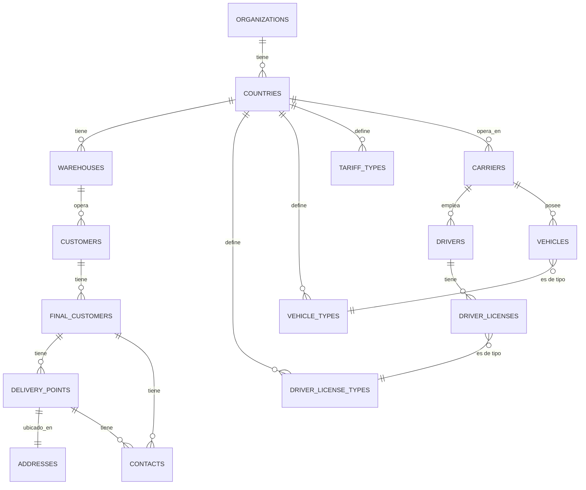
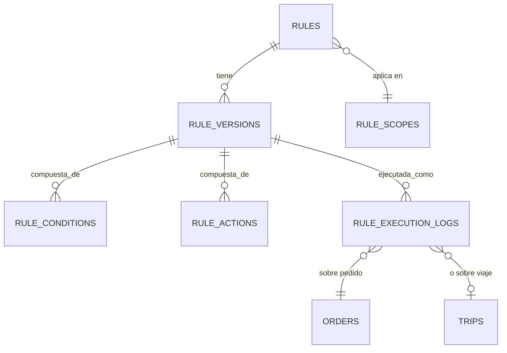
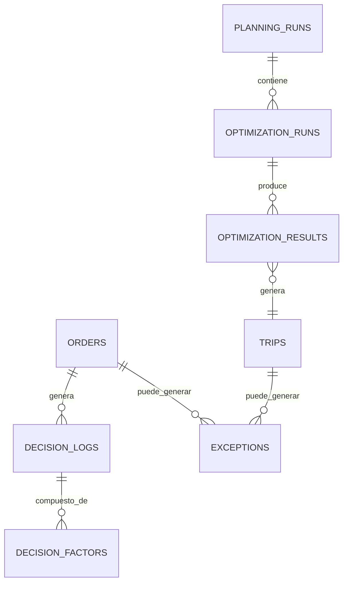

# Documento 3 — Modelo de Datos / ERD Propuesto

> Convención en todo este documento: **tenant scope** lista las columnas que
> deben usarse para filtrar por contexto (§6 del prompt maestro); **audit
> fields** = `created_at, updated_at, created_by, updated_by` salvo que se
> indique otra cosa; soft delete se marca explícitamente donde aplica
> (`deleted_at`), el resto usa borrado físico solo si no hay historial que
> preservar.

## 1. Diagrama ER — núcleo de jerarquía + maestros

## 2. Diagrama ER — Rules Engine (compartido OMS + TMS)

## 3. Diagrama ER — Planificación, Optimización, Auditoría

## 4. Tablas — jerarquía (nuevas o modificadas)

| Tabla | Responsabilidad | PK | FK principales | Constraints/Indexes | Tenant scope | Notas |
|---|---|---|---|---|---|---|
| `countries` | País operativo | `id` | `organization_id` | `UNIQUE(organization_id, code)` | `organization_id` | Ya existe; agregar `timezone`, `locale`, `unit_system`, `date_format` |
| `warehouses` **(nueva)** | Almacén/operación (ej. "OLO Costa Rica") | `id` | `country_id` | `UNIQUE(country_id, code)` | `country_id` | No existe hoy — es el gap principal de §4 |
| `customers` | Cliente del almacén (Cofersa, EPA) | `id` | `warehouse_id` (antes `organization_id` directo) | `UNIQUE(warehouse_id, code)` | `warehouse_id` | Re-scopear de `organization_id` a `warehouse_id` |
| `final_customers` **(nueva)** | Cliente final del `customer` (ferretería X) | `id` | `customer_id` | `UNIQUE(customer_id, external_code)` — **no** único global (§8) | `customer_id` | Sustituye el uso de `stores` como "cliente final" |
| `delivery_points` **(nueva)** | Punto(s) de entrega de un cliente final | `id` | `final_customer_id`, `address_id` | `idx(final_customer_id)`; 1 marcado `is_default` por cliente final | `final_customer_id` | 0..N por cliente final (§4) |
| `addresses` **(nueva)** | Dirección física + geo | `id` | — | `idx(country_id)` | `country_id` | Separada para permitir reintentar geocoding sin tocar negocio |
| `contacts` **(nueva)** | Contacto (teléfono, encargado) | `id` | `final_customer_id` o `delivery_point_id` (uno de los dos, `CHECK`) | — | vía padre | |
| `stores` | Bodega de **origen** (`is_origin=true`) | `id` | `warehouse_id` | — | `warehouse_id` | Se retira su uso como "cliente final"; queda solo para origen |

## 5. Tablas — maestros (existentes, con ajuste de scope)

| Tabla | Cambio propuesto |
|---|---|
| `carriers` | Agregar `country_id` explícito si falta en algún flujo; ya tiene `payment_account`/`softland_code` (mandato Jean Carlo, ya aplicado) |
| `drivers` | Ya tiene `license_type_id` → `license_types`; agregar tabla `driver_licenses` (N:M drivers↔license_types) si un conductor puede tener más de una categoría (§10) |
| `driver_license_types` **(renombre de `license_types`)** | Agregar `country_id`, `vehicle_restrictions` (jsonb), `validity_rules` (jsonb) |
| `vehicles` / `vehicle_types` | Sin cambio estructural; agregar `country_id` a `vehicle_types` si se requiere variación por país |
| `tariff_types` | Ya existe (5 tipos mandatados); sin cambio |
| `rates` | Re-scopear a `warehouse_id`/`customer_id` según corresponda; agregar columnas de snapshot de costo (ver §7 de `02-to-be.md`) |

## 6. Tablas — Rules Engine (nuevas, generalizando `src/lib/tarifas/types.ts`)

| Tabla | Responsabilidad | PK | FK | Constraints | Tenant scope |
|---|---|---|---|---|---|
| `rules` | Identidad de una regla (código, nombre, dominio) | `id` | — | `UNIQUE(code)`; `domain IN ('OMS_PRIORITY','TARIFF','ROUTING', ...)` | vía `rule_scopes` |
| `rule_scopes` | A qué nivel aplica una regla | `id` | `rule_id`, `country_id?`, `warehouse_id?`, `customer_id?` | exactamente uno de país/almacén/cliente no-nulo, o ninguno = GLOBAL | el que corresponda |
| `rule_versions` | Snapshot versionado del AST (`Pred`/`Expr` como jsonb) | `id` | `rule_id` | `UNIQUE(rule_id, version)`; nunca se sobreescribe (§33) | — |
| `rule_conditions` | Condiciones normalizadas (opcional si se prefiere jsonb en `rule_versions`) | `id` | `rule_version_id` | — | — |
| `rule_actions` | Acción/expresión resultante | `id` | `rule_version_id` | — | — |
| `rule_execution_logs` | Cada vez que una regla se evaluó sobre un pedido/viaje | `id` | `rule_version_id`, `order_id?`, `trip_id?` | — | vía pedido/viaje |

## 7. Tablas — Planificación, Optimización, Decisión (nuevas)

| Tabla | Responsabilidad | PK | FK | Notas |
|---|---|---|---|---|
| `planning_runs` | Una corrida de planificación (batch) | `id` | `warehouse_id` | `status`, `started_at`, `finished_at` |
| `optimization_runs` | Una corrida del motor de ruteo dentro de un planning run | `id` | `planning_run_id` | parámetros usados (jsonb, snapshot) |
| `optimization_results` | Resultado (rutas propuestas) de una corrida | `id` | `optimization_run_id` | `score`, `accepted boolean` |
| `decision_logs` | Una decisión explicable (§12) | `id` | `order_id?`, `trip_id?` | `summary text` |
| `decision_factors` | Cada razón que compuso la decisión | `id` | `decision_log_id` | `label`, `weight`, `value` |
| `exceptions` | Cola de excepciones (§37) | `id` | `entity_type`, `entity_id` (polimórfico) | `severity`, `recommended_action`, `assigned_user_id`, `status` |
| `config_values` | Configuración heredable (§34) | `id` | `scope_type`, `scope_id` | `UNIQUE(scope_type, scope_id, key, effective_from)` |
| `ai_recommendations` | Recomendación de IA (nunca decisión final, §25) | `id` | `entity_type`, `entity_id` | `confidence numeric`, `accepted boolean` |

## 8. Tablas existentes — ajustes puntuales identificados

| Tabla | Ajuste |
|---|---|
| `orders` | Unificar `status` a la máquina de estados de `02-to-be.md` §5 (hoy mezcla `'assigned'`/`'Asignado'`/`'delivered'` sin normalizar); agregar `warehouse_id`, `final_customer_id`, `delivery_point_id` |
| `routes` | Agregar `warehouse_id`; considerar `planning_run_id` para trazabilidad |
| `settlements` | Agregar columnas de desglose (`operating_cost`, `billable_cost`, `selling_rate`, `margin_pct`, `margin_status`) para que el snapshot deje de vivir en `settlementSnapshots.ts` local |
| `stores` | Retirar su uso como "cliente final"; mantener solo `is_origin=true` |
| **`zones`** | **No existe pero se referencia** — decisión pendiente: crear la tabla real, o quitar la referencia si el concepto de zona debe vivir en `src/lib/tarifas` (`Zone`/`ZoneGroup`) en vez de duplicarse |

## 9. ❓ Decisiones de modelado que requieren confirmación de negocio

1. ¿`final_customers`/`delivery_points` reemplaza completamente el uso actual
   de `stores` como destino, o `stores` sigue existiendo para algo más que
   origen? (impacta la Fase 3 del roadmap)
2. ¿Un `driver` puede tener más de una `driver_license_type` simultáneamente
   en la operación real, o basta con `license_type_id` único como hoy? (§10)
3. ¿El concepto de "zona" de Planificación/Tarifas (`src/lib/tarifas::Zone`)
   es el mismo "zona" que faltaba en Tiendas/Tipos de Ruta, o son dominios
   distintos que coincidieron en nombre?
4. Base de `occupancy_pct` (peso, volumen, o `MAX` de ambos — §22).
