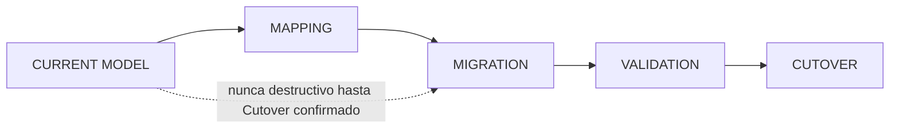

# Documento 4 — Matriz CURRENT → TARGET y Estrategia de Migración

## 1. Matriz de entidades

| CURRENT | TARGET | ACTION | MIGRACIÓN REQUERIDA | RIESGO |
|---|---|---|---|---|
| `organization_id` como único tenant scope | `country_id` + `warehouse_id` (+`customer_id` donde aplique) | EXTEND | Sí — backfill desde datos existentes | MEDIO |
| (no existe) | `warehouses` | CREATE | Sí — crear 1 warehouse ("OLO Costa Rica") y re-apuntar todo lo de CR | ALTO (toca casi todas las tablas transaccionales) |
| `stores` (usada como origen y como destino) | `stores` (solo origen) + `final_customers` + `delivery_points` + `addresses` | REFACTOR | Sí — separar filas por `is_origin` | ALTO |
| `customers` | `customers` (re-scope a `warehouse_id`) | REFACTOR | Sí | MEDIO |
| `orders.status` (strings mixtos) | Máquina de estados normalizada | REFACTOR | Sí — mapear valores existentes | MEDIO |
| `license_types` | `driver_license_types` (+ `country_id`, reglas) | RENAME + EXTEND | Sí | BAJO |
| `drivers.license_type_id` (1:1) | `driver_licenses` (N:M) si aplica §10 | EXTEND (condicional) | Depende de decisión de negocio (§9.2 del ERD) | BAJO |
| `src/lib/tarifas/localData/*` (en memoria) | `rules`, `rule_versions`, `rule_scopes` (Postgres) | MIGRATE | Sí — exportar reglas actuales a filas reales | ALTO (es el motor ya en uso de Liquidaciones) |
| `oms/mockData.ts` | Tablas reales de `orders`/`rules`/`decision_logs` vía `WMSProvider` | REPLACE | Sí — pero puede convivir con `MockWMSProvider` mientras no hay EFLOW real | MEDIO |
| `settlementSnapshots.ts` (local) | Columnas de desglose en `settlements` | MIGRATE | Sí | MEDIO |
| `zones` (referenciada, no existe) | Crear tabla real, o retirar la referencia | DECIDE + FIX | Sí (bug ya documentado) | BAJO |
| `server/db.mjs` (acoplado a `mssql` directo) | `WMSProvider` interface + `EflowWMSProvider` | REFACTOR | No destructivo — es una envoltura | BAJO |
| Ninguna auditoría de decisión | `decision_logs`, `decision_factors`, `rule_execution_logs` | CREATE | No — tablas nuevas, no reemplazan nada | BAJO |
| Ninguna cola de excepciones | `exceptions` | CREATE | No | BAJO |
| RBAC plano (`roles`+`app_users`, sin scope) | `user_scopes` con país/almacén/cliente | EXTEND | Sí — asignar scope a usuarios existentes (hoy son 2 personas reales) | BAJO |
| `.env` con credenciales reales trackeado en git | Secrets Manager / variables de entorno no versionadas | REMEDIATE | Fuera del alcance del rediseño de datos, pero requerido antes de producción | ALTO (seguridad) |

## 2. Estrategia de migración (por cada cambio de esquema)



Reglas fijas para toda migración de este rediseño (§41):

1. **Nunca destruir datos existentes.** Toda migración agrega columnas
   nullable primero, hace backfill, y solo vuelve `NOT NULL`/retira la
   columna vieja en un paso posterior y separado.
2. **Migraciones versionadas** (siguiendo el patrón ya usado en `sql/01_*`
   … `sql/05_*`), nunca un cambio manual directo contra Aurora.
3. **Validación antes de cutover**: cada migración de datos corre en modo
   *dry-run* (transacción con `ROLLBACK`) reportando conteos antes de
   aplicarse — mismo patrón ya usado en la limpieza de datos de ejemplo de
   esta sesión (ver historial de la conversación).
4. **Cutover explícito y reversible**: cada fase del roadmap (`05-roadmap.md`)
   tiene su propio cutover; no se activa la siguiente fase hasta validar la
   anterior contra datos reales de Costa Rica.

## 3. Orden de dependencia de migraciones (para no romper FKs)

```
1. warehouses                        (nueva, sin dependencias nuevas)
2. countries → warehouses backfill   (asignar warehouse_id por country_id)
3. customers.warehouse_id            (backfill desde organization_id/country_id actual)
4. final_customers, addresses,
   delivery_points, contacts         (nuevas; poblar desde stores marcadas is_origin=false)
5. orders.warehouse_id/final_customer_id/delivery_point_id
6. driver_license_types (rename)     + driver_licenses (si aplica)
7. rules / rule_versions / rule_scopes  (poblar desde src/lib/tarifas/localData actual)
8. rule_execution_logs / decision_logs / exceptions / config_values  (tablas nuevas, sin backfill)
9. settlements (columnas de desglose) (backfill desde settlementSnapshots.ts donde exista)
10. zones (crear o retirar según decisión)
```
