# Documento 5 — Roadmap por Fases

> El roadmap del prompt maestro (§50) se ajusta en dos puntos, justificados
> abajo: (a) se adelanta "Motor de Reglas" antes de "Mock integration layer"
> porque el motor de reglas de Tarifas **ya existe** y generalizarlo primero
> reduce el trabajo de las fases de OMS; (b) se separa "Fase 1" en dos
> (fundación de país/almacén, y arreglo de deuda técnica puntual) porque son
> riesgos y validaciones independientes.

```mermaid
gantt
    dateFormat  X
    axisFormat %s
    section Fundación
    Fase 0 Architecture baseline           :f0, 0, 1
    Fase 1 Multi-country + Warehouse       :f1, after f0, 1
    Fase 2 Master Data + deuda técnica     :f2, after f1, 1
    Fase 3 Customer/Final Customer         :f3, after f2, 1
    section Motor
    Fase 4 Rules Engine (generalizar)      :f4, after f3, 1
    Fase 5 Mock integration layer (OMS)    :f5, after f4, 1
    Fase 6 Priority Engine                 :f6, after f5, 1
    Fase 7 Planning Engine                 :f7, after f6, 1
    Fase 8 Routing optimization            :f8, after f7, 1
    Fase 9 Cost Engine (conectar)          :f9, after f8, 1
    section Ejecución
    Fase 10 Fleet/Carrier assignment       :f10, after f9, 1
    Fase 11 Tendering                      :f11, after f10, 1
    Fase 12 Execution/Tracking             :f12, after f11, 1
    section Integraciones reales
    Fase 13 EFLOW real                     :f13, after f12, 1
    Fase 14 ERP/Softland                   :f14, after f13, 1
    Fase 15 AI/predictivo                  :f15, after f14, 1
```

## Fase 0 — Architecture baseline

- **Objetivo:** aprobar este documento (o sus ajustes) antes de tocar código.
- **Entregable:** los 6 documentos de esta carpeta, aprobados/ajustados.
- **Riesgo:** ninguno (no hay código involucrado).

## Fase 1 — Multi-country + Warehouse

- Crear `warehouses`; backfill un warehouse "OLO Costa Rica".
- Re-scopear `customers` a `warehouse_id`.
- Ajustar `RBAC`/`user_scopes` con el nuevo nivel.
- **Test crítico:** aislamiento CR↔VE, y ahora también warehouse↔warehouse.
- **Riesgo:** ALTO — toca la tabla más usada del sistema (`customers`).

## Fase 2 — Master Data + deuda técnica puntual

- Resolver `zones` (crear tabla real o retirar referencia — decisión previa
  requerida, ver `03-modelo-datos-erd.md` §9.3).
- Renombrar `license_types` → `driver_license_types` + `country_id`.
- Cambiar label "Licencia" → "Licencia de conducir" en Conductores (§10 —
  este es el único punto de este roadmap que es un cambio de UI trivial;
  se agrupa aquí porque toca la misma pantalla que el catálogo de licencias).

## Fase 3 — Customer / Final Customer hierarchy

- Crear `final_customers`, `delivery_points`, `addresses`, `contacts`.
- Migrar filas de `stores` con `is_origin=false` hacia el nuevo modelo.
- **Riesgo:** ALTO — es el cambio de modelo más grande del rediseño.

## Fase 4 — Rules Engine (generalizar, no reconstruir)

- Extraer el AST de `src/lib/tarifas/types.ts` a un paquete de dominio
  compartido, con `domain` como discriminador (`TARIFF` vs `OMS_PRIORITY`).
- Crear `rules`, `rule_versions`, `rule_scopes`, `rule_execution_logs`.
- Migrar las reglas actuales de Tarifas (hoy en `localData/`) a filas reales
  — **con test de regresión** contra los casos ya cubiertos en
  `src/lib/tarifas/__tests__/` antes de considerar esta fase cerrada.

## Fase 5 — Mock integration layer (OMS)

- Definir `WMSProvider`/`ERPProvider`/`MapProvider` (interfaces).
- `MockWMSProvider` reemplaza a `oms/mockData.ts` con el mismo contenido,
  pero detrás de la interfaz — el OMS empieza a leer pedidos "de verdad" (de
  Postgres, poblada por el mock), no de un array en memoria del navegador.

## Fase 6 — Priority Engine

- El pipeline de `02-to-be.md` §5 corre sobre el Rules Engine de la Fase 4,
  con `scope` CUSTOMER→WAREHOUSE→COUNTRY→GLOBAL.
- Se retiran `oms/useColaController` etc. como dueños de la lógica de
  filtrado/orden — pasan a ser solo presentación sobre el resultado del
  motor.

## Fase 7 — Planning Engine

- `planning_runs`, agrupación de pedidos `READY_FOR_PLANNING`.

## Fase 8 — Routing optimization

- Evaluar e integrar OR-Tools (o equivalente) como *job* asíncrono.
- `optimization_runs`, `optimization_results`.

## Fase 9 — Cost Engine (conectar)

- Mover `computeCost()`/`MarginPolicy` de `src/lib/tarifas/` a operar sobre
  `rates`/`vehicles`/`settlements` reales, con snapshot inmutable persistido
  (no solo en memoria de la sesión del navegador).
- ❓ Requiere cerrar antes: base de `occupancy_pct`, origen del margen (ver
  `02-to-be.md` §7).

## Fase 10 — Fleet / Carrier assignment

- Regla de prioridad de flota propia (§13) como fila en `rules`, no como
  `if` de código.

## Fase 11 — Tendering

- Proceso manual (nivel 1 de automatización) primero; `automation_level`
  configurable para escalar después.

## Fase 12 — Execution / Tracking

- Ya existe parcialmente (`dispatch_guides`, `tracking_events`) — extender
  con los nuevos IDs de correlación (§12 de `02-to-be.md`).

## Fase 13 — EFLOW real

- `EflowWMSProvider` reemplaza al `MockWMSProvider` cuando exista la réplica
  de `EFLOW_OLO` (CR) — bloqueado externamente en solicitar la réplica (ya
  registrado en `project.md`), no por este roadmap.

## Fase 14 — ERP / Softland

- Requiere contrato de API/DB de EPRAC y de Softland, que hoy no existe en
  este repositorio — esta fase no puede detallarse más sin esa información.

## Fase 15 — AI / predictivo

- Solo después de que las capas 1 (reglas) y 2 (optimización) estén en
  producción — por diseño (§25), la IA nunca sustituye una decisión que ya
  tiene una regla o algoritmo determinístico aplicable.

## Entregable esperado al cierre de cada fase (aplica a todas)

Archivos creados/modificados · Tablas creadas · Migraciones · Endpoints ·
Tests · Riesgos · Pendientes · Cómo probar — formato fijo, igual para todas
las fases (§53 del prompt maestro).
