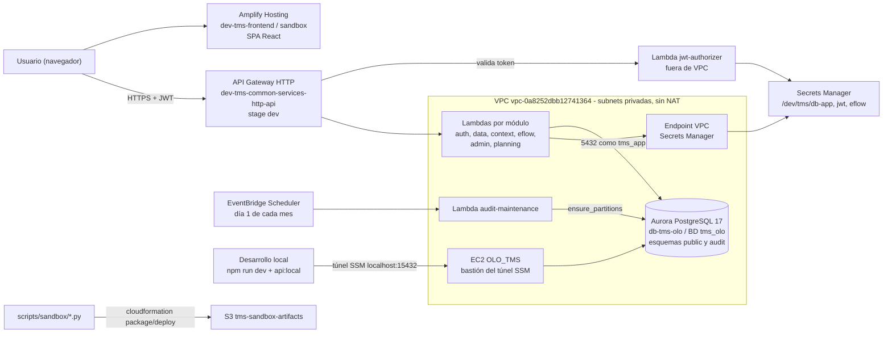

# Inventario AWS del TMS y arquitectura

> **Documento vivo.** Todo recurso de AWS que se cree, cambie o borre para el TMS se registra aquí **en el mismo
> cambio**, con fecha, en la [bitácora de cambios](#bitácora-de-cambios). Si algo existe en AWS y no está aquí, está
> mal. Relevado contra la cuenta real el 2026-09-24.

- **Cuenta:** `758837481569` — **sandbox** para probar apps. Intelix toma de aquí y despliega a producción
  (ver [`../guides/despliegue-sandbox.md`](../guides/despliegue-sandbox.md)).
- **Región:** `us-east-2` (Ohio).
- **Ambiente:** `dev` (prefijo de todo lo del TMS: `dev-tms-*` y `/dev/tms/*`).

## Diagrama de arquitectura

**Versión en texto** (por si el diagrama no se ve):

1. El usuario abre el frontend (SPA React) servido por **Amplify**.
2. El frontend llama al **API Gateway HTTP** con el JWT de sesión. El **authorizer** (Lambda fuera de VPC) valida el
   token leyendo `/dev/tms/jwt`.
3. API Gateway enruta a la **Lambda del módulo** (`auth`, `data`, `context`, `eflow`, `admin`, `planning`). Estas
   Lambdas están **dentro de la VPC** de Aurora, en subnets privadas y **sin NAT**: salen a AWS solo por endpoints VPC
   (Secrets Manager para sus credenciales, S3 gateway).
4. Las Lambdas se conectan a **Aurora** (`db-tms-olo`, BD `tms_olo`) como el rol **`tms_app`**: lee y escribe datos,
   pero no puede alterar la bitácora de auditoría (`audit.events`) ni la estructura.
5. Cada escritura queda en `audit.events` (trigger de BD). El **Scheduler** dispara cada mes la Lambda
   `audit-maintenance`, que crea las particiones mensuales siguientes.
6. En desarrollo local, el backend corre en la máquina y llega a Aurora por el **túnel SSM** a través del bastión
   `OLO_TMS`. Las migraciones se aplican con el dueño (`olo_db`) mediante `scripts/run-migration.mjs`.

## 1. Lo que EXISTE hoy (2026-09-24)

### Base de datos

| Recurso | Identificador | Detalle |
|---|---|---|
| Cluster Aurora | `db-tms-olo` | Aurora PostgreSQL **17.7**, aprovisionado, cifrado, backups 7 días, puerto 5432. Creado 2026-09-14. |
| Instancia escritora | `db-tms-olo-instance-1` | `db.t3.medium`, `us-east-2c` |
| Instancia lectora | `db-tms-olo-instance-1-reader` | `db.t3.medium`, `us-east-2a` |
| Endpoint escritura | `db-tms-olo.cluster-cjo2ss6io0lb.us-east-2.rds.amazonaws.com` | |
| Endpoint lectura | `db-tms-olo.cluster-ro-cjo2ss6io0lb.us-east-2.rds.amazonaws.com` | Todavía no lo usa nadie |
| Base | `tms_olo` | Esquemas `public` (negocio) y `audit` (bitácora, particionada por mes, `sql/16`–`17`). Migraciones registradas en `public.schema_migrations`. |
| Rol dueño | `olo_db` | Dueño de las tablas. **Solo** migraciones/DDL (`TMS_DB_ADMIN_*` en `.env.local`). Lo usan también otras ramas del equipo. |
| Rol de la app | `tms_app` | `sql/18`. Lee/escribe datos, solo lee/inserta en `audit.events`, sin DDL. Credencial en `/dev/tms/db-app`. |

### Red

| Recurso | Identificador | Detalle |
|---|---|---|
| VPC | `vpc-0a8252dbb12741364` | `172.31.0.0/16`, **VPC por defecto de la cuenta, compartida** con otros proyectos (ver §3). Sin NAT gateway. |
| Subnets de Aurora | `subnet-0bb5505fe97ac8064` (2a), `subnet-0f1b05bea67e94ebe` (2b), `subnet-0394ed09a2cdb0520` (2c) | Privadas (grupo `rds-ec2-db-subnet-group-1`). Aquí van también las Lambdas. |
| Subnet del bastión | `subnet-0ec6329b88ede025c` | |
| SG `default` | `sg-06b3986a1f95d2f19` | En Aurora. Entrada 5432 desde `0.0.0.0/0` y todo el tráfico interno del mismo SG. Lo usarán las Lambdas. |
| SG `rds-ec2-1` | `sg-076beb3665b4542b0` | En Aurora. 5432 desde `sg-07f9acfc826f9e908`. Creado por la consola al conectar EC2↔RDS. |
| SG `ec2-rds-1` | `sg-07f9acfc826f9e908` | En el bastión. "No modificar: se pierde la conexión". |
| SG `launch-wizard-1` | `sg-0da061854d7171bd4` | En el bastión (creado con la instancia). |
| Endpoint VPC S3 | `vpce-097cbc5b345d0e899` | Gateway. Ya existía; compartido. |

### Acceso y operación

| Recurso | Identificador | Detalle |
|---|---|---|
| Bastión | `i-062fc98e8e26c0f79` (`OLO_TMS`) | `t2.micro`, encendido. Solo para el túnel SSM a Aurora (`scripts/tunel-aurora.ps1`, `localhost:15432`). |
| Secreto | `/dev/tms/db-app` | Credencial de `tms_app` (host, puerto, usuario, clave, BD). Creado 2026-09-24 por `backend/local/activar_rol_tms_app.py`. |
| Usuario IAM | `ext.claude` | Grupo `CP-Mayoreo-Sandbox-Devs` (`ReadOnlyAccess`) + `AmazonS3FullAccess` + inline `AllowSSMTunnelToTMSBastion`, `SSM-SessionAccess-ExtClaude`, `claude-secrets-policy.json` (secretos `/dev/tms/*`). Para desplegar necesita además `infra/iam/ext-claude-sandbox-deploy-policy.json`. |

## 2. Lo que se CREA al desplegar (pendiente: falta la política de despliegue)

Lo crea `npm run deploy:sandbox` (idempotente). Al desplegar, mover cada fila a §1 con su identificador real.

| Recurso | Nombre | Lo crea | Para qué |
|---|---|---|---|
| Secreto | `/dev/tms/jwt` | `deploy_backend.py` | Clave de firma de las sesiones (aleatoria). |
| Secreto | `/dev/tms/eflow` | `deploy_backend.py` | Credenciales EFLOW por país. Placeholder: EFLOW corre en **mock** en el sandbox. |
| Parámetros SSM | `/dev/tms/network/subnets`, `/dev/tms/network/lambda-sg` | `deploy_backend.py` | Red de las Lambdas (los leen las plantillas). |
| Endpoint VPC | `dev-tms-secretsmanager` | `deploy_backend.py` | Secrets Manager desde la VPC sin NAT. Interface en 3 AZ (costo aprox. USD 22/mes). |
| Bucket S3 | `tms-sandbox-artifacts-758837481569` | `deploy_backend.py` | Código empaquetado de las Lambdas. |
| Stack | `dev-tms-common-services` | CloudFormation | API Gateway HTTP (stage `dev`), authorizer JWT, Layer `tms_common`, rol de las Lambdas. Output `ApiUrl`. |
| Stack | `dev-tms-auth` | CloudFormation | `/api/auth/*`: login, signup, sesión, logout. |
| Stack | `dev-tms-data` | CloudFormation | `/api/data/{table}`: API genérica con permisos y auditoría. |
| Stack | `dev-tms-context` | CloudFormation | `/api/v1/*`: jerarquía país→almacén→cliente, puntos de entrega. |
| Stack | `dev-tms-eflow` | CloudFormation | Lectura de EFLOW (modo mock). |
| Stack | `dev-tms-admin` | CloudFormation | Usuarios, roles, matriz de permisos, auditoría + Lambda y schedule mensual de particiones. |
| Stack | `dev-tms-planning` | CloudFormation | `/api/v1/planificacion/pedidos`. |
| App Amplify | `dev-tms-frontend`, rama `sandbox` | `deploy_frontend.py` | Frontend. URL `https://sandbox.<appId>.amplifyapp.com`. |

## 3. En la cuenta pero NO son del TMS (no tocar)

| Recurso | Nota |
|---|---|
| Clusters Aurora `mayoreo-sac`, `mayoreo-servicio-cliente` | Otros proyectos. Comparten la VPC. |
| Secretos `sandbox_sac`, `rds-db-credentials/cluster-HGXNVPRWCVMH3B3Y5GYMW4IE24/postgres/...` | De `mayoreo-sac`. |
| Buckets `homologador-input/-maestro/-output-758837481569` | Otro proyecto. |
| Endpoints VPC `vpce-0b7151e661da6d3ee`, `vpce-00bd9859297ce5d8e` | Interface a servicios de Amazon (`vpce-svc-…`); origen no identificado. No los creó el TMS. |

## 4. Cómo funciona (resumen operativo)

- **Deploy:** `npm run deploy:sandbox` (backend y después frontend). Solo cuando el usuario lo indica.
- **Migraciones:** `node --env-file=.env.local scripts/run-migration.mjs sql/NN.sql` y luego `--execute` (usa el dueño).
  La BD es **la misma** para local y sandbox.
- **Credenciales:** la app usa `tms_app`; rotar con `python backend/local/activar_rol_tms_app.py`.
- **Auditoría:** `audit.events`, solo inserción, particionada por mes; ADR `docs/decisions/0003-bitacora-auditoria.md`.
- **Permisos de la app:** matriz por rol (`sql/15`), aplicada en el backend.

## Bitácora de cambios

| Fecha | Cambio | Quién |
|---|---|---|
| 2026-09-14 | Cluster `db-tms-olo`, bastión `OLO_TMS` y sus security groups (creados en consola). | Equipo |
| 2026-09-24 | Rol de BD `tms_app` (`sql/18`) y secreto `/dev/tms/db-app`. | Claude |
| 2026-09-24 | Esquema `audit` y particiones mensuales hasta 2027-12 (`sql/16`–`17`). | Claude |
| 2026-09-24 | Documentado este inventario. Despliegue al sandbox preparado; pendiente de la política IAM. | Claude |
