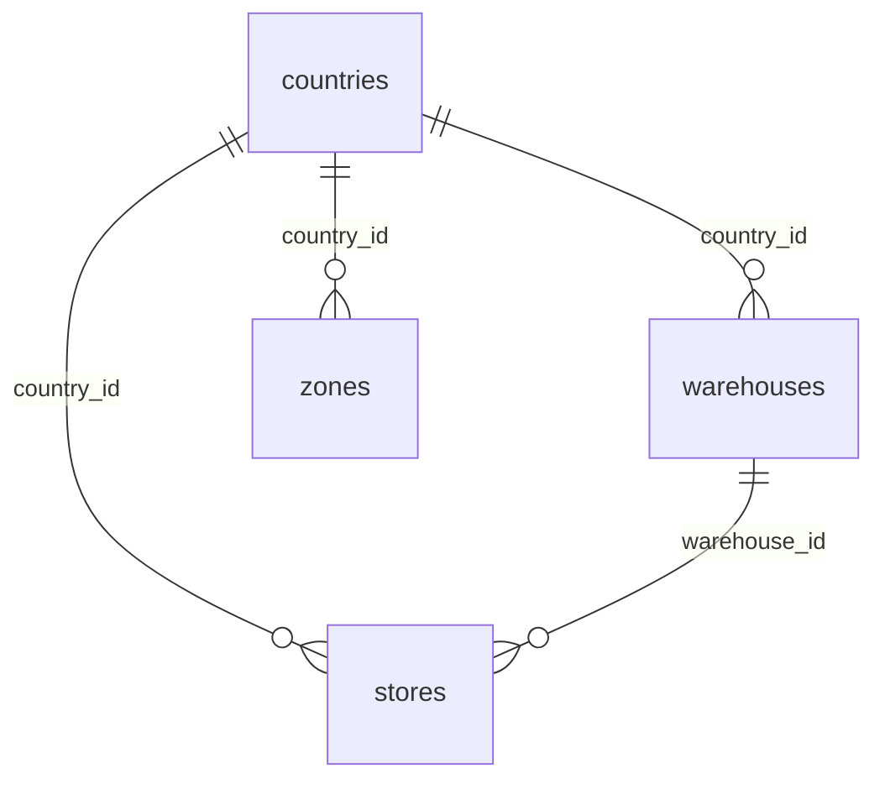
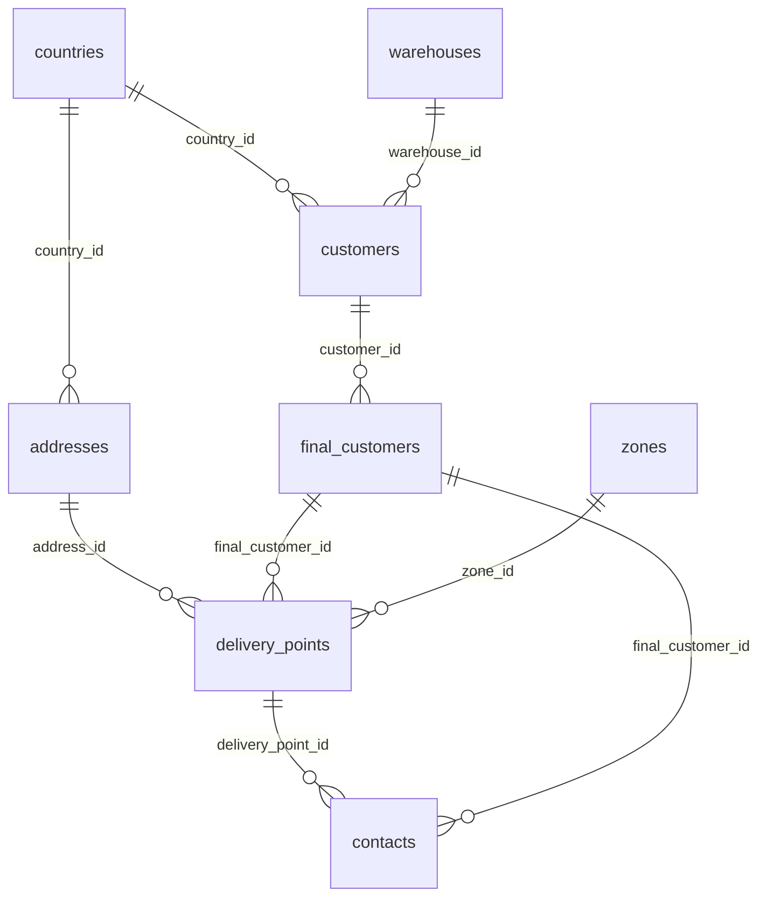
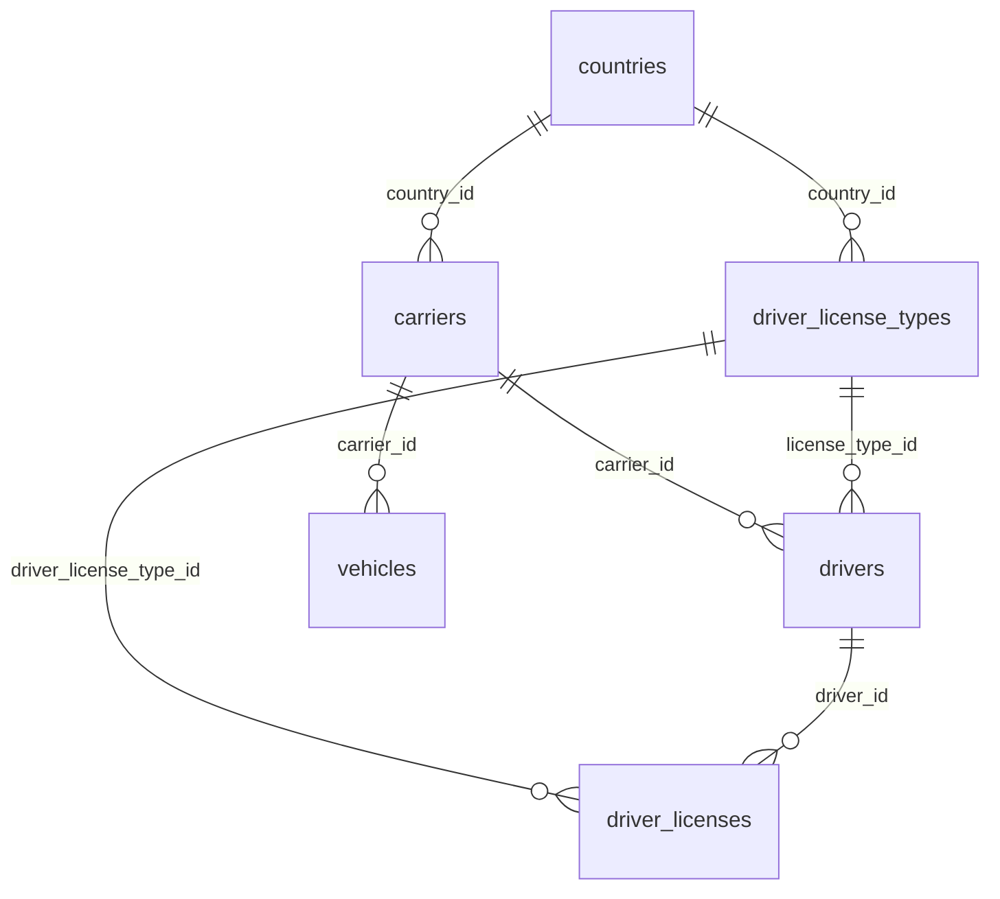
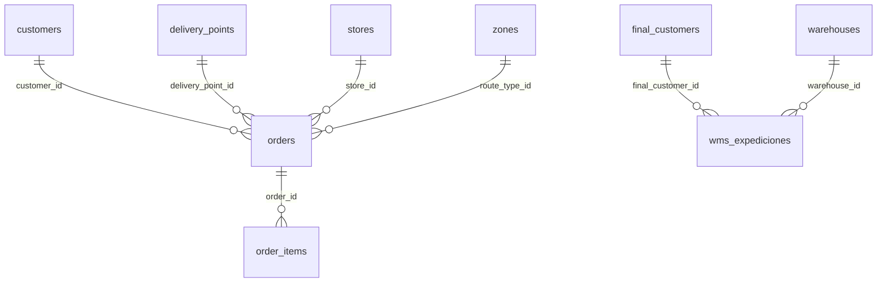
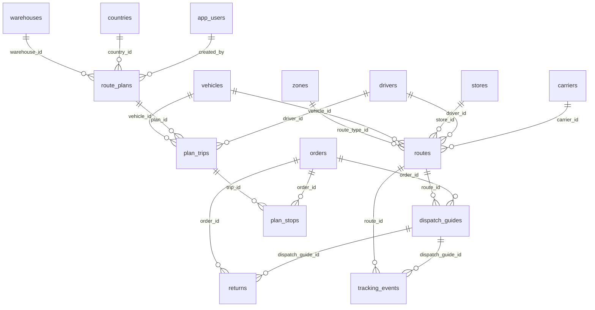
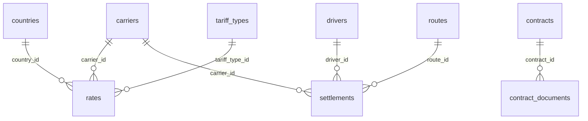
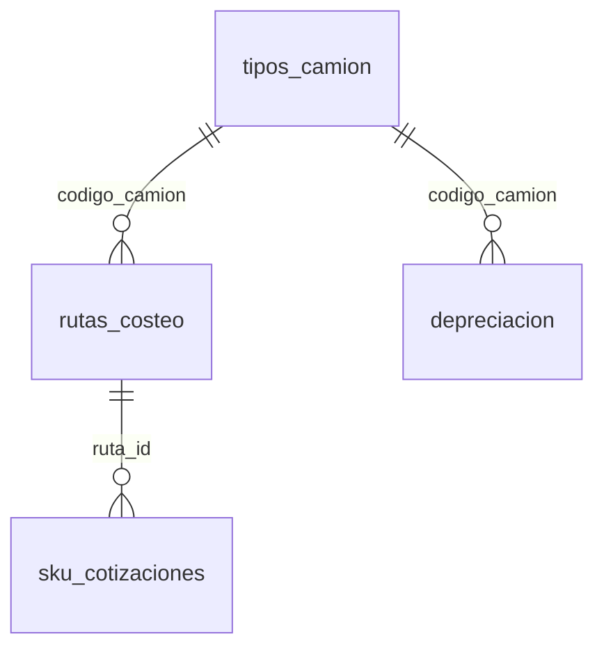
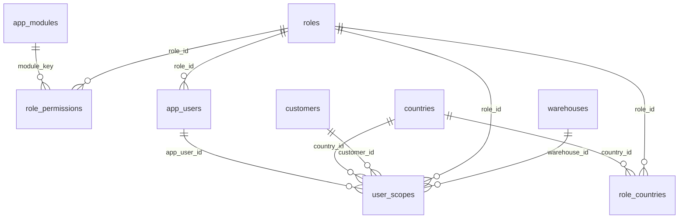

# Diccionario de datos — `tms_olo` (Aurora PostgreSQL)

> **Generado el 2026-09-30** desde la base real con [`scripts/diccionario-datos.py`](../../scripts/diccionario-datos.py). No editar a mano: las estructuras (columnas, tipos, llaves, índices, triggers) salen del catálogo de PostgreSQL; las descripciones de tabla viven en el script. Para regenerar: abrir el túnel (`scripts/tunel-aurora.ps1`) y correr `python scripts/diccionario-datos.py`.

- **Servidor:** PostgreSQL 17.7 on x86_64-pc-linux-gnu — cluster `db-tms-olo` (us-east-2), base `tms_olo`. Conexión y túnel: [`aws-inventario-tms.md`](aws-inventario-tms.md), [`../guides/tunel-ssm-a-rds.md`](../guides/tunel-ssm-a-rds.md).
- **Contenido:** 48 tablas y 2 vistas en los esquemas `public` (negocio) y `audit` (bitácora).
- **Filas:** conteo exacto (`count(*)`) al 2026-09-30. "—" = el rol de la app (`tms_app`) no tiene permiso de lectura.
- Casi todas las tablas llevan `organization_id → organizations`; esa relación se omite en los diagramas para que se lean.

## Índice

**Organización, países y almacenes:** [`organizations`](#publicorganizations), [`countries`](#publiccountries), [`warehouses`](#publicwarehouses), [`stores`](#publicstores), [`zones`](#publiczones)

**Clientes y puntos de entrega:** [`customers`](#publiccustomers), [`final_customers`](#publicfinal_customers), [`delivery_points`](#publicdelivery_points), [`addresses`](#publicaddresses), [`contacts`](#publiccontacts)

**Transportistas y flota:** [`carriers`](#publiccarriers), [`drivers`](#publicdrivers), [`driver_license_types`](#publicdriver_license_types), [`driver_licenses`](#publicdriver_licenses), [`vehicles`](#publicvehicles), [`vehicle_types`](#publicvehicle_types)

**Pedidos y WMS:** [`orders`](#publicorders), [`order_items`](#publicorder_items), [`wms_expediciones`](#publicwms_expediciones)

**Planificación y ejecución de rutas:** [`route_plans`](#publicroute_plans), [`plan_trips`](#publicplan_trips), [`plan_stops`](#publicplan_stops), [`routes`](#publicroutes), [`dispatch_guides`](#publicdispatch_guides), [`tracking_events`](#publictracking_events), [`returns`](#publicreturns)

**Tarifas, contratos y liquidaciones:** [`rates`](#publicrates), [`tariff_types`](#publictariff_types), [`contracts`](#publiccontracts), [`contract_documents`](#publiccontract_documents), [`settlements`](#publicsettlements)

**Costeo de transporte:** [`tipos_camion`](#publictipos_camion), [`costos_fijos`](#publiccostos_fijos), [`costos_variables`](#publiccostos_variables), [`depreciacion`](#publicdepreciacion), [`parametros_globales`](#publicparametros_globales), [`rutas_costeo`](#publicrutas_costeo), [`sku_cotizaciones`](#publicsku_cotizaciones), [`v_costo_fijo_mensual`](#publicv_costo_fijo_mensual), [`v_costo_variable_por_km`](#publicv_costo_variable_por_km)

**Seguridad y acceso:** [`app_users`](#publicapp_users), [`auth_credentials`](#publicauth_credentials), [`roles`](#publicroles), [`role_permissions`](#publicrole_permissions), [`role_countries`](#publicrole_countries), [`app_modules`](#publicapp_modules), [`user_scopes`](#publicuser_scopes)

**Sistema y auditoría:** [`schema_migrations`](#publicschema_migrations), [`audit.events`](#auditevents), [`audit.tracked_tables`](#audittracked_tables)

## Observaciones (revisión 2026-09-30)

- **Scripts que no están en la base:** las tablas de `sql/01_fase1_zonas_reglas.sql` (`zone_groups`, `zone_lane_rates`,
  `pricing_rules`, `fx_rates`) y de `sql/03_fase3_plantillas.sql` (`pricing_templates`) **no existen** en `tms_olo`.
  O no se aplicaron, o se borraron después.
- **`route_type_id` apunta a `zones`:** `orders.route_type_id` y `routes.route_type_id` son FK a `zones`, porque
  `route_types` se renombró a `zones` en `sql/09` y la columna conservó el nombre viejo.
- **Comentario desactualizado:** `drivers.license_type_id` dice "FK a license_types", pero la tabla ahora es
  `driver_license_types` (renombrada en `sql/06`). La FK real apunta bien.
- **Tablas vacías (0 filas):** `contacts`, `contracts`, `contract_documents`, `driver_licenses`, `rates`, `returns`,
  `role_countries`, `rutas_costeo`, `settlements`, `sku_cotizaciones`, `tracking_events`.
- **Todavía no existe nada del OMS:** ni la base `logistica_olo` con esquemas `OMS`/`TMS` (decidido el 2026-09-15) ni
  las tablas propias del OMS (`route_dispatch_schedule`, `order_priority_*`, simulaciones). Todo esto es `tms_olo`.
- **Casi sin `COMMENT ON`:** solo 3 tablas y 6 columnas tienen comentario en la base; las descripciones de este
  documento se escribieron a partir de los nombres, las columnas y los scripts `sql/`.
- **Permisos de `tms_app`:** no puede leer `public.schema_migrations` ni `audit.tracked_tables`, por eso no se cuentan
  sus filas. Es coherente con `sql/18` (la app no necesita esas tablas).

---

## Organización, países y almacenes



<a id="publicorganizations"></a>

### `public.organizations`

*tabla · 1 filas* — Organización dueña de los datos (hoy una sola: OLO). Casi todas las tablas cuelgan de ella.

| Columna | Tipo | Nulo | Default | Notas |
|---|---|---|---|---|
| `id` | `uuid` | no | `gen_random_uuid()` | **PK** |
| `name` | `character varying(255)` | no |  |  |
| `slug` | `character varying(100)` | no |  | único |
| `logo_url` | `text` | sí |  |  |
| `status` | `character varying(50)` | sí | `'active'::character varying` |  |
| `created_at` | `timestamp with time zone` | sí | `now()` |  |
| `updated_at` | `timestamp with time zone` | sí | `now()` |  |

- Índice: `btree (slug)` — `idx_organizations_slug`
- Índice: `btree (status)` — `idx_organizations_status`
- Trigger: auditada — cada INSERT/UPDATE/DELETE queda en `audit.events`.

<a id="publiccountries"></a>

### `public.countries`

*tabla · 2 filas* — Países donde opera la organización (CR, VE) con moneda, zona horaria, idioma y formatos.

| Columna | Tipo | Nulo | Default | Notas |
|---|---|---|---|---|
| `id` | `uuid` | no | `gen_random_uuid()` | **PK** |
| `organization_id` | `uuid` | no |  | FK → [`organizations`](#publicorganizations) |
| `name` | `character varying(100)` | no |  |  |
| `code` | `character varying(3)` | no |  |  |
| `currency` | `character varying(3)` | no |  |  |
| `timezone` | `character varying(50)` | no |  |  |
| `status` | `character varying(50)` | sí | `'active'::character varying` |  |
| `created_at` | `timestamp with time zone` | sí | `now()` |  |
| `updated_at` | `timestamp with time zone` | sí | `now()` |  |
| `iso_code` | `character varying(3)` | sí |  |  |
| `phone_code` | `character varying(10)` | sí |  |  |
| `flag_emoji` | `character varying(10)` | sí |  |  |
| `capital` | `character varying(100)` | sí |  |  |
| `language` | `character varying(100)` | sí |  |  |
| `notes` | `text` | sí |  |  |
| `locale` | `text` | sí |  |  |
| `unit_system` | `text` | sí |  |  |
| `date_format` | `text` | sí |  |  |

- Único: `UNIQUE (organization_id, code)`
- Índice: `btree (code)` — `idx_countries_code`
- Índice: `btree (organization_id)` — `idx_countries_org`
- Trigger: auditada — cada INSERT/UPDATE/DELETE queda en `audit.events`.

<a id="publicwarehouses"></a>

### `public.warehouses`

*tabla · 2 filas* — Almacenes/CEDIS por país. Nivel de la jerarquía entre país y cliente.

| Columna | Tipo | Nulo | Default | Notas |
|---|---|---|---|---|
| `id` | `uuid` | no | `gen_random_uuid()` | **PK** |
| `organization_id` | `uuid` | no |  | FK → [`organizations`](#publicorganizations) |
| `country_id` | `uuid` | no |  | FK → [`countries`](#publiccountries) |
| `code` | `text` | no |  |  |
| `name` | `text` | no |  |  |
| `timezone` | `text` | sí |  |  |
| `currency_id` | `text` | sí |  |  |
| `address` | `text` | sí |  |  |
| `latitude` | `numeric` | sí |  |  |
| `longitude` | `numeric` | sí |  |  |
| `active` | `boolean` | no | `true` |  |
| `created_at` | `timestamp with time zone` | no | `now()` |  |
| `updated_at` | `timestamp with time zone` | no | `now()` |  |

- Único: `UNIQUE (country_id, code)`
- Trigger: auditada — cada INSERT/UPDATE/DELETE queda en `audit.events`.

<a id="publicstores"></a>

### `public.stores`

*tabla · 7 filas* — Tiendas y puntos de origen. `is_origin = true` marca los orígenes de despacho; las tiendas EPA pasaron a `delivery_points` (`sql/13`).

| Columna | Tipo | Nulo | Default | Notas |
|---|---|---|---|---|
| `id` | `uuid` | no | `gen_random_uuid()` | **PK** |
| `organization_id` | `uuid` | no |  | FK → [`organizations`](#publicorganizations) |
| `country_id` | `uuid` | no |  | FK → [`countries`](#publiccountries) |
| `name` | `character varying(255)` | no |  |  |
| `code` | `character varying(50)` | no |  |  |
| `address` | `text` | no |  |  |
| `city` | `character varying(100)` | no |  |  |
| `state` | `character varying(100)` | sí |  |  |
| `postal_code` | `character varying(20)` | sí |  |  |
| `latitude` | `numeric(10,8)` | sí |  |  |
| `longitude` | `numeric(11,8)` | sí |  |  |
| `phone` | `character varying(50)` | sí |  |  |
| `email` | `character varying(255)` | sí |  |  |
| `status` | `character varying(50)` | sí | `'active'::character varying` |  |
| `created_at` | `timestamp with time zone` | sí | `now()` |  |
| `updated_at` | `timestamp with time zone` | sí | `now()` |  |
| `store_type` | `character varying(50)` | sí |  |  |
| `manager_name` | `character varying(255)` | sí |  |  |
| `opening_hours` | `character varying(100)` | sí |  |  |
| `capacity` | `integer` | sí |  |  |
| `area_m2` | `numeric(10,2)` | sí |  |  |
| `notes` | `text` | sí |  |  |
| `contact_name` | `character varying(100)` | sí |  |  |
| `contact_phone` | `character varying(50)` | sí |  |  |
| `contact_email` | `character varying(100)` | sí |  |  |
| `delivery_zone` | `character varying(100)` | sí |  |  |
| `is_origin` | `boolean` | sí | `false` |  |
| `warehouse_id` | `uuid` | sí |  | FK → [`warehouses`](#publicwarehouses) |

- Único: `UNIQUE (organization_id, code)`
- Índice: `btree (country_id)` — `idx_stores_country`
- Índice: `btree (organization_id)` — `idx_stores_org`
- Índice: `btree (status)` — `idx_stores_status`
- Trigger: auditada — cada INSERT/UPDATE/DELETE queda en `audit.events`.

<a id="publiczones"></a>

### `public.zones`

*tabla · 17 filas* — Zonas / tipos de ruta por país. Antes se llamaba `route_types` (renombrada en `sql/09`).

| Columna | Tipo | Nulo | Default | Notas |
|---|---|---|---|---|
| `id` | `uuid` | no | `gen_random_uuid()` | **PK** |
| `name` | `text` | no |  |  |
| `status` | `text` | no | `'active'::text` |  |
| `organization_id` | `uuid` | no |  | FK → [`organizations`](#publicorganizations) |
| `created_at` | `timestamp with time zone` | sí | `now()` |  |
| `updated_at` | `timestamp with time zone` | sí | `now()` |  |
| `country_id` | `uuid` | no |  | FK → [`countries`](#publiccountries) |
| `code` | `text` | sí |  |  |

- Check `zones_status_check`: `CHECK ((status = ANY (ARRAY['active'::text, 'inactive'::text])))`
- Índice: `btree (organization_id)` — `idx_route_types_organization`
- Índice: `btree (status)` — `idx_route_types_status`
- Índice: `btree (country_id, code) WHERE (code IS NOT NULL)` (único) — `zones_country_code_key`
- Índice: `btree (country_id)` — `zones_country_id_idx`
- Trigger: auditada — cada INSERT/UPDATE/DELETE queda en `audit.events`.

---

## Clientes y puntos de entrega



<a id="publiccustomers"></a>

### `public.customers`

*tabla · 2 filas* — Clientes de OLO (Cofersa, EPA…), por país y almacén.

> Comentario en la base: Incluye Cofersa/EPA como clientes reales desde 2026-09-16 (antes solo existían como fuentes de datos/reglas del OMS, no como filas de este catálogo).

| Columna | Tipo | Nulo | Default | Notas |
|---|---|---|---|---|
| `id` | `uuid` | no | `gen_random_uuid()` | **PK** |
| `organization_id` | `uuid` | no |  | FK → [`organizations`](#publicorganizations) |
| `country_id` | `uuid` | no |  | FK → [`countries`](#publiccountries) |
| `code` | `character varying(50)` | no |  |  |
| `name` | `character varying(255)` | no |  |  |
| `tax_id` | `character varying(50)` | sí |  |  |
| `email` | `character varying(255)` | sí |  |  |
| `phone` | `character varying(50)` | sí |  |  |
| `address` | `text` | sí |  |  |
| `city` | `character varying(100)` | sí |  |  |
| `state` | `character varying(100)` | sí |  |  |
| `postal_code` | `character varying(20)` | sí |  |  |
| `latitude` | `numeric(10,8)` | sí |  |  |
| `longitude` | `numeric(11,8)` | sí |  |  |
| `delivery_zone` | `character varying(100)` | sí |  |  |
| `status` | `character varying(50)` | sí | `'active'::character varying` |  |
| `created_at` | `timestamp with time zone` | sí | `now()` |  |
| `updated_at` | `timestamp with time zone` | sí | `now()` |  |
| `warehouse_id` | `uuid` | sí |  | FK → [`warehouses`](#publicwarehouses) |

- Único: `UNIQUE (organization_id, code)`
- Índice: `btree (warehouse_id, code)` (único) — `customers_warehouse_id_code_key`
- Índice: `btree (country_id)` — `idx_customers_country`
- Índice: `btree (organization_id)` — `idx_customers_org`
- Índice: `btree (delivery_zone)` — `idx_customers_zone`
- Trigger: auditada — cada INSERT/UPDATE/DELETE queda en `audit.events`.

<a id="publicfinal_customers"></a>

### `public.final_customers`

*tabla · 1.583 filas* — Clientes finales de cada cliente (a quién se le entrega).

| Columna | Tipo | Nulo | Default | Notas |
|---|---|---|---|---|
| `id` | `uuid` | no | `gen_random_uuid()` | **PK** |
| `customer_id` | `uuid` | no |  | FK → [`customers`](#publiccustomers) |
| `external_code` | `text` | no |  |  |
| `name` | `text` | no |  |  |
| `region` | `text` | sí |  |  |
| `status` | `text` | no | `'active'::text` |  |
| `created_at` | `timestamp with time zone` | no | `now()` |  |
| `updated_at` | `timestamp with time zone` | no | `now()` |  |

- Único: `UNIQUE (customer_id, external_code)`
- Trigger: auditada — cada INSERT/UPDATE/DELETE queda en `audit.events`.

<a id="publicdelivery_points"></a>

### `public.delivery_points`

*tabla · 1.581 filas* — Puntos de entrega de un cliente final, con dirección, ventana horaria, zona y códigos de ruta/zona WMS.

| Columna | Tipo | Nulo | Default | Notas |
|---|---|---|---|---|
| `id` | `uuid` | no | `gen_random_uuid()` | **PK** |
| `final_customer_id` | `uuid` | no |  | FK → [`final_customers`](#publicfinal_customers) |
| `address_id` | `uuid` | sí |  | FK → [`addresses`](#publicaddresses) |
| `external_code` | `text` | sí |  |  |
| `name` | `text` | no |  |  |
| `delivery_instructions` | `text` | sí |  |  |
| `delivery_window_start` | `time without time zone` | sí |  |  |
| `delivery_window_end` | `time without time zone` | sí |  |  |
| `is_default` | `boolean` | no | `false` |  |
| `active` | `boolean` | no | `true` |  |
| `created_at` | `timestamp with time zone` | no | `now()` |  |
| `updated_at` | `timestamp with time zone` | no | `now()` |  |
| `zone_id` | `uuid` | sí |  | FK → [`zones`](#publiczones) |
| `route_code` | `text` | sí |  |  |
| `wms_zone_code` | `text` | sí |  |  |

- Índice: `btree (final_customer_id, external_code) WHERE (external_code IS NOT NULL)` (único) — `delivery_points_final_customer_external_code_key`
- Índice: `btree (final_customer_id)` — `delivery_points_final_customer_id_idx`
- Índice: `btree (final_customer_id) WHERE is_default` (único) — `delivery_points_one_default_per_final_customer`
- Índice: `btree (zone_id)` — `delivery_points_zone_id_idx`
- Trigger: auditada — cada INSERT/UPDATE/DELETE queda en `audit.events`.

<a id="publicaddresses"></a>

### `public.addresses`

*tabla · 1.581 filas* — Direcciones geocodificables, referenciadas por los puntos de entrega.

| Columna | Tipo | Nulo | Default | Notas |
|---|---|---|---|---|
| `id` | `uuid` | no | `gen_random_uuid()` | **PK** |
| `country_id` | `uuid` | no |  | FK → [`countries`](#publiccountries) |
| `line1` | `text` | sí |  |  |
| `line2` | `text` | sí |  |  |
| `city` | `text` | sí |  |  |
| `state` | `text` | sí |  |  |
| `postal_code` | `text` | sí |  |  |
| `latitude` | `numeric` | sí |  |  |
| `longitude` | `numeric` | sí |  |  |
| `geocoding_status` | `text` | no | `'PENDING'::text` |  |
| `geocoding_provider` | `text` | sí |  |  |
| `geocoded_at` | `timestamp with time zone` | sí |  |  |
| `created_at` | `timestamp with time zone` | no | `now()` |  |
| `updated_at` | `timestamp with time zone` | no | `now()` |  |

- Trigger: auditada — cada INSERT/UPDATE/DELETE queda en `audit.events`.

<a id="publiccontacts"></a>

### `public.contacts`

*tabla · 0 filas* — Contactos de un cliente final o de un punto de entrega.

| Columna | Tipo | Nulo | Default | Notas |
|---|---|---|---|---|
| `id` | `uuid` | no | `gen_random_uuid()` | **PK** |
| `final_customer_id` | `uuid` | sí |  | FK → [`final_customers`](#publicfinal_customers) |
| `delivery_point_id` | `uuid` | sí |  | FK → [`delivery_points`](#publicdelivery_points) |
| `name` | `text` | sí |  |  |
| `phone` | `text` | sí |  |  |
| `email` | `text` | sí |  |  |
| `role` | `text` | sí |  |  |
| `created_at` | `timestamp with time zone` | no | `now()` |  |

- Check `contacts_exactly_one_parent`: `CHECK (((((final_customer_id IS NOT NULL))::integer + ((delivery_point_id IS NOT NULL))::integer) = 1))`
- Trigger: auditada — cada INSERT/UPDATE/DELETE queda en `audit.events`.

---

## Transportistas y flota



<a id="publiccarriers"></a>

### `public.carriers`

*tabla · 9 filas* — Transportistas (terceros y flota propia) por país.

| Columna | Tipo | Nulo | Default | Notas |
|---|---|---|---|---|
| `id` | `uuid` | no | `gen_random_uuid()` | **PK** |
| `organization_id` | `uuid` | no |  | FK → [`organizations`](#publicorganizations) |
| `name` | `character varying(255)` | no |  |  |
| `code` | `character varying(50)` | no |  |  |
| `tax_id` | `character varying(50)` | sí |  |  |
| `email` | `character varying(255)` | sí |  |  |
| `phone` | `character varying(50)` | sí |  |  |
| `address` | `text` | sí |  |  |
| `status` | `character varying(50)` | sí | `'active'::character varying` |  |
| `created_at` | `timestamp with time zone` | sí | `now()` |  |
| `updated_at` | `timestamp with time zone` | sí | `now()` |  |
| `contact_name` | `character varying(255)` | sí |  |  |
| `country_id` | `uuid` | sí |  | FK → [`countries`](#publiccountries) |
| `payment_account` | `text` | sí |  | Cuenta bancaria/contable para pagar al transportista (borrador, 2026-09-16) |
| `softland_code` | `text` | sí |  | Código del transportista en Softland (ERP externo) — integración aún no confirmada (borrador, 2026-09-16) |
| `is_flota_propia` | `boolean` | no | `false` | true = flota propia de la empresa (prioridad en el reparto automático de Planificación); false = transportista tercero. |

- Único: `UNIQUE (organization_id, code)`
- Índice: `btree (organization_id)` — `idx_carriers_org`
- Índice: `btree (status)` — `idx_carriers_status`
- Trigger: auditada — cada INSERT/UPDATE/DELETE queda en `audit.events`.

<a id="publicdrivers"></a>

### `public.drivers`

*tabla · 18 filas* — Conductores de cada transportista.

| Columna | Tipo | Nulo | Default | Notas |
|---|---|---|---|---|
| `id` | `uuid` | no | `gen_random_uuid()` | **PK** |
| `organization_id` | `uuid` | no |  | FK → [`organizations`](#publicorganizations) |
| `carrier_id` | `uuid` | sí |  | FK → [`carriers`](#publiccarriers) |
| `code` | `character varying(50)` | no |  |  |
| `full_name` | `character varying(255)` | no |  |  |
| `license_number` | `character varying(50)` | no |  |  |
| `license_expiry` | `date` | sí |  |  |
| `phone` | `character varying(50)` | no |  |  |
| `email` | `character varying(255)` | sí |  |  |
| `photo_url` | `text` | sí |  |  |
| `status` | `character varying(50)` | sí | `'active'::character varying` |  |
| `created_at` | `timestamp with time zone` | sí | `now()` |  |
| `updated_at` | `timestamp with time zone` | sí | `now()` |  |
| `document` | `character varying(50)` | sí |  |  |
| `license_type` | `character varying(20)` | sí |  |  |
| `notes` | `text` | sí |  |  |
| `license_type_id` | `uuid` | sí |  | FK → [`driver_license_types`](#publicdriver_license_types) · FK a license_types (borrador, 2026-09-16). drivers.license_type (texto libre) se conserva por compatibilidad hacia atrás. |

- Único: `UNIQUE (organization_id, code)`
- Índice: `btree (carrier_id)` — `idx_drivers_carrier`
- Índice: `btree (organization_id)` — `idx_drivers_org`
- Índice: `btree (status)` — `idx_drivers_status`
- Trigger: auditada — cada INSERT/UPDATE/DELETE queda en `audit.events`.

<a id="publicdriver_license_types"></a>

### `public.driver_license_types`

*tabla · 9 filas* — Catálogo de tipos de licencia de conducir por país.

> Comentario en la base: Catálogo de tipos/categorías de licencia de conducir (borrador, 2026-09-16). Sembrado solo con los códigos que ya usan los conductores reales (B, A2, A4) — la lista completa CR/VE queda pendiente de validar.

| Columna | Tipo | Nulo | Default | Notas |
|---|---|---|---|---|
| `id` | `uuid` | no | `gen_random_uuid()` | **PK** |
| `code` | `text` | no |  |  |
| `name` | `text` | no |  |  |
| `description` | `text` | sí |  |  |
| `orden` | `smallint` | no | `0` |  |
| `activo` | `boolean` | no | `true` |  |
| `created_at` | `timestamp with time zone` | no | `now()` |  |
| `updated_at` | `timestamp with time zone` | no | `now()` |  |
| `country_id` | `uuid` | no |  | FK → [`countries`](#publiccountries) |
| `vehicle_restrictions` | `jsonb` | sí |  |  |
| `validity_rules` | `jsonb` | sí |  |  |

- Índice: `btree (country_id, code)` (único) — `driver_license_types_country_code_key`
- Trigger: auditada — cada INSERT/UPDATE/DELETE queda en `audit.events`.

<a id="publicdriver_licenses"></a>

### `public.driver_licenses`

*tabla · 0 filas* — Licencias de un conductor (N:M). Tabla creada pero aún no es la fuente de verdad: lo sigue siendo `drivers.license_type_id`.

| Columna | Tipo | Nulo | Default | Notas |
|---|---|---|---|---|
| `id` | `uuid` | no | `gen_random_uuid()` | **PK** |
| `driver_id` | `uuid` | no |  | FK → [`drivers`](#publicdrivers) |
| `driver_license_type_id` | `uuid` | no |  | FK → [`driver_license_types`](#publicdriver_license_types) |
| `license_number` | `text` | sí |  |  |
| `expiry_date` | `date` | sí |  |  |
| `created_at` | `timestamp with time zone` | no | `now()` |  |

- Único: `UNIQUE (driver_id, driver_license_type_id)`
- Trigger: auditada — cada INSERT/UPDATE/DELETE queda en `audit.events`.

<a id="publicvehicles"></a>

### `public.vehicles`

*tabla · 12 filas* — Vehículos de cada transportista, con capacidad en peso, volumen y tarimas.

| Columna | Tipo | Nulo | Default | Notas |
|---|---|---|---|---|
| `id` | `uuid` | no | `gen_random_uuid()` | **PK** |
| `organization_id` | `uuid` | no |  | FK → [`organizations`](#publicorganizations) |
| `carrier_id` | `uuid` | sí |  | FK → [`carriers`](#publiccarriers) |
| `plate` | `character varying(50)` | no |  |  |
| `brand` | `character varying(100)` | sí |  |  |
| `model` | `character varying(100)` | sí |  |  |
| `year` | `integer` | sí |  |  |
| `vehicle_type` | `character varying(50)` | no |  |  |
| `capacity_weight` | `numeric(10,2)` | sí |  |  |
| `capacity_volume` | `numeric(10,2)` | sí |  |  |
| `fuel_type` | `character varying(50)` | sí |  |  |
| `status` | `character varying(50)` | sí | `'active'::character varying` |  |
| `created_at` | `timestamp with time zone` | sí | `now()` |  |
| `updated_at` | `timestamp with time zone` | sí | `now()` |  |
| `pallets` | `integer` | sí |  |  |
| `image_url` | `text` | sí |  |  |
| `notes` | `text` | sí |  |  |

- Único: `UNIQUE (organization_id, plate)`
- Índice: `btree (carrier_id)` — `idx_vehicles_carrier`
- Índice: `btree (organization_id)` — `idx_vehicles_org`
- Índice: `btree (status)` — `idx_vehicles_status`
- Trigger: auditada — cada INSERT/UPDATE/DELETE queda en `audit.events`.

<a id="publicvehicle_types"></a>

### `public.vehicle_types`

*tabla · 2 filas* — Catálogo de tipos de vehículo.

| Columna | Tipo | Nulo | Default | Notas |
|---|---|---|---|---|
| `id` | `uuid` | no | `gen_random_uuid()` | **PK** |
| `organization_id` | `uuid` | no |  | FK → [`organizations`](#publicorganizations) |
| `name` | `character varying(100)` | no |  |  |
| `description` | `text` | sí |  |  |
| `icon` | `character varying(50)` | sí | `'ri-truck-line'::character varying` |  |
| `status` | `character varying(20)` | sí | `'activo'::character varying` |  |
| `created_at` | `timestamp with time zone` | sí | `now()` |  |
| `updated_at` | `timestamp with time zone` | sí | `now()` |  |

- Check `vehicle_types_status_check`: `CHECK (((status)::text = ANY (ARRAY[('activo'::character varying)::text, ('inactivo'::character varying)::text])))`
- Trigger: auditada — cada INSERT/UPDATE/DELETE queda en `audit.events`.

---

## Pedidos y WMS



<a id="publicorders"></a>

### `public.orders`

*tabla · 108 filas* — Pedidos a entregar (encabezado): cliente, punto de entrega, fechas, totales, prioridad y estado.

| Columna | Tipo | Nulo | Default | Notas |
|---|---|---|---|---|
| `id` | `uuid` | no | `gen_random_uuid()` | **PK** |
| `organization_id` | `uuid` | no |  | FK → [`organizations`](#publicorganizations) |
| `store_id` | `uuid` | no |  | FK → [`stores`](#publicstores) |
| `customer_id` | `uuid` | no |  | FK → [`customers`](#publiccustomers) |
| `order_number` | `character varying(100)` | no |  |  |
| `invoice_number` | `character varying(100)` | sí |  |  |
| `order_date` | `date` | no |  |  |
| `delivery_date` | `date` | sí |  |  |
| `total_weight` | `numeric(10,2)` | sí |  |  |
| `total_volume` | `numeric(10,2)` | sí |  |  |
| `total_items` | `integer` | sí |  |  |
| `total_amount` | `numeric(12,2)` | sí |  |  |
| `delivery_address` | `text` | no |  |  |
| `delivery_city` | `character varying(100)` | sí |  |  |
| `delivery_latitude` | `numeric(10,8)` | sí |  |  |
| `delivery_longitude` | `numeric(11,8)` | sí |  |  |
| `delivery_zone` | `character varying(100)` | sí |  |  |
| `priority` | `character varying(50)` | sí | `'normal'::character varying` |  |
| `status` | `character varying(50)` | sí | `'pending'::character varying` |  |
| `notes` | `text` | sí |  |  |
| `created_at` | `timestamp with time zone` | sí | `now()` |  |
| `updated_at` | `timestamp with time zone` | sí | `now()` |  |
| `route_type_id` | `uuid` | sí |  | FK → [`zones`](#publiczones) |
| `delivery_point_id` | `uuid` | sí |  | FK → [`delivery_points`](#publicdelivery_points) |

- Único: `UNIQUE (organization_id, order_number)`
- Índice: `btree (customer_id)` — `idx_orders_customer`
- Índice: `btree (order_date)` — `idx_orders_date`
- Índice: `btree (organization_id)` — `idx_orders_org`
- Índice: `btree (status)` — `idx_orders_status`
- Índice: `btree (store_id)` — `idx_orders_store`
- Trigger: auditada — cada INSERT/UPDATE/DELETE queda en `audit.events`.

<a id="publicorder_items"></a>

### `public.order_items`

*tabla · 216 filas* — Líneas (productos) de cada pedido.

| Columna | Tipo | Nulo | Default | Notas |
|---|---|---|---|---|
| `id` | `uuid` | no | `gen_random_uuid()` | **PK** |
| `order_id` | `uuid` | no |  | FK → [`orders`](#publicorders) |
| `product_code` | `character varying(100)` | no |  |  |
| `product_name` | `character varying(255)` | no |  |  |
| `quantity` | `integer` | no |  |  |
| `weight` | `numeric(10,2)` | sí |  |  |
| `volume` | `numeric(10,2)` | sí |  |  |
| `unit_price` | `numeric(12,2)` | sí |  |  |
| `total_price` | `numeric(12,2)` | sí |  |  |
| `created_at` | `timestamp with time zone` | sí | `now()` |  |

- Índice: `btree (order_id)` — `idx_order_items_order`
- Trigger: auditada — cada INSERT/UPDATE/DELETE queda en `audit.events`.

<a id="publicwms_expediciones"></a>

### `public.wms_expediciones`

*tabla · 50 filas* — Staging de expediciones traídas del WMS/EFLOW (`sql/07`): estado, situación, avance, prioridad y viaje WMH.

| Columna | Tipo | Nulo | Default | Notas |
|---|---|---|---|---|
| `id` | `uuid` | no | `gen_random_uuid()` | **PK** |
| `organization_id` | `uuid` | no |  | FK → [`organizations`](#publicorganizations) |
| `warehouse_id` | `uuid` | no |  | FK → [`warehouses`](#publicwarehouses) |
| `id_compania` | `text` | no |  |  |
| `id_sucursal` | `text` | no | `'0001'::text` |  |
| `expedicion` | `text` | no |  |  |
| `tipo_expedicion` | `text` | no |  |  |
| `estado` | `text` | no |  |  |
| `situacion` | `text` | no |  |  |
| `avance_pct` | `numeric` | no | `0` |  |
| `ruta` | `text` | sí |  |  |
| `cliente_code` | `text` | no |  |  |
| `nombre_cliente` | `text` | no |  |  |
| `final_customer_id` | `uuid` | sí |  | FK → [`final_customers`](#publicfinal_customers) |
| `cant_lineas` | `integer` | no | `0` |  |
| `muelle_asignado` | `text` | sí |  |  |
| `fecha_expedicion` | `date` | sí |  |  |
| `fecha_planificada` | `date` | sí |  |  |
| `prioridad` | `integer` | sí |  |  |
| `numero_viaje_wmh` | `text` | sí |  |  |
| `observaciones` | `text` | sí |  |  |
| `created_at` | `timestamp with time zone` | no | `now()` |  |
| `updated_at` | `timestamp with time zone` | no | `now()` |  |

- Índice: `btree (id_compania)` — `wms_expediciones_id_compania_idx`
- Índice: `btree (warehouse_id, id_compania, id_sucursal, expedicion)` (único) — `wms_expediciones_natural_key`
- Índice: `btree (situacion)` — `wms_expediciones_situacion_idx`
- Índice: `btree (warehouse_id)` — `wms_expediciones_warehouse_id_idx`
- Trigger: auditada — cada INSERT/UPDATE/DELETE queda en `audit.events`.

---

## Planificación y ejecución de rutas



<a id="publicroute_plans"></a>

### `public.route_plans`

*tabla · 4 filas* — Plan de rutas de un día para un país/almacén.

| Columna | Tipo | Nulo | Default | Notas |
|---|---|---|---|---|
| `id` | `uuid` | no | `gen_random_uuid()` | **PK** |
| `organization_id` | `uuid` | no |  | FK → [`organizations`](#publicorganizations) |
| `country_id` | `uuid` | no |  | FK → [`countries`](#publiccountries) |
| `warehouse_id` | `uuid` | no |  | FK → [`warehouses`](#publicwarehouses) |
| `plan_date` | `date` | no |  |  |
| `status` | `text` | no | `'draft'::text` |  |
| `created_by` | `uuid` | no |  | FK → [`app_users`](#publicapp_users) |
| `notes` | `text` | sí |  |  |
| `created_at` | `timestamp with time zone` | no | `now()` |  |
| `updated_at` | `timestamp with time zone` | no | `now()` |  |

- Check `route_plans_status_check`: `CHECK ((status = ANY (ARRAY['draft'::text, 'confirmed'::text, 'completed'::text, 'cancelled'::text])))`
- Índice: `btree (warehouse_id, plan_date, status)` — `ix_route_plans_wh_date_status`

<a id="publicplan_trips"></a>

### `public.plan_trips`

*tabla · 15 filas* — Viajes de un plan: vehículo, conductor, zona y carga total.

| Columna | Tipo | Nulo | Default | Notas |
|---|---|---|---|---|
| `id` | `uuid` | no | `gen_random_uuid()` | **PK** |
| `plan_id` | `uuid` | no |  | FK → [`route_plans`](#publicroute_plans) |
| `vehicle_id` | `uuid` | no |  | FK → [`vehicles`](#publicvehicles) |
| `driver_id` | `uuid` | sí |  | FK → [`drivers`](#publicdrivers) |
| `delivery_zone` | `text` | sí |  |  |
| `sequence_order` | `integer` | no | `0` |  |
| `total_weight` | `numeric` | sí |  |  |
| `total_volume` | `numeric` | sí |  |  |
| `created_at` | `timestamp with time zone` | no | `now()` |  |
| `updated_at` | `timestamp with time zone` | no | `now()` |  |

- Índice: `btree (plan_id)` — `ix_plan_trips_plan`

<a id="publicplan_stops"></a>

### `public.plan_stops`

*tabla · 37 filas* — Paradas de un viaje planificado (pedido y orden de visita).

| Columna | Tipo | Nulo | Default | Notas |
|---|---|---|---|---|
| `id` | `uuid` | no | `gen_random_uuid()` | **PK** |
| `trip_id` | `uuid` | no |  | FK → [`plan_trips`](#publicplan_trips) |
| `order_id` | `uuid` | no |  | FK → [`orders`](#publicorders) |
| `stop_order` | `integer` | no | `0` |  |
| `created_at` | `timestamp with time zone` | no | `now()` |  |

- Índice: `btree (trip_id)` — `ix_plan_stops_trip`

<a id="publicroutes"></a>

### `public.routes`

*tabla · 28 filas* — Rutas en ejecución: conductor, vehículo, transportista, horarios reales y avance.

| Columna | Tipo | Nulo | Default | Notas |
|---|---|---|---|---|
| `id` | `uuid` | no | `gen_random_uuid()` | **PK** |
| `organization_id` | `uuid` | no |  | FK → [`organizations`](#publicorganizations) |
| `store_id` | `uuid` | no |  | FK → [`stores`](#publicstores) |
| `driver_id` | `uuid` | sí |  | FK → [`drivers`](#publicdrivers) |
| `vehicle_id` | `uuid` | sí |  | FK → [`vehicles`](#publicvehicles) |
| `carrier_id` | `uuid` | sí |  | FK → [`carriers`](#publiccarriers) |
| `route_number` | `character varying(100)` | no |  |  |
| `route_date` | `date` | no |  |  |
| `planned_start_time` | `timestamp with time zone` | sí |  |  |
| `actual_start_time` | `timestamp with time zone` | sí |  |  |
| `planned_end_time` | `timestamp with time zone` | sí |  |  |
| `actual_end_time` | `timestamp with time zone` | sí |  |  |
| `total_distance` | `numeric(10,2)` | sí |  |  |
| `total_stops` | `integer` | sí | `0` |  |
| `completed_stops` | `integer` | sí | `0` |  |
| `total_weight` | `numeric(10,2)` | sí |  |  |
| `total_volume` | `numeric(10,2)` | sí |  |  |
| `status` | `character varying(50)` | sí | `'planned'::character varying` |  |
| `notes` | `text` | sí |  |  |
| `created_at` | `timestamp with time zone` | sí | `now()` |  |
| `updated_at` | `timestamp with time zone` | sí | `now()` |  |
| `route_type_id` | `uuid` | sí |  | FK → [`zones`](#publiczones) |
| `capacity_percentage` | `numeric` | sí |  |  |

- Único: `UNIQUE (organization_id, route_number)`
- Índice: `btree (route_date)` — `idx_routes_date`
- Índice: `btree (driver_id)` — `idx_routes_driver`
- Índice: `btree (organization_id)` — `idx_routes_org`
- Índice: `btree (status)` — `idx_routes_status`
- Índice: `btree (store_id)` — `idx_routes_store`
- Trigger: auditada — cada INSERT/UPDATE/DELETE queda en `audit.events`.

<a id="publicdispatch_guides"></a>

### `public.dispatch_guides`

*tabla · 68 filas* — Guías de despacho: un pedido dentro de una ruta, con horarios, estado de entrega y evidencia (firma, foto).

| Columna | Tipo | Nulo | Default | Notas |
|---|---|---|---|---|
| `id` | `uuid` | no | `gen_random_uuid()` | **PK** |
| `organization_id` | `uuid` | no |  | FK → [`organizations`](#publicorganizations) |
| `route_id` | `uuid` | no |  | FK → [`routes`](#publicroutes) |
| `order_id` | `uuid` | no |  | FK → [`orders`](#publicorders) |
| `guide_number` | `character varying(100)` | no |  |  |
| `sequence_number` | `integer` | no |  |  |
| `planned_arrival_time` | `timestamp with time zone` | sí |  |  |
| `actual_arrival_time` | `timestamp with time zone` | sí |  |  |
| `planned_departure_time` | `timestamp with time zone` | sí |  |  |
| `actual_departure_time` | `timestamp with time zone` | sí |  |  |
| `status` | `character varying(50)` | sí | `'pending'::character varying` |  |
| `delivery_status` | `character varying(50)` | sí |  |  |
| `signature_url` | `text` | sí |  |  |
| `photo_url` | `text` | sí |  |  |
| `recipient_name` | `character varying(255)` | sí |  |  |
| `recipient_id` | `character varying(50)` | sí |  |  |
| `notes` | `text` | sí |  |  |
| `created_at` | `timestamp with time zone` | sí | `now()` |  |
| `updated_at` | `timestamp with time zone` | sí | `now()` |  |

- Único: `UNIQUE (organization_id, guide_number)`
- Índice: `btree (order_id)` — `idx_dispatch_guides_order`
- Índice: `btree (organization_id)` — `idx_dispatch_guides_org`
- Índice: `btree (route_id)` — `idx_dispatch_guides_route`
- Índice: `btree (status)` — `idx_dispatch_guides_status`
- Trigger: auditada — cada INSERT/UPDATE/DELETE queda en `audit.events`.

<a id="publictracking_events"></a>

### `public.tracking_events`

*tabla · 0 filas* — Eventos de seguimiento de una ruta o guía (con ubicación).

| Columna | Tipo | Nulo | Default | Notas |
|---|---|---|---|---|
| `id` | `uuid` | no | `gen_random_uuid()` | **PK** |
| `organization_id` | `uuid` | no |  | FK → [`organizations`](#publicorganizations) |
| `route_id` | `uuid` | sí |  | FK → [`routes`](#publicroutes) |
| `dispatch_guide_id` | `uuid` | sí |  | FK → [`dispatch_guides`](#publicdispatch_guides) |
| `event_type` | `character varying(50)` | no |  |  |
| `event_status` | `character varying(50)` | no |  |  |
| `event_time` | `timestamp with time zone` | sí | `now()` |  |
| `latitude` | `numeric(10,8)` | sí |  |  |
| `longitude` | `numeric(11,8)` | sí |  |  |
| `notes` | `text` | sí |  |  |
| `created_by` | `uuid` | sí |  |  |
| `created_at` | `timestamp with time zone` | sí | `now()` |  |

- Índice: `btree (dispatch_guide_id)` — `idx_tracking_guide`
- Índice: `btree (organization_id)` — `idx_tracking_org`
- Índice: `btree (route_id)` — `idx_tracking_route`
- Índice: `btree (event_time)` — `idx_tracking_time`
- Trigger: auditada — cada INSERT/UPDATE/DELETE queda en `audit.events`.

<a id="publicreturns"></a>

### `public.returns`

*tabla · 0 filas* — Devoluciones asociadas a una guía o pedido.

| Columna | Tipo | Nulo | Default | Notas |
|---|---|---|---|---|
| `id` | `uuid` | no | `gen_random_uuid()` | **PK** |
| `organization_id` | `uuid` | no |  | FK → [`organizations`](#publicorganizations) |
| `dispatch_guide_id` | `uuid` | sí |  | FK → [`dispatch_guides`](#publicdispatch_guides) |
| `order_id` | `uuid` | no |  | FK → [`orders`](#publicorders) |
| `return_number` | `character varying(100)` | no |  |  |
| `return_type` | `character varying(50)` | no |  |  |
| `return_date` | `timestamp with time zone` | sí | `now()` |  |
| `reason` | `character varying(255)` | no |  |  |
| `product_code` | `character varying(100)` | sí |  |  |
| `product_name` | `character varying(255)` | sí |  |  |
| `quantity` | `integer` | sí |  |  |
| `photo_url` | `text` | sí |  |  |
| `signature_url` | `text` | sí |  |  |
| `notes` | `text` | sí |  |  |
| `status` | `character varying(50)` | sí | `'pending'::character varying` |  |
| `created_at` | `timestamp with time zone` | sí | `now()` |  |
| `updated_at` | `timestamp with time zone` | sí | `now()` |  |

- Único: `UNIQUE (organization_id, return_number)`
- Índice: `btree (dispatch_guide_id)` — `idx_returns_guide`
- Índice: `btree (order_id)` — `idx_returns_order`
- Índice: `btree (organization_id)` — `idx_returns_org`
- Índice: `btree (status)` — `idx_returns_status`
- Trigger: auditada — cada INSERT/UPDATE/DELETE queda en `audit.events`.

---

## Tarifas, contratos y liquidaciones



<a id="publicrates"></a>

### `public.rates`

*tabla · 0 filas* — Tarifas de cada transportista por país, zona y tipo de tarifa.

| Columna | Tipo | Nulo | Default | Notas |
|---|---|---|---|---|
| `id` | `uuid` | no | `gen_random_uuid()` | **PK** |
| `organization_id` | `uuid` | no |  | FK → [`organizations`](#publicorganizations) |
| `carrier_id` | `uuid` | sí |  | FK → [`carriers`](#publiccarriers) |
| `country_id` | `uuid` | sí |  | FK → [`countries`](#publiccountries) |
| `rate_type` | `character varying(50)` | no |  |  |
| `zone` | `character varying(100)` | sí |  |  |
| `base_rate` | `numeric(12,2)` | no |  |  |
| `per_km_rate` | `numeric(12,2)` | sí |  |  |
| `per_delivery_rate` | `numeric(12,2)` | sí |  |  |
| `per_return_rate` | `numeric(12,2)` | sí |  |  |
| `min_charge` | `numeric(12,2)` | sí |  |  |
| `effective_from` | `date` | no |  |  |
| `effective_to` | `date` | sí |  |  |
| `status` | `character varying(50)` | sí | `'active'::character varying` |  |
| `created_at` | `timestamp with time zone` | sí | `now()` |  |
| `updated_at` | `timestamp with time zone` | sí | `now()` |  |
| `tariff_type_id` | `uuid` | sí |  | FK → [`tariff_types`](#publictariff_types) · FK a tariff_types (borrador, 2026-09-16). Filas existentes (rate_type='standard') quedan sin mapear a propósito. |
| `occupancy_pct` | `numeric(5,2)` | sí |  | Variable de % de ocupación mencionada en las notas de Jean Carlo — unidad/base de cálculo sin confirmar (volumen vs. peso). Borrador, 2026-09-16. |

- Índice: `btree (carrier_id)` — `idx_rates_carrier`
- Índice: `btree (organization_id)` — `idx_rates_org`
- Índice: `btree (status)` — `idx_rates_status`
- Trigger: auditada — cada INSERT/UPDATE/DELETE queda en `audit.events`.

<a id="publictariff_types"></a>

### `public.tariff_types`

*tabla · 5 filas* — Catálogo de tipos de tarifa (km, unidad, fija, volumen, tendering).

> Comentario en la base: Catálogo de tipos de tarifa (borrador, 2026-09-16): km, unidad, fija, volumen, tendering. "tendering" sin mecánica definida todavía — ver pregunta abierta en el documento de origen.

| Columna | Tipo | Nulo | Default | Notas |
|---|---|---|---|---|
| `id` | `uuid` | no | `gen_random_uuid()` | **PK** |
| `code` | `text` | no |  | único |
| `name` | `text` | no |  |  |
| `description` | `text` | sí |  |  |
| `orden` | `smallint` | no | `0` |  |
| `activo` | `boolean` | no | `true` |  |
| `created_at` | `timestamp with time zone` | no | `now()` |  |
| `updated_at` | `timestamp with time zone` | no | `now()` |  |

- Trigger: auditada — cada INSERT/UPDATE/DELETE queda en `audit.events`.

<a id="publiccontracts"></a>

### `public.contracts`

*tabla · 0 filas* — Contratos con transportistas u otras entidades: vigencia, valor y renovación.

| Columna | Tipo | Nulo | Default | Notas |
|---|---|---|---|---|
| `id` | `uuid` | no | `gen_random_uuid()` | **PK** |
| `organization_id` | `uuid` | sí |  | FK → [`organizations`](#publicorganizations) |
| `contract_number` | `text` | no |  |  |
| `title` | `text` | no |  |  |
| `contract_type` | `text` | no | `'service'::text` |  |
| `status` | `text` | no | `'draft'::text` |  |
| `entity_type` | `text` | sí |  |  |
| `entity_id` | `uuid` | sí |  |  |
| `entity_name` | `text` | sí |  |  |
| `start_date` | `date` | no |  |  |
| `end_date` | `date` | sí |  |  |
| `value` | `numeric(12,2)` | sí |  |  |
| `currency` | `text` | sí | `'USD'::text` |  |
| `description` | `text` | sí |  |  |
| `terms` | `text` | sí |  |  |
| `auto_renew` | `boolean` | sí | `false` |  |
| `renewal_period_months` | `integer` | sí | `12` |  |
| `alert_days_before` | `integer` | sí | `30` |  |
| `signed_by` | `text` | sí |  |  |
| `signed_date` | `date` | sí |  |  |
| `created_at` | `timestamp with time zone` | sí | `now()` |  |
| `updated_at` | `timestamp with time zone` | sí | `now()` |  |

- Trigger: auditada — cada INSERT/UPDATE/DELETE queda en `audit.events`.

<a id="publiccontract_documents"></a>

### `public.contract_documents`

*tabla · 0 filas* — Documentos adjuntos a un contrato.

| Columna | Tipo | Nulo | Default | Notas |
|---|---|---|---|---|
| `id` | `uuid` | no | `gen_random_uuid()` | **PK** |
| `contract_id` | `uuid` | sí |  | FK → [`contracts`](#publiccontracts) |
| `organization_id` | `uuid` | sí |  | FK → [`organizations`](#publicorganizations) |
| `name` | `text` | no |  |  |
| `document_type` | `text` | no | `'contract'::text` |  |
| `file_url` | `text` | sí |  |  |
| `file_name` | `text` | sí |  |  |
| `file_size_kb` | `integer` | sí |  |  |
| `notes` | `text` | sí |  |  |
| `uploaded_at` | `timestamp with time zone` | sí | `now()` |  |
| `uploaded_by` | `text` | sí |  |  |

- Trigger: auditada — cada INSERT/UPDATE/DELETE queda en `audit.events`.

<a id="publicsettlements"></a>

### `public.settlements`

*tabla · 0 filas* — Liquidaciones (pagos) a transportistas y conductores por ruta.

| Columna | Tipo | Nulo | Default | Notas |
|---|---|---|---|---|
| `id` | `uuid` | no | `gen_random_uuid()` | **PK** |
| `organization_id` | `uuid` | no |  | FK → [`organizations`](#publicorganizations) |
| `route_id` | `uuid` | no |  | FK → [`routes`](#publicroutes) |
| `carrier_id` | `uuid` | sí |  | FK → [`carriers`](#publiccarriers) |
| `driver_id` | `uuid` | sí |  | FK → [`drivers`](#publicdrivers) |
| `settlement_number` | `character varying(100)` | no |  |  |
| `settlement_date` | `date` | no |  |  |
| `total_distance` | `numeric(10,2)` | sí |  |  |
| `total_deliveries` | `integer` | sí |  |  |
| `total_returns` | `integer` | sí |  |  |
| `base_amount` | `numeric(12,2)` | sí |  |  |
| `distance_amount` | `numeric(12,2)` | sí |  |  |
| `delivery_amount` | `numeric(12,2)` | sí |  |  |
| `return_amount` | `numeric(12,2)` | sí |  |  |
| `bonus_amount` | `numeric(12,2)` | sí |  |  |
| `penalty_amount` | `numeric(12,2)` | sí |  |  |
| `total_amount` | `numeric(12,2)` | sí |  |  |
| `status` | `character varying(50)` | sí | `'pending'::character varying` |  |
| `notes` | `text` | sí |  |  |
| `created_at` | `timestamp with time zone` | sí | `now()` |  |
| `updated_at` | `timestamp with time zone` | sí | `now()` |  |

- Único: `UNIQUE (organization_id, settlement_number)`
- Índice: `btree (carrier_id)` — `idx_settlements_carrier`
- Índice: `btree (organization_id)` — `idx_settlements_org`
- Índice: `btree (route_id)` — `idx_settlements_route`
- Índice: `btree (status)` — `idx_settlements_status`
- Trigger: auditada — cada INSERT/UPDATE/DELETE queda en `audit.events`.

---

## Costeo de transporte



<a id="publictipos_camion"></a>

### `public.tipos_camion`

*tabla · 3 filas* — Tipos de camión del costeo (capacidad, rendimiento km/litro). Datos del estudio de costos CR (`sql/04`).

| Columna | Tipo | Nulo | Default | Notas |
|---|---|---|---|---|
| `codigo` | `text` | no |  | **PK** |
| `etiqueta` | `text` | no |  |  |
| `descripcion` | `text` | no |  |  |
| `capacidad_kg` | `numeric(10,2)` | no |  |  |
| `capacidad_m3` | `numeric(10,2)` | no |  |  |
| `km_por_litro` | `numeric(6,2)` | no |  |  |
| `orden` | `smallint` | no |  |  |
| `created_at` | `timestamp with time zone` | no | `now()` |  |

- Check `tipos_camion_capacidad_kg_check`: `CHECK ((capacidad_kg > (0)::numeric))`
- Check `tipos_camion_capacidad_m3_check`: `CHECK ((capacidad_m3 > (0)::numeric))`
- Check `tipos_camion_km_por_litro_check`: `CHECK ((km_por_litro > (0)::numeric))`
- Trigger: auditada — cada INSERT/UPDATE/DELETE queda en `audit.events`.

<a id="publiccostos_fijos"></a>

### `public.costos_fijos`

*tabla · 8 filas* — Costos fijos mensuales por categoría (conductor, ayudante, otros).

| Columna | Tipo | Nulo | Default | Notas |
|---|---|---|---|---|
| `id` | `bigint` | no | `nextval('costos_fijos_id_seq'::regclass)` | **PK** |
| `categoria` | `costo_fijo_categoria` | no |  |  |
| `concepto` | `text` | no |  |  |
| `monto` | `numeric(14,2)` | no |  |  |
| `orden` | `smallint` | no | `0` |  |
| `activo` | `boolean` | no | `true` |  |
| `created_at` | `timestamp with time zone` | no | `now()` |  |
| `updated_at` | `timestamp with time zone` | no | `now()` |  |

- Único: `UNIQUE (categoria, concepto)`
- Check `costos_fijos_monto_check`: `CHECK ((monto >= (0)::numeric))`
- Índice: `btree (categoria) WHERE activo` — `idx_costos_fijos_categoria`
- Trigger: `updated_at` se actualiza solo (`set_updated_at()`).
- Trigger: auditada — cada INSERT/UPDATE/DELETE queda en `audit.events`.

<a id="publiccostos_variables"></a>

### `public.costos_variables`

*tabla · 40 filas* — Los 40 componentes de costo variable, con frecuencia y costo por tipo de camión (T1, T3, T5).

| Columna | Tipo | Nulo | Default | Notas |
|---|---|---|---|---|
| `id` | `bigint` | no | `nextval('costos_variables_id_seq'::regclass)` | **PK** |
| `componente` | `text` | no |  | único |
| `frecuencia` | `frecuencia_tipo` | no |  |  |
| `cantidad` | `text` | sí |  |  |
| `freq_t1` | `numeric(12,2)` | no |  |  |
| `costo_t1` | `numeric(14,2)` | no |  |  |
| `freq_t3` | `numeric(12,2)` | no |  |  |
| `costo_t3` | `numeric(14,2)` | no |  |  |
| `freq_t5` | `numeric(12,2)` | no |  |  |
| `costo_t5` | `numeric(14,2)` | no |  |  |
| `orden` | `smallint` | no | `0` |  |
| `activo` | `boolean` | no | `true` |  |
| `created_at` | `timestamp with time zone` | no | `now()` |  |
| `updated_at` | `timestamp with time zone` | no | `now()` |  |

- Check `costos_variables_costo_t1_check`: `CHECK ((costo_t1 >= (0)::numeric))`
- Check `costos_variables_costo_t3_check`: `CHECK ((costo_t3 >= (0)::numeric))`
- Check `costos_variables_costo_t5_check`: `CHECK ((costo_t5 >= (0)::numeric))`
- Check `costos_variables_freq_t1_check`: `CHECK ((freq_t1 > (0)::numeric))`
- Check `costos_variables_freq_t3_check`: `CHECK ((freq_t3 > (0)::numeric))`
- Check `costos_variables_freq_t5_check`: `CHECK ((freq_t5 > (0)::numeric))`
- Índice: `btree (activo) WHERE activo` — `idx_costos_variables_activo`
- Trigger: `updated_at` se actualiza solo (`set_updated_at()`).
- Trigger: auditada — cada INSERT/UPDATE/DELETE queda en `audit.events`.

<a id="publicdepreciacion"></a>

### `public.depreciacion`

*tabla · 3 filas* — Depreciación mensual por tipo de camión.

| Columna | Tipo | Nulo | Default | Notas |
|---|---|---|---|---|
| `codigo_camion` | `text` | no |  | **PK** · FK → [`tipos_camion`](#publictipos_camion) |
| `valor_vehiculo` | `numeric(14,2)` | no |  |  |
| `vida_meses` | `smallint` | no |  |  |
| `monto_mensual` | `numeric(14,2)` | sí | `(valor_vehiculo / (vida_meses)::numeric)` |  |
| `updated_at` | `timestamp with time zone` | no | `now()` |  |

- Check `depreciacion_valor_vehiculo_check`: `CHECK ((valor_vehiculo > (0)::numeric))`
- Check `depreciacion_vida_meses_check`: `CHECK ((vida_meses > 0))`
- Trigger: `updated_at` se actualiza solo (`set_updated_at()`).
- Trigger: auditada — cada INSERT/UPDATE/DELETE queda en `audit.events`.

<a id="publicparametros_globales"></a>

### `public.parametros_globales`

*tabla · 10 filas* — Parámetros del costeo (diésel, tipo de cambio, días operativos…).

| Columna | Tipo | Nulo | Default | Notas |
|---|---|---|---|---|
| `clave` | `text` | no |  | **PK** |
| `valor` | `numeric(14,4)` | no |  |  |
| `unidad` | `text` | sí |  |  |
| `descripcion` | `text` | no |  |  |
| `updated_at` | `timestamp with time zone` | no | `now()` |  |

- Trigger: `updated_at` se actualiza solo (`set_updated_at()`).
- Trigger: auditada — cada INSERT/UPDATE/DELETE queda en `audit.events`.

<a id="publicrutas_costeo"></a>

### `public.rutas_costeo`

*tabla · 0 filas* — Rutas costeadas por un usuario en la calculadora de costos.

| Columna | Tipo | Nulo | Default | Notas |
|---|---|---|---|---|
| `id` | `uuid` | no | `gen_random_uuid()` | **PK** |
| `user_id` | `uuid` | sí |  |  |
| `nombre` | `text` | no |  |  |
| `codigo_camion` | `text` | no |  | FK → [`tipos_camion`](#publictipos_camion) |
| `kilometros` | `numeric(10,2)` | no |  |  |
| `dias` | `smallint` | no | `1` |  |
| `horas` | `smallint` | no | `8` |  |
| `con_ayudante` | `boolean` | no | `false` |  |
| `precio_diesel` | `numeric(10,2)` | no |  |  |
| `tipo_cambio` | `numeric(10,2)` | no |  |  |
| `dias_operativos` | `smallint` | no | `30` |  |
| `factor_ocupacion` | `numeric(5,2)` | no | `85` |  |
| `factor_volumetrico` | `numeric(8,2)` | no | `333` |  |
| `carga_peso_kg` | `numeric(12,2)` | sí | `0` |  |
| `carga_vol_m3` | `numeric(12,3)` | sí | `0` |  |
| `costo_fijo` | `numeric(14,2)` | sí |  |  |
| `costo_combustible` | `numeric(14,2)` | sí |  |  |
| `costo_mantenimiento` | `numeric(14,2)` | sí |  |  |
| `costo_horas_extra` | `numeric(14,2)` | sí |  |  |
| `costo_total` | `numeric(14,2)` | sí |  |  |
| `notas` | `text` | sí |  |  |
| `created_at` | `timestamp with time zone` | no | `now()` |  |
| `updated_at` | `timestamp with time zone` | no | `now()` |  |

- Check `rutas_costeo_dias_check`: `CHECK (((dias >= 1) AND (dias <= 7)))`
- Check `rutas_costeo_horas_check`: `CHECK (((horas >= 1) AND (horas <= 16)))`
- Check `rutas_costeo_kilometros_check`: `CHECK ((kilometros >= (0)::numeric))`
- Índice: `btree (codigo_camion)` — `idx_rutas_costeo_camion`
- Índice: `btree (user_id, created_at DESC)` — `idx_rutas_costeo_user`
- Trigger: `updated_at` se actualiza solo (`set_updated_at()`).
- Trigger: auditada — cada INSERT/UPDATE/DELETE queda en `audit.events`.

<a id="publicsku_cotizaciones"></a>

### `public.sku_cotizaciones`

*tabla · 0 filas* — Cotizaciones por SKU sobre una ruta costeada (peso facturable, unidades máximas).

| Columna | Tipo | Nulo | Default | Notas |
|---|---|---|---|---|
| `id` | `uuid` | no | `gen_random_uuid()` | **PK** |
| `ruta_id` | `uuid` | sí |  | FK → [`rutas_costeo`](#publicrutas_costeo) |
| `user_id` | `uuid` | sí |  |  |
| `referencia` | `text` | no |  |  |
| `peso_kg` | `numeric(12,3)` | no |  |  |
| `volumen_m3` | `numeric(12,4)` | no |  |  |
| `cantidad` | `integer` | no | `1` |  |
| `peso_volumetrico` | `numeric(12,3)` | sí |  |  |
| `peso_facturable` | `numeric(12,3)` | sí |  |  |
| `costo_unitario` | `numeric(14,4)` | sí |  |  |
| `costo_total` | `numeric(14,2)` | sí |  |  |
| `max_uds_peso` | `integer` | sí |  |  |
| `max_uds_volumen` | `integer` | sí |  |  |
| `max_uds_efectivo` | `integer` | sí |  |  |
| `created_at` | `timestamp with time zone` | no | `now()` |  |

- Check `sku_cotizaciones_cantidad_check`: `CHECK ((cantidad > 0))`
- Check `sku_cotizaciones_peso_kg_check`: `CHECK ((peso_kg >= (0)::numeric))`
- Check `sku_cotizaciones_volumen_m3_check`: `CHECK ((volumen_m3 >= (0)::numeric))`
- Índice: `btree (ruta_id)` — `idx_sku_ruta`
- Índice: `btree (user_id, created_at DESC)` — `idx_sku_user`
- Trigger: auditada — cada INSERT/UPDATE/DELETE queda en `audit.events`.

<a id="publicv_costo_fijo_mensual"></a>

### `public.v_costo_fijo_mensual`

*vista* — Vista: costo fijo mensual por tipo de camión, con y sin ayudante.

| Columna | Tipo | Nulo | Default | Notas |
|---|---|---|---|---|
| `codigo_camion` | `text` | sí |  |  |
| `etiqueta` | `text` | sí |  |  |
| `total_conductor` | `numeric` | sí |  |  |
| `total_ayudante` | `numeric` | sí |  |  |
| `total_otros` | `numeric` | sí |  |  |
| `depreciacion_mensual` | `numeric(14,2)` | sí |  |  |
| `fijo_sin_ayudante` | `numeric` | sí |  |  |
| `fijo_con_ayudante` | `numeric` | sí |  |  |

<details><summary>Definición de la vista</summary>

```sql
SELECT tc.codigo AS codigo_camion,
    tc.etiqueta,
    COALESCE(cond.total, 0::numeric) AS total_conductor,
    COALESCE(ayud.total, 0::numeric) AS total_ayudante,
    COALESCE(otro.total, 0::numeric) AS total_otros,
    d.monto_mensual AS depreciacion_mensual,
    COALESCE(cond.total, 0::numeric) + COALESCE(otro.total, 0::numeric) + d.monto_mensual AS fijo_sin_ayudante,
    COALESCE(cond.total, 0::numeric) + COALESCE(otro.total, 0::numeric) + d.monto_mensual + COALESCE(ayud.total, 0::numeric) AS fijo_con_ayudante
   FROM tipos_camion tc
     JOIN depreciacion d ON d.codigo_camion = tc.codigo
     LEFT JOIN ( SELECT sum(costos_fijos.monto) AS total
           FROM costos_fijos
          WHERE costos_fijos.categoria = 'conductor'::costo_fijo_categoria AND costos_fijos.activo) cond ON true
     LEFT JOIN ( SELECT sum(costos_fijos.monto) AS total
           FROM costos_fijos
          WHERE costos_fijos.categoria = 'ayudante'::costo_fijo_categoria AND costos_fijos.activo) ayud ON true
     LEFT JOIN ( SELECT sum(costos_fijos.monto) AS total
           FROM costos_fijos
          WHERE costos_fijos.categoria = 'otros'::costo_fijo_categoria AND costos_fijos.activo) otro ON true;
```

</details>

<a id="publicv_costo_variable_por_km"></a>

### `public.v_costo_variable_por_km`

*vista* — Vista: costo variable por km por componente y tipo de camión.

| Columna | Tipo | Nulo | Default | Notas |
|---|---|---|---|---|
| `id` | `bigint` | sí |  |  |
| `componente` | `text` | sí |  |  |
| `frecuencia` | `frecuencia_tipo` | sí |  |  |
| `cantidad` | `text` | sí |  |  |
| `codigo_camion` | `text` | sí |  |  |
| `frecuencia_valor` | `numeric(12,2)` | sí |  |  |
| `costo_valor` | `numeric(14,2)` | sí |  |  |
| `costo_por_km` | `numeric` | sí |  |  |

<details><summary>Definición de la vista</summary>

```sql
WITH km_anual AS (
         SELECT parametros_globales.valor AS v
           FROM parametros_globales
          WHERE parametros_globales.clave = 'km_anual'::text
        )
 SELECT cv.id,
    cv.componente,
    cv.frecuencia,
    cv.cantidad,
    t.codigo_camion,
    t.frecuencia_valor,
    t.costo_valor,
        CASE cv.frecuencia
            WHEN 'km'::frecuencia_tipo THEN t.costo_valor / NULLIF(t.frecuencia_valor, 0::numeric)
            WHEN 'year'::frecuencia_tipo THEN t.costo_valor / NULLIF(t.frecuencia_valor * (( SELECT km_anual.v
               FROM km_anual)), 0::numeric)
            WHEN 'month'::frecuencia_tipo THEN t.costo_valor / NULLIF((( SELECT km_anual.v
               FROM km_anual)) / 12.0, 0::numeric)
            ELSE NULL::numeric
        END AS costo_por_km
   FROM costos_variables cv
     CROSS JOIN LATERAL ( VALUES ('t1'::text,cv.freq_t1,cv.costo_t1), ('t3'::text,cv.freq_t3,cv.costo_t3), ('t5'::text,cv.freq_t5,cv.costo_t5)) t(codigo_camion, frecuencia_valor, costo_valor)
  WHERE cv.activo;
```

</details>

---

## Seguridad y acceso



<a id="publicapp_users"></a>

### `public.app_users`

*tabla · 3 filas* — Usuarios de la aplicación, con rol y organización.

| Columna | Tipo | Nulo | Default | Notas |
|---|---|---|---|---|
| `id` | `uuid` | no | `gen_random_uuid()` | **PK** |
| `auth_user_id` | `uuid` | sí |  |  |
| `email` | `character varying(255)` | no |  | único |
| `full_name` | `character varying(255)` | sí |  |  |
| `role_id` | `uuid` | sí |  | FK → [`roles`](#publicroles) |
| `organization_id` | `uuid` | sí |  | FK → [`organizations`](#publicorganizations) |
| `is_active` | `boolean` | sí | `true` |  |
| `created_at` | `timestamp with time zone` | sí | `now()` |  |
| `updated_at` | `timestamp with time zone` | sí | `now()` |  |

- Índice: `btree (auth_user_id)` — `idx_app_users_auth_user_id`
- Índice: `btree (email)` — `idx_app_users_email`
- Índice: `btree (role_id)` — `idx_app_users_role_id`
- Trigger: auditada — cada INSERT/UPDATE/DELETE queda en `audit.events`.

<a id="publicauth_credentials"></a>

### `public.auth_credentials`

*tabla · 3 filas* — Credenciales de inicio de sesión (hash de contraseña) del login propio.

| Columna | Tipo | Nulo | Default | Notas |
|---|---|---|---|---|
| `auth_user_id` | `uuid` | no |  | **PK** |
| `email` | `text` | no |  | único |
| `password_hash` | `text` | no |  |  |
| `created_at` | `timestamp with time zone` | sí | `now()` |  |

- Trigger: auditada — cada INSERT/UPDATE/DELETE queda en `audit.events`.

<a id="publicroles"></a>

### `public.roles`

*tabla · 6 filas* — Roles de la aplicación. `all_countries` da acceso a todos los países.

| Columna | Tipo | Nulo | Default | Notas |
|---|---|---|---|---|
| `id` | `uuid` | no | `gen_random_uuid()` | **PK** |
| `name` | `character varying(50)` | no |  | único |
| `description` | `text` | sí |  |  |
| `created_at` | `timestamp with time zone` | sí | `now()` |  |
| `all_countries` | `boolean` | no | `true` |  |

- Trigger: auditada — cada INSERT/UPDATE/DELETE queda en `audit.events`.

<a id="publicrole_permissions"></a>

### `public.role_permissions`

*tabla · 108 filas* — Matriz de permisos: qué acción puede hacer cada rol en cada módulo (`sql/15`).

| Columna | Tipo | Nulo | Default | Notas |
|---|---|---|---|---|
| `role_id` | `uuid` | no |  | **PK** · FK → [`roles`](#publicroles) |
| `module_key` | `text` | no |  | **PK** · FK → [`app_modules`](#publicapp_modules) |
| `action` | `text` | no |  | **PK** |

- Check `role_permissions_action_check`: `CHECK ((action = ANY (ARRAY['view'::text, 'create'::text, 'edit'::text, 'delete'::text, 'export'::text])))`
- Trigger: auditada — cada INSERT/UPDATE/DELETE queda en `audit.events`.

<a id="publicrole_countries"></a>

### `public.role_countries`

*tabla · 0 filas* — Países a los que tiene acceso un rol cuando no tiene `all_countries`.

| Columna | Tipo | Nulo | Default | Notas |
|---|---|---|---|---|
| `role_id` | `uuid` | no |  | **PK** · FK → [`roles`](#publicroles) |
| `country_id` | `uuid` | no |  | **PK** · FK → [`countries`](#publiccountries) |

- Trigger: auditada — cada INSERT/UPDATE/DELETE queda en `audit.events`.

<a id="publicapp_modules"></a>

### `public.app_modules`

*tabla · 25 filas* — Catálogo de módulos/pantallas de la aplicación (llave de los permisos).

| Columna | Tipo | Nulo | Default | Notas |
|---|---|---|---|---|
| `key` | `text` | no |  | **PK** |
| `group_key` | `text` | sí |  |  |
| `path` | `text` | no |  |  |
| `sort_order` | `integer` | no |  |  |

- Trigger: auditada — cada INSERT/UPDATE/DELETE queda en `audit.events`.

<a id="publicuser_scopes"></a>

### `public.user_scopes`

*tabla · 3 filas* — Alcance de datos de un usuario: país, almacén y cliente que puede ver.

| Columna | Tipo | Nulo | Default | Notas |
|---|---|---|---|---|
| `id` | `uuid` | no | `gen_random_uuid()` | **PK** |
| `app_user_id` | `uuid` | no |  | FK → [`app_users`](#publicapp_users) |
| `role_id` | `uuid` | sí |  | FK → [`roles`](#publicroles) |
| `country_id` | `uuid` | sí |  | FK → [`countries`](#publiccountries) |
| `warehouse_id` | `uuid` | sí |  | FK → [`warehouses`](#publicwarehouses) |
| `customer_id` | `uuid` | sí |  | FK → [`customers`](#publiccustomers) |
| `created_at` | `timestamp with time zone` | no | `now()` |  |

- Índice: `btree (app_user_id)` — `user_scopes_app_user_id_idx`
- Índice: `btree (country_id)` — `user_scopes_country_id_idx`
- Índice: `btree (customer_id)` — `user_scopes_customer_id_idx`
- Índice: `btree (warehouse_id)` — `user_scopes_warehouse_id_idx`
- Trigger: auditada — cada INSERT/UPDATE/DELETE queda en `audit.events`.

---

## Sistema y auditoría

<a id="publicschema_migrations"></a>

### `public.schema_migrations`

*tabla · filas: —* — Registro de migraciones `sql/NN_*.sql` aplicadas por `scripts/run-migration.mjs`.

| Columna | Tipo | Nulo | Default | Notas |
|---|---|---|---|---|
| `name` | `text` | no |  | **PK** |
| `checksum` | `text` | no |  |  |
| `applied_at` | `timestamp with time zone` | no | `now()` |  |

<a id="auditevents"></a>

### `audit.events`

*tabla particionada · 785 filas* — Bitácora de auditoría (`sql/16`–`17`, ADR 0003): quién cambió qué, con antes/después. Particionada por mes e inmutable.

Particionada por `RANGE (occurred_at)`. Particiones: `events_2026_09`, `events_2026_10`, `events_2026_11`, `events_2026_12`, `events_2027_01`, `events_2027_02`, `events_2027_03`, `events_2027_04`, `events_2027_05`, `events_2027_06`, `events_2027_07`, `events_2027_08`, `events_2027_09`, `events_2027_10`, `events_2027_11`, `events_2027_12`, `events_default`.

| Columna | Tipo | Nulo | Default | Notas |
|---|---|---|---|---|
| `id` | `bigint` | no | `nextval('audit.event_ids'::regclass)` | **PK** |
| `occurred_at` | `timestamp with time zone` | no | `clock_timestamp()` | **PK** |
| `actor_type` | `text` | no |  |  |
| `auth_user_id` | `uuid` | sí |  |  |
| `app_user_id` | `uuid` | sí |  |  |
| `actor_email` | `text` | sí |  |  |
| `role_name` | `text` | sí |  |  |
| `source` | `text` | no |  |  |
| `action` | `text` | no |  |  |
| `module_key` | `text` | sí |  |  |
| `entity_table` | `text` | sí |  |  |
| `entity_id` | `text` | sí |  |  |
| `changes` | `jsonb` | sí |  |  |
| `before` | `jsonb` | sí |  |  |
| `after` | `jsonb` | sí |  |  |
| `request_id` | `text` | sí |  |  |
| `ip` | `text` | sí |  |  |
| `user_agent` | `text` | sí |  |  |
| `metadata` | `jsonb` | sí |  |  |

- Check `events_actor_type_check1`: `CHECK ((actor_type = ANY (ARRAY['user'::text, 'system'::text, 'anonymous'::text])))`
- Índice: `btree (action, occurred_at DESC)` — `events_action_idx`
- Índice: `btree (app_user_id, occurred_at DESC)` — `events_app_user_idx`
- Índice: `btree (entity_table, entity_id, occurred_at DESC)` — `events_entity_idx`
- Índice: `btree (module_key, occurred_at DESC)` — `events_module_idx`
- Índice: `btree (occurred_at DESC)` — `events_occurred_at_idx`
- Trigger: inmutable — UPDATE y DELETE están prohibidos (`audit.forbid_change()`).

<a id="audittracked_tables"></a>

### `audit.tracked_tables`

*tabla · filas: —* — Tablas que la bitácora audita, con las columnas que se enmascaran.

| Columna | Tipo | Nulo | Default | Notas |
|---|---|---|---|---|
| `table_name` | `text` | no |  | **PK** |
| `module_key` | `text` | sí |  |  |
| `id_column` | `text` | no | `'id'::text` |  |
| `masked_columns` | `text[]` | no | `'{}'::text[]` |  |

---

## Tipos y funciones

**Enums:**

- `public.costo_fijo_categoria`: `conductor`, `ayudante`, `otros`
- `public.frecuencia_tipo`: `km`, `year`, `month`

**Funciones propias:**

- `audit.capture_row_change()` → `trigger`
- `audit.ensure_partitions(months_ahead integer, from_month date)` → `integer`
- `audit.forbid_change()` → `trigger`
- `public.set_updated_at()` → `trigger`
